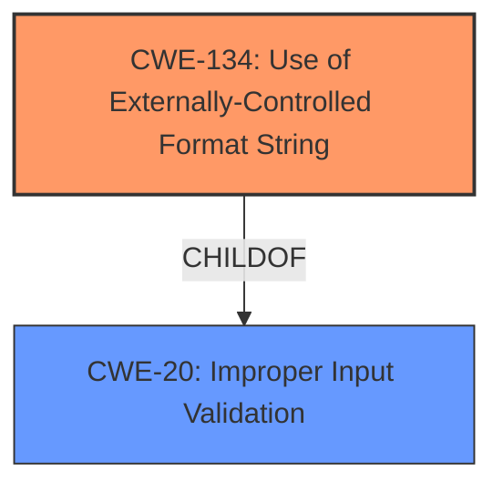

# Final Resolution for CVE-2021-25489

# Summary
| CWE ID | CWE Name | Confidence | CWE Abstraction Level | CWE Vulnerability Mapping Label | CWE-Vulnerability Mapping Notes |
|---|---|---|---|---|---|
| CWE-134 | Use of Externally-Controlled Format String | 0.95 | Base | Allowed | Primary CWE |
| CWE-20 | Improper Input Validation | 0.4 | Class | Discouraged | Secondary Candidate |

## Evidence and Confidence

*   **Confidence Score:** 0.9
*   **Evidence Strength:** MEDIUM

## Relationship Analysis
The primary relationship that influenced the decision was the parent-child relationship between CWE-20 (**Improper Input Validation**) and CWE-134 (**Use of Externally-Controlled Format String**). While CWE-20 represents the broader class of input validation issues, CWE-134 offers a more specific classification directly addressing the format string vulnerability described. The analysis correctly prioritizes the more specific CWE-134 as the primary weakness. I am not confident enough to add it as a secondary.

## Vulnerability Chain
The vulnerability chain begins with the **ROOTCAUSE** which is **improper input validation** (potential CWE-20). This leads to the **WEAKNESS**, use of an externally-controlled format string (CWE-134), which ultimately results in a kernel panic (impact).

## Summary of Analysis
The initial analysis correctly identified CWE-134 (**Use of Externally-Controlled Format String**) as the primary weakness with high confidence. The criticism reinforces this decision, highlighting the explicit mention of a "format string bug" in the vulnerability description as strong evidence.

The decision is based on the following evidence: "Assuming radio permission is gained, missing input validation in modem interface driver prior to SMR Oct-2021 Release 1 results in format string bug leading to kernel panic."

The relationship analysis, specifically the parent-child relationship between CWE-20 and CWE-134, supports the choice of CWE-134 due to its greater specificity. While CWE-20 represents the broader category of input validation flaws, CWE-134 accurately pinpoints the format string vulnerability.

The selected CWEs are at the optimal level of specificity because CWE-134 directly addresses the identified "format string bug," providing a more precise classification than the more general CWE-20.