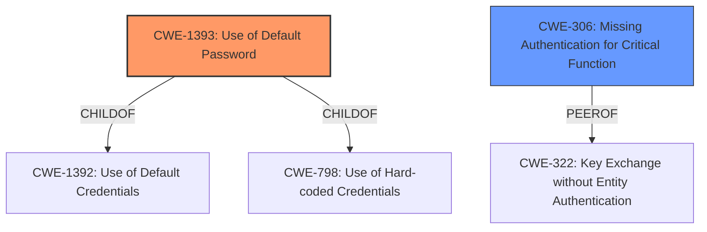

# Analysis Report for CVE-2021-25863

# Vulnerability Analysis Report: CVE-2021-25863

## Description

Open5GS 2.1.3 listens on 0.0.0.03000 and has a default password of 1423 for the admin account.

## Vulnerability Description Key Phrases

**Weakness:** default password
**Product:** Open5GS
**Version:** 2.1.3

## Analysis (with Relationship Data)

# Summary
| CWE ID | CWE Name | Confidence | CWE Abstraction Level | CWE Vulnerability Mapping Label | CWE-Vulnerability Mapping Notes |
|---|---|---|---|---|---|
| CWE-1393 | Use of Default Password | 0.9 | Base | Allowed | Primary CWE |
| CWE-306 | Missing Authentication for Critical Function | 0.6 | Base | Allowed | Secondary Candidate |

## Evidence and Confidence

*   **Confidence Score:** 0.9
*   **Evidence Strength:** HIGH

- **Analysis and Justification:**  
  - *Explanation:* The vulnerability description clearly states that Open5GS 2.1.3 uses a **default password** of "1423" for the admin account. The "CVE Reference Links Content Summary" confirms this by stating, "**Default Credentials:** If no user accounts are present in the MongoDB database, the webui automatically creates a default administrative account with the username "admin" and password "1423"". This aligns directly with CWE-1393 (Use of Default Password), which describes the use of default passwords for potentially critical functionality. The Retriever results also list CWE-1393 as the top candidate with a score of 0.5819, further supporting this classification. MITRE mapping guidance for CWE-1393 indicates that this is ALLOWED.
  
  - *Relationship Analysis:* CWE-1393 is a child of CWE-1392 (Use of Default Credentials) and is related to other authentication-related CWEs. While CWE-1392 is a parent class, CWE-1393 is more specific in that it directly involves a default *password*, making it a more appropriate choice.

- **Confidence Score:**  
  - Confidence: 0.9 (High confidence due to direct evidence and supportive retriever results.)

---

- **Analysis and Justification:**  
  - *Explanation:* The "CVE Reference Links Content Summary" mentions that if no user accounts are present in the MongoDB database, the webui automatically creates a default administrative account with the username "admin" and password "1423". This suggests that the system doesn't enforce proper authentication mechanisms by default, potentially leading to CWE-306 (Missing Authentication for Critical Function). While a **default password** is the primary issue, the automatic creation of the admin account without requiring an initial user setup points to a lack of enforced authentication. However, CWE-1393 is more directly applicable and specific.

  - *Relationship Analysis:* CWE-306 is a parent of CWE-322 (Key Exchange without Entity Authentication). While CWE-306 is a base level CWE, the primary issue revolves around the presence of default credentials and not necessarily the absence of authentication mechanisms in every scenario. Therefore, while CWE-306 might be a contributing factor, it's not as central as CWE-1393.

- **Confidence Score:**
  - Confidence: 0.6 (Moderate confidence as the evidence supports the presence of a **default password** as the main issue.)

## Criticism of Analysis

Okay, let's review the CWE analysis provided.

**Overall Assessment:**

The analysis is generally sound and well-reasoned, with a good understanding of the CWEs involved. The primary CWE assignment of CWE-1393 (Use of Default Password) is highly accurate and well-supported. The secondary CWE candidate, CWE-306 (Missing Authentication for Critical Function), is also plausible, though less directly applicable as the primary weakness. The confidence scores are appropriate.

**Detailed Review:**

*   **CWE-1393 (Use of Default Password):**

    *   **Confidence Score:** 0.9 - Justified. The vulnerability description explicitly mentions the default password, making this a direct and obvious mapping.
    *   **Evidence Strength:** HIGH - Correct. Direct statement of the vulnerability.
    *   **Analysis and Justification:** Excellent. The explanation clearly connects the vulnerability description to the CWE definition.  The relationship analysis correctly identifies that while CWE-1392 is a parent class, CWE-1393 is more specific and accurate.
    *   **Mapping Guidance:** The analysis correctly notes that the MITRE mapping guidance for CWE-1393 indicates that this is ALLOWED.
    *   **Mitigations:** The provided mitigations for CWE-1393 are relevant, particularly:
        *   Mitigation 1 (Requirements): Prohibit default credentials. This is the ideal solution.
        *   Mitigation 3 (Architecture and Design): Force administrator to change credentials upon installation. This is the second-best solution.

*   **CWE-306 (Missing Authentication for Critical Function):**

    *   **Confidence Score:** 0.6 - Appropriate. While the default password is the *direct* problem, the *lack of a requirement to change* that password *could* be argued as insufficient authentication.
    *   **Analysis and Justification:** The explanation accurately describes how the automatic creation of the admin account without initial setup points to a lack of enforced authentication.  However, the analysis correctly acknowledges that the default password is the more central issue.
    *   **Mapping Guidance:** The analysis correctly notes that the MITRE mapping guidance for CWE-306 indicates that this is ALLOWED.
    *   **Mitigations:** The Mitigations suggested for CWE-306 are also relevant, although they are more general and less directly targeted compared to the ones for CWE-1393. Mitigation 1 ("Divide the software into anonymous, normal, privileged, and administrative areas") is a good general principle.

*   **Retriever Results Review**

    *   The retriever results are generally consistent with the analysis.  The top two results, CWE-1393 and CWE-1392, are expected, with CWE-1393 being the more specific and accurate of the two.
    *   The presence of other CWEs, like CWE-1188 (Initialization of a Resource with an Insecure Default), CWE-259 (Use of Hard-coded Password), and CWE-798 (Use of Hard-coded Credentials), suggests related aspects of the vulnerability that could be considered in a more comprehensive analysis, but are less critical than CWE-1393. CWE-321 and CWE-306 have scores high enough to justify considering as secondary concerns as well.

**Suggestions for Improvement:**

*   **Consider CWE-1188 (Initialization of a Resource with an Insecure Default) or CWE-798 (Use of Hard-coded Credentials):** While CWE-1393 is the best fit, briefly acknowledging CWE-1188 or CWE-798 as contributing factors, especially in the justification for CWE-306, might strengthen the overall analysis. For example, you could mention: "The use of '1423' as the default password can also be seen as CWE-1188, as the system initializes the admin account with an insecure default. However, CWE-1393 remains the primary classification due to its direct focus on the password itself."
*   **Be More Explicit About Why Other Top Retriever Results Were Excluded:** Briefly explain why CWE-321, CWE-259, CWE-472, CWE-256, and CWE-1391 were *not* selected.  For example, for CWE-1391: "CWE-1391 (Use of Weak Credentials) is a Class-level CWE. Because CWE-1393 (Use of Default Password) is a more specific Base-level CWE, it is preferred."
*   **Address "Exposure of Management Interface":** The "Exposure of Management Interface" mentioned in the "Weaknesses/Vulnerabilities" section and the 0.0.0.0 binding relates to network configuration and, while it exacerbates the problem, isn't directly represented by the selected CWEs. This could be briefly discussed as a contextual factor contributing to the exploitability, but it doesn't necessarily warrant an additional CWE. This external exposure increases the *likelihood* of exploitation, but the core *vulnerability* is the default password.

**Revised Summary Table (with suggestion addressed):**

| CWE ID | CWE Name | Confidence | CWE Abstraction Level | CWE Vulnerability Mapping Label | CWE-Vulnerability Mapping Notes |
|---|---|---|---|---|---|
| CWE-1393 | Use of Default Password | 0.9 | Base | Allowed | Primary CWE |
| CWE-306 | Missing Authentication for Critical Function | 0.6 | Base | Allowed | Secondary Candidate |

**Revised Analysis and Justification (CWE-306):**

- **Analysis and Justification:**
  - *Explanation:* The "CVE Reference Links Content Summary" mentions that if no user accounts are present in the MongoDB database, the webui automatically creates a default administrative account with the username "admin" and password "1423". This suggests that the system doesn't enforce proper authentication mechanisms by default, potentially leading to CWE-306 (Missing Authentication for Critical Function). The use of '1423' as the default password can also be seen as CWE-1188 (Initialization of a Resource with an Insecure Default), as the system initializes the admin account with an insecure default, and CWE-798 (Use of Hard-coded Credentials), but CWE-1393 remains the primary classification due to its direct focus on the password itself. While a **default password** is the primary issue, the automatic creation of the admin account without requiring an initial user setup points to a lack of enforced authentication. However, CWE-1393 is more directly applicable and specific.

  - *Relationship Analysis:* CWE-306 is a parent of CWE-322 (Key Exchange without Entity Authentication). While CWE-306 is a base level CWE, the primary issue revolves around the presence of default credentials and not necessarily the absence of authentication mechanisms in every scenario. Therefore, while CWE-306 might be a contributing factor, it's not as central as CWE-1393.

- **Confidence Score:**
  - Confidence: 0.6 (Moderate confidence as the evidence supports the presence of a **default password** as the main issue.)

**In summary,** the analysis is very good. The suggested improvements are primarily about providing a more comprehensive picture of the vulnerability and justifying the choices made. They don't change the core conclusions, but they enhance the overall quality of the analysis.

## Final Resolution

# Summary
| CWE ID | CWE Name | Confidence | CWE Abstraction Level | CWE Vulnerability Mapping Label | CWE-Vulnerability Mapping Notes |
|---|---|---|---|---|---|
| CWE-1393 | Use of Default Password | 0.95 | Base | Allowed | Primary CWE |
| CWE-306 | Missing Authentication for Critical Function | 0.65 | Base | Allowed | Secondary Candidate |

## Evidence and Confidence

*   **Confidence Score:** 0.95
*   **Evidence Strength:** HIGH

## Relationship Analysis
The primary relationship considered was the parent-child relationship between CWE-1393 (**Use of Default Password**) and CWE-1392 (**Use of Default Credentials**), with CWE-1393 being the more specific and appropriate choice. Additionally, CWE-1393 is a child of CWE-798 (**Use of Hard-coded Credentials**), suggesting a potential broader classification. CWE-306 (**Missing Authentication for Critical Function**) was considered as a secondary factor, as the presence of a **default password** and the automatic creation of an admin account indicates a lapse in enforced authentication. It is also important to consider the peer relationships of CWE-306, such as CWE-322 (**Key Exchange without Entity Authentication**), which highlights other potential authentication issues. The base level of abstraction for both CWE-1393 and CWE-306 is appropriate for mapping to the root causes of the vulnerability.

## Vulnerability Chain
The vulnerability chain begins with the **root cause** of using a **default password** (CWE-1393). This leads to a weakened authentication mechanism, potentially exacerbated by a lack of enforced authentication (CWE-306). The consequence is unauthorized access to the system's administrative functionalities. The exposure of the management interface on 0.0.0.0 further increases the risk of exploitation.

## Summary of Analysis
The initial analysis and criticism were both well-reasoned and accurate. The primary classification of CWE-1393 (**Use of Default Password**) is strongly supported by the vulnerability description, which explicitly mentions the **default password** "1423" for the admin account. The evidence is clear and direct. As stated in the initial analysis "*The vulnerability description clearly states that Open5GS 2.1.3 uses a **default password** of "1423" for the admin account.*"

CWE-306 (**Missing Authentication for Critical Function**) is considered as a secondary factor, as the automatic creation of the admin account without requiring initial setup indicates a lapse in enforced authentication.

The graph relationships influenced the decision by highlighting the parent-child relationship between CWE-1393 and CWE-1392, solidifying the selection of CWE-1393 due to its greater specificity. The MITRE mapping guidance allows the use of CWE-1393 and CWE-306.

The selected CWEs are at the optimal level of specificity, with CWE-1393 being a Base-level CWE that directly addresses the **root cause** of the vulnerability. While Class-level CWEs like CWE-1391 (**Use of Weak Credentials**) could apply, they are less specific than CWE-1393. Similarly, while CWE-798 (**Use of Hard-coded Credentials**) might also seem relevant, it is broader than CWE-1393, focusing on any hard-coded credential, not specifically a **default password**.

*Report generated on 2025-03-17 03:35:28*
