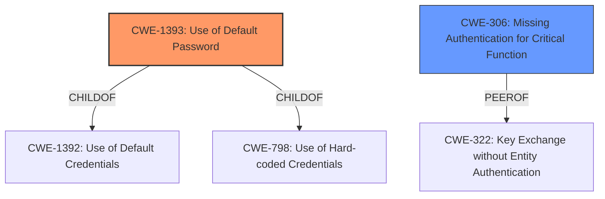

# Final Resolution for CVE-2021-25863

# Summary
| CWE ID | CWE Name | Confidence | CWE Abstraction Level | CWE Vulnerability Mapping Label | CWE-Vulnerability Mapping Notes |
|---|---|---|---|---|---|
| CWE-1393 | Use of Default Password | 0.95 | Base | Allowed | Primary CWE |
| CWE-306 | Missing Authentication for Critical Function | 0.65 | Base | Allowed | Secondary Candidate |

## Evidence and Confidence

*   **Confidence Score:** 0.95
*   **Evidence Strength:** HIGH

## Relationship Analysis
The primary relationship considered was the parent-child relationship between CWE-1393 (**Use of Default Password**) and CWE-1392 (**Use of Default Credentials**), with CWE-1393 being the more specific and appropriate choice. Additionally, CWE-1393 is a child of CWE-798 (**Use of Hard-coded Credentials**), suggesting a potential broader classification. CWE-306 (**Missing Authentication for Critical Function**) was considered as a secondary factor, as the presence of a **default password** and the automatic creation of an admin account indicates a lapse in enforced authentication. It is also important to consider the peer relationships of CWE-306, such as CWE-322 (**Key Exchange without Entity Authentication**), which highlights other potential authentication issues. The base level of abstraction for both CWE-1393 and CWE-306 is appropriate for mapping to the root causes of the vulnerability.

## Vulnerability Chain
The vulnerability chain begins with the **root cause** of using a **default password** (CWE-1393). This leads to a weakened authentication mechanism, potentially exacerbated by a lack of enforced authentication (CWE-306). The consequence is unauthorized access to the system's administrative functionalities. The exposure of the management interface on 0.0.0.0 further increases the risk of exploitation.

## Summary of Analysis
The initial analysis and criticism were both well-reasoned and accurate. The primary classification of CWE-1393 (**Use of Default Password**) is strongly supported by the vulnerability description, which explicitly mentions the **default password** "1423" for the admin account. The evidence is clear and direct. As stated in the initial analysis "*The vulnerability description clearly states that Open5GS 2.1.3 uses a **default password** of "1423" for the admin account.*"

CWE-306 (**Missing Authentication for Critical Function**) is considered as a secondary factor, as the automatic creation of the admin account without requiring initial setup indicates a lapse in enforced authentication.

The graph relationships influenced the decision by highlighting the parent-child relationship between CWE-1393 and CWE-1392, solidifying the selection of CWE-1393 due to its greater specificity. The MITRE mapping guidance allows the use of CWE-1393 and CWE-306.

The selected CWEs are at the optimal level of specificity, with CWE-1393 being a Base-level CWE that directly addresses the **root cause** of the vulnerability. While Class-level CWEs like CWE-1391 (**Use of Weak Credentials**) could apply, they are less specific than CWE-1393. Similarly, while CWE-798 (**Use of Hard-coded Credentials**) might also seem relevant, it is broader than CWE-1393, focusing on any hard-coded credential, not specifically a **default password**.