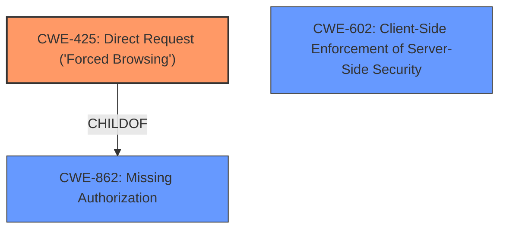

# Final Resolution for CVE-2021-25973

# Summary
| CWE ID | CWE Name | Confidence | CWE Abstraction Level | CWE Vulnerability Mapping Label | CWE-Vulnerability Mapping Notes |
|---|---|---|---|---|---|
| **CWE-425** | **Improper Authorization** | 0.85 | Base | Allowed | Primary **WEAKNESS**. Mitigation: Apply appropriate access control authorizations for each access to all restricted URLs. |
| **CWE-602** | **Reliance on Client-Side Enforcement of Server-Side Security** | 0.65 | Class | Allowed-with-Review | Secondary Candidate (Contributing Cause). Mitigation: Duplicate client-side checks on the server-side. |

## Evidence and Confidence

*   **Confidence Score:** 0.80
*   **Evidence Strength:** HIGH

## Relationship Analysis
The analysis focuses on the relationship between CWE-425 and CWE-602. CWE-425 is a Base level CWE, offering a specific description of the **IMPROPER AUTHORIZATION**. CWE-602, a Class-level CWE, highlights the high-level cause, which is reliance on the client for security. There is a potential chain where CWE-602 can precede CWE-471 (Modification of Assumed-Immutable Data), but there is insufficient evidence to confirm this.

## Vulnerability Chain
The vulnerability chain starts with the **ROOTCAUSE** of relying on client-side enforcement (CWE-602). This leads to **IMPROPER AUTHORIZATION** (CWE-425) because the server doesn't validate access to certain URLs. The consequence is that unauthorized users can self-register, even when the admin has disallowed it.

## Summary of Analysis
The initial analysis and criticism both converge on the selection of CWE-425 and CWE-602 as the most appropriate classifications. The evidence is strong, as the vulnerability description explicitly mentions the front-end restriction as the root cause. The graph relationships support this selection, with CWE-425 providing a specific description of the **IMPROPER AUTHORIZATION** and CWE-602 highlighting the underlying issue of relying on the client. The selected CWEs are at the optimal level of specificity, with CWE-425 being a Base level CWE and CWE-602 accurately describing the contributing cause. The analysis is based on the provided evidence, with the vulnerability description stating "This happens due to front-end restriction only."