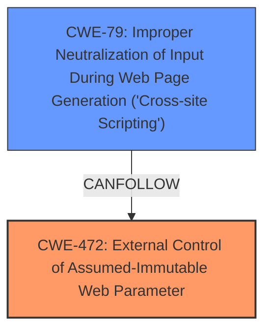

# Final Resolution for CVE-2021-26029

# Summary
| CWE ID | CWE Name | Confidence | CWE Abstraction Level | CWE Vulnerability Mapping Label | CWE-Vulnerability Mapping Notes |
|---|---|---|---|---|---|
| CWE-472 | External Control of Assumed-Immutable Web Parameter | 0.9 | Base | Allowed | Primary CWE |
| CWE-79 | Improper Neutralization of Input During Web Page Generation ('Cross-site Scripting') | 0.6 | Base | Allowed | Secondary Candidate |

## Evidence and Confidence

*   **Confidence Score:** 0.8
*   **Evidence Strength:** MEDIUM

## Relationship Analysis
The primary relationship is that **CWE-472 (External Control of Assumed-Immutable Web Parameter)** can lead to other vulnerabilities if the externally controlled parameter is not properly handled. In this case, if the overwritten author field is displayed without proper sanitization, it can lead to **CWE-79 (Improper Neutralization of Input During Web Page Generation ('Cross-site Scripting'))**. However, this is only a potential scenario and not directly supported by the initial description. There are no strong relationships to authorization-related CWEs like CWE-425, and after considering the suggestion to potentially use **CWE-863: Incorrect Authorization**, it's clear that filtering is the main **root cause** rather than authorization.

## Vulnerability Chain
The vulnerability chain starts with **inadequate filtering** of form contents, which is represented by **CWE-472 (External Control of Assumed-Immutable Web Parameter)**. If the overwritten "author" field is then displayed without proper sanitization, this leads to **CWE-79 (Improper Neutralization of Input During Web Page Generation ('Cross-site Scripting'))**.
  - The **root cause** is the **inadequate filtering** (CWE-472).
  - The potential consequence is XSS (CWE-79).

## Summary of Analysis
The initial analysis correctly identified **CWE-472 (External Control of Assumed-Immutable Web Parameter)** as the primary **weakness**. The vulnerability description clearly states, "**Inadequate filtering of form contents could allow to overwrite the author field**," which directly aligns with CWE-472. The criticism pointed out the weak relationship of the initially suggested secondary CWE-425, and after re-evaluating the evidence, it is clear that the focus should remain on input validation rather than authorization.

The inclusion of **CWE-79 (Improper Neutralization of Input During Web Page Generation ('Cross-site Scripting'))** as a secondary candidate is plausible but relies on a specific usage pattern (displaying the overwritten author field without sanitization). The analysis has been updated to acknowledge this contingency and increase the confidence to 0.6 based on the potential for XSS.

The selected CWEs are at the optimal level of specificity, with CWE-472 being a Base-level CWE that directly addresses the **root cause**. CWE-79 is also a Base-level CWE. The analysis is based on the provided evidence and the relationships between CWEs, with a focus on input validation and potential output context issues.