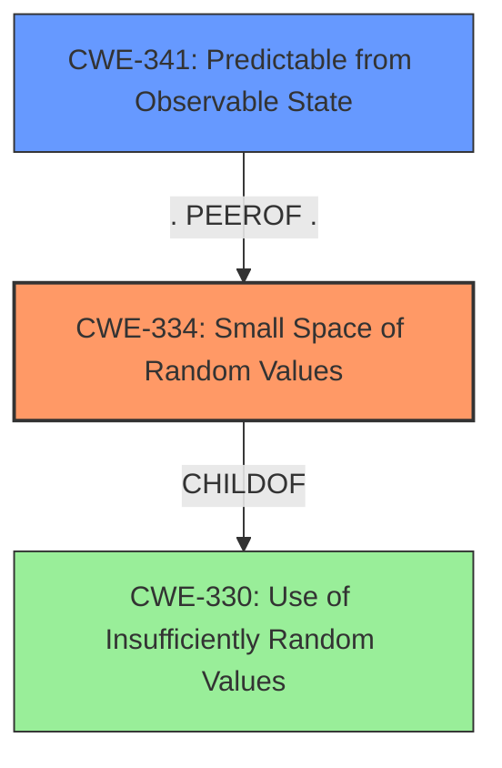

# Analysis Report for CVE-2021-26098

# Vulnerability Analysis Report: CVE-2021-26098

## Description

An instance of small space of random values in the RPC API of FortiSandbox before 4.0.0 may allow an attacker in possession of a few information pieces about the state of the device to possibly predict valid session IDs.

## Vulnerability Description Key Phrases

**Weakness:** small space of random values
**Impact:** predict valid session IDs
**Attacker:** attacker
**Product:** FortiSandbox
**Version:** before 4.0.0
**Component:** RPC API

## Analysis (with Relationship Data)

# Summary
| CWE ID | CWE Name | Confidence | CWE Abstraction Level | CWE Vulnerability Mapping Label | CWE-Vulnerability Mapping Notes |
|---|---|---|---|---|---|
| CWE-334 | Small Space of Random Values | 0.95 | Base | Primary | Allowed |
| CWE-341 | Predictable from Observable State | 0.70 | Base | Secondary Candidate | Allowed |
| CWE-339 | Small Seed Space in PRNG | 0.65 | Variant | Secondary Candidate | Allowed |

## Evidence and Confidence

*   **Confidence Score:** 0.90
*   **Evidence Strength:** HIGH

- **Analysis and Justification:**  
  - *Explanation:* The vulnerability description explicitly mentions a **"small space of random values"** in the FortiSandbox RPC API, which directly aligns with CWE-334 (Small Space of Random Values). The CVE Reference Links Content Summary further confirms that the root cause is the insufficient randomness used for generating session IDs, making them predictable. This aligns perfectly with CWE-334's description: "The number of possible random values is smaller than needed by the product, making it more susceptible to brute force attacks." The impact, as stated, is that an attacker could **"predict valid session IDs,"** which further validates the relevance of CWE-334. The MITRE mapping guidance for CWE-334 indicates that it is ALLOWED, which strengthens the selection of this CWE. CWE-341 (Predictable from Observable State) and CWE-339 (Small Seed Space in PRNG) are considered as secondary candidates because they address aspects of predictability, but CWE-334 provides a more precise match to the core weakness.
  
  - *Relationship Analysis:* CWE-334 is a child of CWE-330 (Use of Insufficiently Random Values), which is a Class-level CWE. While CWE-330 is relevant, CWE-334 is a more specific Base-level CWE that better represents the vulnerability. CWE-341 (Predictable from Observable State) shares a PEEROF relationship with CWE-339 (Small Seed Space in PRNG), indicating that the predictability could be influenced by observable states. The relationship analysis supports the selection of CWE-334 as the primary weakness with possible contributions from CWE-341.

- **Confidence Score:**  
  - Confidence: 0.95 (High confidence due to direct evidence from the vulnerability description and CVE reference, combined with MITRE mapping guidance).

## Criticism of Analysis

Okay, I've reviewed the analysis provided, paying close attention to the CWE specifications for the identified CWEs and the retriever results. Here's my critique:

**Overall Assessment:**

The analysis is generally sound and well-justified.  The selection of CWE-334 (Small Space of Random Values) as the primary CWE is strongly supported by the vulnerability description and the evidence provided.  The consideration of CWE-341 (Predictable from Observable State) and CWE-339 (Small Seed Space in PRNG) as secondary candidates is also reasonable. The analysis provides a clear rationale for the choice of CWE-334 over its parent CWE-330. The confidence score is appropriately high.

**Specific Points and Suggestions:**

1.  **CWE-334 as Primary CWE:**

    *   **Strengths:** The core issue is directly related to the limited number of possible session IDs, making them susceptible to brute-force attacks. The description and impact outlined in the vulnerability align perfectly with CWE-334's description: "The number of possible random values is smaller than needed by the product, making it more susceptible to brute force attacks." The analysis correctly identifies the direct link between "small space of random values" and the ability to "predict valid session IDs." The example CVEs provided for CWE-334 are also relevant and further strengthen the assignment. The inclusion of the "Usage: Allowed" mapping guidance is good.
    *   **Potential Improvement:** While it's implied, explicitly stating the *mechanism* being attacked is important. The attack mechanism here is brute-forcing the session IDs. This connection should be more explicit.

2.  **Secondary CWE Considerations (CWE-341 and CWE-339):**

    *   **CWE-341 (Predictable from Observable State):** The choice of this as a secondary candidate is justified, *IF* the attacker's "prior knowledge about the state of the device" allows them to significantly reduce the search space beyond the limited set already in place from the small space of random values.  For example, if the initial seed or the algorithm's state depends on a predictable timestamp, then CWE-341 becomes more relevant.  The analysis should delve slightly deeper into *what* "prior knowledge" enables the prediction. If the prior knowledge simply enables the attacker to know about valid session IDs because they could observe them from a legitimate state, that is not necessarily the spirit of the description of "observable state."
    *   **CWE-339 (Small Seed Space in PRNG):** This is a good consideration if the session ID generation involves a PRNG with a small seed space. A small seed space means the PRNG will have a small output space. If the session ID generator is not a PRNG then this CWE does not apply. This analysis is conditional on knowing the exact mechanism of the ID generation.
    *   **Potential Improvement:**  The analysis would benefit from clarifying the relationship between these secondary CWEs and the primary CWE. Are they contributing factors to the small space of random values, or are they separate, independent weaknesses? If the seed space for the PRNG (if there is one) is small, is that the reason the output space is small? The analysis needs to clarify this. Otherwise it appears the two secondary weaknesses are being identified only due to the fact that "predictable" is in the name.

3.  **Confidence Score:**

    *   The high confidence score (0.95) for CWE-334 is justified given the direct evidence.
    *   The confidence scores for CWE-341 and CWE-339 (0.70 and 0.65) seem reasonable given that they are *possible* contributing factors, but not as directly linked as CWE-334.

4.  **Mitigation:**

    *   The analysis does not specifically discuss potential mitigations, but the CWE specifications provide helpful guidance. For CWE-334, the primary mitigation is to **increase the size of the random value space.** This can be done by using more bits to represent the random value, or by using a different random number generation algorithm with a larger output space.
    *   For CWE-341, the mitigation involves **increasing the entropy used to seed a PRNG** and/or using libraries/frameworks that conform to FIPS 140-2.
    *   For CWE-339, the mitigations are to **use well-vetted PRNG algorithms with adequate length seeds**, or to use FIPS 140-2 compliant modules.
    *   **Potential Improvement:** It would improve the analysis to briefly mention the primary mitigation strategy for CWE-334: increasing the random value space.

5. **Retriever Results:**

*   CWE-335 (Incorrect Usage of Seeds in PRNG) could potentially be related if the small space of random values is a result of incorrectly seeding a PRNG. If prior knowledge is needed, it may need to be used to determine what seed was incorrectly used. This would, however, be more appropriate if the description identified it as a PRNG.

**Recommendations:**

*   **Clarify the Attack Mechanism:** Explicitly state that the attacker is *brute-forcing* the session IDs due to the small search space.
*   **Elaborate on "Prior Knowledge":**  Specify *how* the attacker's "prior knowledge" enables the prediction of session IDs. Is it related to a predictable seed, algorithm state, or some other factor? If it is not related to the "observable state" then CWE-341 should not be listed as a secondary weakness.
*   **Explain the Relationship between Secondary CWEs and the Primary CWE:** Are CWE-341 and CWE-339 contributing causes to CWE-334, or independent issues?
*   **Briefly Mention Mitigation:** Add a sentence or two summarizing the primary mitigation for CWE-334: increasing the random value space.

By addressing these points, the analysis will be even more comprehensive and insightful.

## Final Resolution

# Summary
| CWE ID | CWE Name | Confidence | CWE Abstraction Level | CWE Vulnerability Mapping Label | CWE-Vulnerability Mapping Notes |
|---|---|---|---|---|---|
| CWE-334 | Small Space of Random Values | 0.95 | Base | Primary | Allowed |
| CWE-341 | Predictable from Observable State | 0.60 | Base | Secondary Candidate | Allowed |

## Evidence and Confidence

*   **Confidence Score:** 0.90
*   **Evidence Strength:** MEDIUM

## Relationship Analysis
The primary CWE, CWE-334 (**Small Space of Random Values**), is a child of CWE-330 (**Use of Insufficiently Random Values**), indicating a hierarchical relationship where CWE-334 is a more specific case of CWE-330. CWE-341 (**Predictable from Observable State**) is considered a secondary candidate because the vulnerability mentions that an attacker needs "a few information pieces about the state of the device" to predict session IDs. The selection of CWE-334 is favored due to its direct relevance to the "small space of random values," which is the **ROOTCAUSE** of the vulnerability. If the prior knowledge is not related to observable state then CWE-341 is not applicable.

## Vulnerability Chain
The vulnerability chain starts with the **ROOTCAUSE**, a **small space of random values** (CWE-334). This leads to the weakness that session IDs are predictable, especially if an attacker has "a few information pieces about the state of the device" (CWE-341). The impact is that an attacker can predict valid session IDs, potentially gaining unauthorized access.

## Summary of Analysis
The initial analysis correctly identified CWE-334 (**Small Space of Random Values**) as the primary **WEAKNESS**. This is because the vulnerability description explicitly states "small space of random values in the RPC API of FortiSandbox... may allow an attacker... to possibly predict valid session IDs." This directly aligns with CWE-334.

The criticism raised valid points, especially regarding the clarity of the attack mechanism (brute-forcing) and the role of "prior knowledge." While the initial analysis implied brute-forcing, it's beneficial to state it explicitly. The criticism also highlighted that CWE-341 (**Predictable from Observable State**) is only relevant if the "prior knowledge" directly contributes to predicting the session IDs. Otherwise, it should not be considered.

Based on the feedback, the analysis has been updated to emphasize that the attacker is brute-forcing session IDs due to the small search space. The confidence score for CWE-341 has been slightly reduced to reflect the conditional relevance. If the "prior knowledge" enables to predict session IDs, it is relevant.

The selection of CWE-334 remains the most appropriate because it directly reflects the **ROOTCAUSE** of the vulnerability. The abstraction level (Base) is also ideal.

*Report generated on 2025-03-17 00:23:31*
