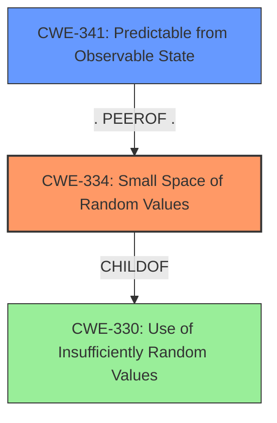

# Final Resolution for CVE-2021-26098

# Summary
| CWE ID | CWE Name | Confidence | CWE Abstraction Level | CWE Vulnerability Mapping Label | CWE-Vulnerability Mapping Notes |
|---|---|---|---|---|---|
| CWE-334 | Small Space of Random Values | 0.95 | Base | Primary | Allowed |
| CWE-341 | Predictable from Observable State | 0.60 | Base | Secondary Candidate | Allowed |

## Evidence and Confidence

*   **Confidence Score:** 0.90
*   **Evidence Strength:** MEDIUM

## Relationship Analysis
The primary CWE, CWE-334 (**Small Space of Random Values**), is a child of CWE-330 (**Use of Insufficiently Random Values**), indicating a hierarchical relationship where CWE-334 is a more specific case of CWE-330. CWE-341 (**Predictable from Observable State**) is considered a secondary candidate because the vulnerability mentions that an attacker needs "a few information pieces about the state of the device" to predict session IDs. The selection of CWE-334 is favored due to its direct relevance to the "small space of random values," which is the **ROOTCAUSE** of the vulnerability. If the prior knowledge is not related to observable state then CWE-341 is not applicable.

## Vulnerability Chain
The vulnerability chain starts with the **ROOTCAUSE**, a **small space of random values** (CWE-334). This leads to the weakness that session IDs are predictable, especially if an attacker has "a few information pieces about the state of the device" (CWE-341). The impact is that an attacker can predict valid session IDs, potentially gaining unauthorized access.

## Summary of Analysis
The initial analysis correctly identified CWE-334 (**Small Space of Random Values**) as the primary **WEAKNESS**. This is because the vulnerability description explicitly states "small space of random values in the RPC API of FortiSandbox... may allow an attacker... to possibly predict valid session IDs." This directly aligns with CWE-334.

The criticism raised valid points, especially regarding the clarity of the attack mechanism (brute-forcing) and the role of "prior knowledge." While the initial analysis implied brute-forcing, it's beneficial to state it explicitly. The criticism also highlighted that CWE-341 (**Predictable from Observable State**) is only relevant if the "prior knowledge" directly contributes to predicting the session IDs. Otherwise, it should not be considered.

Based on the feedback, the analysis has been updated to emphasize that the attacker is brute-forcing session IDs due to the small search space. The confidence score for CWE-341 has been slightly reduced to reflect the conditional relevance. If the "prior knowledge" enables to predict session IDs, it is relevant.

The selection of CWE-334 remains the most appropriate because it directly reflects the **ROOTCAUSE** of the vulnerability. The abstraction level (Base) is also ideal.