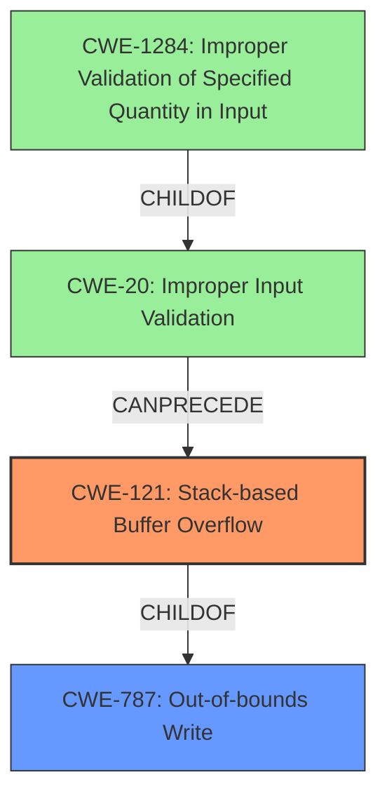

# Analysis Report for CVE-2021-26112

# Vulnerability Analysis Report: CVE-2021-26112

## Description

Multiple stack-based buffer overflow vulnerabilities [CWE-121] both in network daemons and in the command line interpreter of FortiWAN before 4.5.9 may allow an unauthenticated attacker to potentially corrupt control data in memory and execute arbitrary code via specifically crafted requests.

## Vulnerability Description Key Phrases

**Rootcause:** stack-based buffer overflow
**Weakness:** CWE-121
**Impact:** ['corrupt control data in memory', 'execute arbitrary code']
**Vector:** specifically crafted requests
**Attacker:** unauthenticated attacker
**Product:** FortiWAN
**Version:** before 4.5.9
**Component:** ['network daemons', 'command line interpreter']

## Analysis (with Relationship Data)

# Summary
| CWE ID | CWE Name | Confidence | CWE Abstraction Level | CWE Vulnerability Mapping Label | CWE-Vulnerability Mapping Notes |
|---|---|---|---|---|---|
| **CWE-121** | Stack-based Buffer Overflow | 1.00 | Variant | Primary | Allowed |

## Evidence and Confidence

*   **Confidence Score:** 1.00
*   **Evidence Strength:** HIGH

- **Analysis and Justification:**  
  - *Explanation:* The vulnerability description explicitly states that there are multiple **stack-based buffer overflow** vulnerabilities [**CWE-121**] in FortiWAN. The CVE Reference Links Content Summary reinforces this, confirming that **stack-based buffer overflows** [**CWE-121**] are the root cause of the vulnerability. This aligns directly with the definition of CWE-121, which describes a buffer overflow condition where the buffer being overwritten is allocated on the stack. The impact of the vulnerability is that an unauthenticated attacker can corrupt control data in memory and execute arbitrary code by sending specifically crafted requests.
  
  - *Relationship Analysis:* CWE-121 is a variant of CWE-120 (Buffer Copy without Checking Size of Input) and CWE-787 (Out-of-bounds Write). While CWE-120 could be considered, the explicit mention of "stack-based" makes CWE-121 a more specific and appropriate choice.

- **Confidence Score:**  
  - Confidence: 1.00 (The vulnerability description explicitly identifies CWE-121 as the weakness.)

## Criticism of Analysis

Okay, I've reviewed the analysis with the full CWE specifications you provided. Here's my critique, focusing on the accuracy, completeness, and justification of the CWE mapping, and considering alternative CWEs and their relationships.

**Overall Assessment:**

The analysis is generally **accurate** in identifying CWE-121 as the primary weakness. The description explicitly mentions "stack-based buffer overflow," which directly maps to CWE-121. The confidence score of 1.0 is justified based on the provided information. However, the analysis could be improved by exploring potential related weaknesses and providing more context within the full CWE specifications.

**Detailed Review:**

*   **CWE-121: Stack-based Buffer Overflow**
    *   **Accuracy:** Correct. The vulnerability description explicitly states "stack-based buffer overflow."
    *   **Completeness:** Good. The description highlights the key characteristics: the buffer is allocated on the stack.
    *   **Justification:** Strong. The explanation connects the "stack-based" aspect to the definition of CWE-121. The impact described (corrupting control data, arbitrary code execution) is a typical consequence of stack-based buffer overflows.
    *   **Areas for Improvement:**
        *   Consider mentioning CWE-787 (Out-of-bounds Write) as a parent. While CWE-121 is more specific, the vulnerability fundamentally involves writing data beyond the allocated buffer's boundaries.
        *   Discuss how the attacker achieves the overflow. Is it through a `strcpy`-like function without length checks (leading to CWE-120 potentially)? Or is there some incorrect calculation of buffer size (leading to CWE-131 potentially)?

*   **Alternative CWEs Considered and Why They Were Rejected:**
    *   **CWE-120: Buffer Copy without Checking Size of Input ('Classic Buffer Overflow')**
        *   The analysis correctly states that CWE-121 is a specialization of CWE-120.
        *   Justification for choosing CWE-121 is that the description explicitly calls out stack-based. This is valid.
    *   **CWE-787: Out-of-bounds Write**
         *  CWE-787 is a parent of CWE-121
         *  The relationship is a parent child relationship not necessarily a rejection.
*   **Retriever Results**
      *   The retriever results are interesting to look at.
      *   CWE-120, CWE-193, CWE-124 and CWE-190 all have higher scores than CWE-121.
      *   The retriever results are worth mentioning even though the explicity name is CWE-121

**Recommendations for Enhancements:**

1.  **Chain Analysis:** Explore potential CWE chains. A stack-based buffer overflow often stems from underlying causes like:
    *   **CWE-20: Improper Input Validation** -> **CWE-121:** Lack of proper input validation might allow an attacker to send overly long input that causes the overflow. If there's a validation attempt, consider sub-CWEs of CWE-20 like **CWE-1284** (Improper Validation of Specified Quantity in Input) if the quantity of input was incorrectly validated.
    *   **CWE-131: Incorrect Calculation of Buffer Size** -> **CWE-121:** An incorrect buffer size calculation could lead to a buffer being too small, causing a subsequent copy operation to overflow it.
    *   **CWE-676: Use of Potentially Dangerous Function** -> **CWE-121:** Use of functions like `strcpy` without proper bounds checking.
2.  **Mitigation Strategies:** Briefly mention relevant mitigation strategies derived from the CWE specifications. For example:
    *   "Mitigation strategies to prevent CWE-121 include using languages or compilers that offer automatic bounds checking, employing safe string handling libraries, and using compiler extensions that provide buffer overflow detection mechanisms (as outlined in the CWE-121 specification)."
3.  **Parent-Child Relationships:** While selecting the most specific CWE is good, acknowledging the parent-child relationships provides a broader context.  Mention that CWE-121 is a child of CWE-787 (Out-of-bounds Write) to indicate that it's a specific type of out-of-bounds write.
4.  **Context from Observed Examples:** The "Observed Examples" section in the full CWE specifications can be used to provide concrete real-world instances of similar vulnerabilities, adding weight to the analysis.

**Revised Summary Table:**

| CWE ID | CWE Name | Confidence | CWE Abstraction Level | CWE Vulnerability Mapping Label | CWE-Vulnerability Mapping Notes |
|---|---|---|---|---|---|
| **CWE-121** | Stack-based Buffer Overflow | 1.00 | Variant | Primary | Allowed |
| CWE-787 | Out-of-bounds Write | 0.80 | Base | Supporting | Parent of CWE-121, the root write that causes the overflow |
| CWE-20 | Improper Input Validation | 0.60 | Class | Contributing | Lack of input validation can lead to the overflow. Consider CWE-1284 if the vulnerability revolves around length. |

**In Conclusion:**

The analysis is correct and well-justified. However, by considering potential chains, related CWEs, and integrating mitigation information from the full CWE specifications, the analysis can become more comprehensive and provide a richer understanding of the vulnerability. The retrievers results provide some good pointers.

## Final Resolution

# Summary
| CWE ID | CWE Name | Confidence | CWE Abstraction Level | CWE Vulnerability Mapping Label | CWE-Vulnerability Mapping Notes |
|---|---|---|---|---|---|
| **CWE-121** | Stack-based Buffer Overflow | 1.00 | Variant | Primary | Allowed |
| CWE-787 | Out-of-bounds Write | 0.80 | Base | Supporting | Parent of CWE-121, the root write that causes the overflow |
| CWE-20 | Improper Input Validation | 0.60 | Class | Contributing | Lack of input validation can lead to the overflow. Consider CWE-1284 if the vulnerability revolves around length. |

## Evidence and Confidence

*   **Confidence Score:** 0.90
*   **Evidence Strength:** HIGH

## Relationship Analysis
The primary relationship that influenced the decision was the parent-child relationship between CWE-787 (**Out-of-bounds Write**) and CWE-121 (**Stack-based Buffer Overflow**). The vulnerability description explicitly mentioned a stack-based buffer overflow, leading to the selection of CWE-121 as the primary weakness. However, recognizing that a stack-based buffer overflow is a specific type of out-of-bounds write led to the inclusion of CWE-787 as a supporting CWE. Additionally, the potential for **improper input validation** (CWE-20) to contribute to the vulnerability was considered, as a lack of validation could allow an attacker to send overly long input, triggering the overflow. The abstraction levels were also considered, with CWE-121 being a Variant, CWE-787 being a Base, and CWE-20 being a Class. The selection of CWE-121 provides the most specific description of the vulnerability, while the inclusion of CWE-787 and CWE-20 provides broader context.

## Vulnerability Chain
The vulnerability chain starts with a potential lack of **improper input validation** (CWE-20), which allows an attacker to send a specifically crafted request with overly long input. This input then triggers a **stack-based buffer overflow** (CWE-121), which is a specific type of **out-of-bounds write** (CWE-787). The overflow corrupts control data in memory, ultimately leading to the execution of arbitrary code.

**Chain:** CWE-20 (Improper Input Validation) -> CWE-121 (Stack-based Buffer Overflow) -> CWE-787 (Out-of-bounds Write) -> Arbitrary Code Execution

## Summary of Analysis
The initial analysis correctly identified CWE-121 as the primary weakness based on the explicit mention of "stack-based buffer overflow" in the vulnerability description. The criticism suggested considering potential related weaknesses and providing more context, which led to the inclusion of CWE-787 and CWE-20.

The decision to include CWE-787 was influenced by the parent-child relationship with CWE-121. Recognizing that a stack-based buffer overflow is a specific type of out-of-bounds write provided a more comprehensive understanding of the vulnerability.

The inclusion of CWE-20 was based on the potential for **improper input validation** to contribute to the vulnerability. While not explicitly mentioned in the vulnerability description, the possibility that a lack of validation could allow an attacker to send overly long input was considered. "may allow an unauthenticated attacker to potentially corrupt control data in memory and execute arbitrary code via specifically crafted requests"

The retriever results were also considered. While CWE-120, CWE-193, CWE-124 and CWE-190 all had higher scores than CWE-121, the explicit mention of "stack-based" in the vulnerability description made CWE-121 the most appropriate choice.

The selected CWEs are at the optimal level of specificity. CWE-121 provides the most specific description of the vulnerability, while the inclusion of CWE-787 and CWE-20 provides broader context and identifies potential contributing factors.

*Report generated on 2025-03-17 23:26:57*
