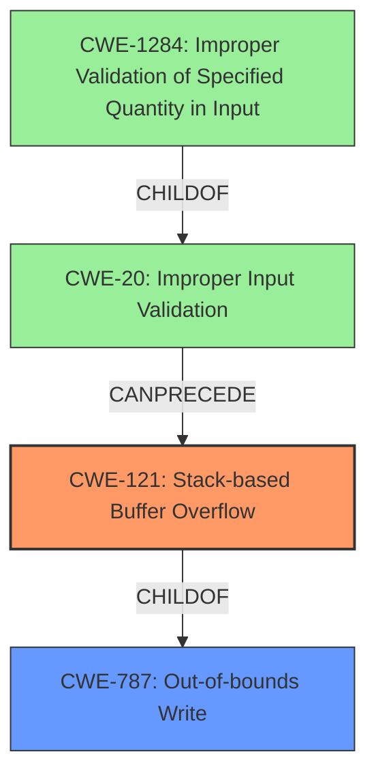

# Final Resolution for CVE-2021-26112

# Summary
| CWE ID | CWE Name | Confidence | CWE Abstraction Level | CWE Vulnerability Mapping Label | CWE-Vulnerability Mapping Notes |
|---|---|---|---|---|---|
| **CWE-121** | Stack-based Buffer Overflow | 1.00 | Variant | Primary | Allowed |
| CWE-787 | Out-of-bounds Write | 0.80 | Base | Supporting | Parent of CWE-121, the root write that causes the overflow |
| CWE-20 | Improper Input Validation | 0.60 | Class | Contributing | Lack of input validation can lead to the overflow. Consider CWE-1284 if the vulnerability revolves around length. |

## Evidence and Confidence

*   **Confidence Score:** 0.90
*   **Evidence Strength:** HIGH

## Relationship Analysis
The primary relationship that influenced the decision was the parent-child relationship between CWE-787 (**Out-of-bounds Write**) and CWE-121 (**Stack-based Buffer Overflow**). The vulnerability description explicitly mentioned a stack-based buffer overflow, leading to the selection of CWE-121 as the primary weakness. However, recognizing that a stack-based buffer overflow is a specific type of out-of-bounds write led to the inclusion of CWE-787 as a supporting CWE. Additionally, the potential for **improper input validation** (CWE-20) to contribute to the vulnerability was considered, as a lack of validation could allow an attacker to send overly long input, triggering the overflow. The abstraction levels were also considered, with CWE-121 being a Variant, CWE-787 being a Base, and CWE-20 being a Class. The selection of CWE-121 provides the most specific description of the vulnerability, while the inclusion of CWE-787 and CWE-20 provides broader context.

## Vulnerability Chain
The vulnerability chain starts with a potential lack of **improper input validation** (CWE-20), which allows an attacker to send a specifically crafted request with overly long input. This input then triggers a **stack-based buffer overflow** (CWE-121), which is a specific type of **out-of-bounds write** (CWE-787). The overflow corrupts control data in memory, ultimately leading to the execution of arbitrary code.

**Chain:** CWE-20 (Improper Input Validation) -> CWE-121 (Stack-based Buffer Overflow) -> CWE-787 (Out-of-bounds Write) -> Arbitrary Code Execution

## Summary of Analysis
The initial analysis correctly identified CWE-121 as the primary weakness based on the explicit mention of "stack-based buffer overflow" in the vulnerability description. The criticism suggested considering potential related weaknesses and providing more context, which led to the inclusion of CWE-787 and CWE-20.

The decision to include CWE-787 was influenced by the parent-child relationship with CWE-121. Recognizing that a stack-based buffer overflow is a specific type of out-of-bounds write provided a more comprehensive understanding of the vulnerability.

The inclusion of CWE-20 was based on the potential for **improper input validation** to contribute to the vulnerability. While not explicitly mentioned in the vulnerability description, the possibility that a lack of validation could allow an attacker to send overly long input was considered. "may allow an unauthenticated attacker to potentially corrupt control data in memory and execute arbitrary code via specifically crafted requests"

The retriever results were also considered. While CWE-120, CWE-193, CWE-124 and CWE-190 all had higher scores than CWE-121, the explicit mention of "stack-based" in the vulnerability description made CWE-121 the most appropriate choice.

The selected CWEs are at the optimal level of specificity. CWE-121 provides the most specific description of the vulnerability, while the inclusion of CWE-787 and CWE-20 provides broader context and identifies potential contributing factors.