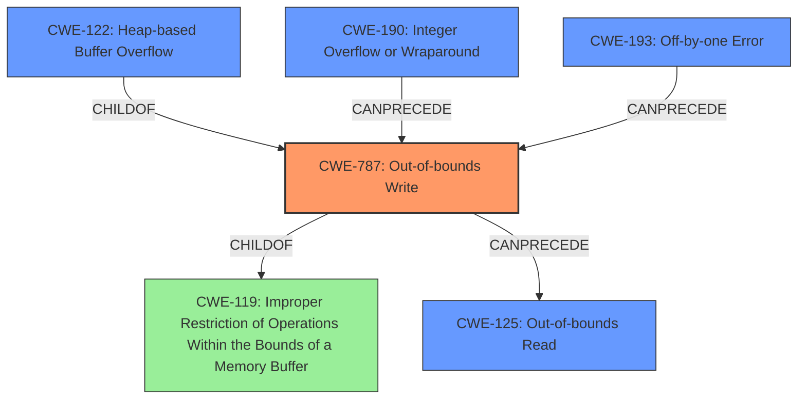

# Analysis Report for CVE-2021-26252

# Vulnerability Analysis Report: CVE-2021-26252

## Description

A flaw was found in htmldoc in v1.9.12. Heap buffer overflow in pspdf_prepare_page(),in ps-pdf.cxx may lead to execute arbitrary code and denial of service.

## Vulnerability Description Key Phrases

**Rootcause:** Heap buffer overflow
**Impact:** ['execute arbitrary code', 'denial of service']
**Product:** htmldoc
**Version:** v1.9.12
**Component:** pspdf_prepare_page() in ps-pdf.cxx

## Analysis (with Relationship Data)

# Summary
| CWE ID | CWE Name | Confidence | CWE Abstraction Level | CWE Vulnerability Mapping Label | CWE-Vulnerability Mapping Notes |
|---|---|---|---|---|---|
| CWE-787 | Out-of-bounds Write | 0.95 | Base | Primary | Allowed |
| CWE-122 | Heap-based Buffer Overflow | 0.75 | Variant | Secondary | Allowed |
| CWE-125 | Out-of-bounds Read | 0.65 | Base | Secondary | Allowed |
| CWE-190 | Integer Overflow or Wraparound | 0.60 | Base | Secondary | Allowed |

## Evidence and Confidence

*   **Confidence Score:** 0.90
*   **Evidence Strength:** HIGH

- **Analysis and Justification:**
  - *Explanation:* The vulnerability is described as a **heap buffer overflow** in the `pspdf_prepare_page()` function of htmldoc. This directly corresponds to **CWE-787** (Out-of-bounds Write) because a buffer overflow involves writing data beyond the intended boundary. The CVE reference summary confirms the **heap-buffer-overflow** as the root cause. Given the **heap** allocation context, **CWE-122** (Heap-based Buffer Overflow) is a more specific variant and is included as a secondary CWE.
  - *Relationship Analysis:* **CWE-787** is a base level CWE, providing a general description of out-of-bounds write issues. **CWE-122** is a variant of buffer overflow focusing on heap allocation. The report also shows that changes were made to validate the page number before using it as index, which suggests that **CWE-190** (Integer Overflow or Wraparound) could also be a contributing factor since the page number is used as an index. **CWE-125** (Out-of-bounds Read) is also listed since the crash could be triggered by reading out of bounds after the write.

- **Confidence Score:**
  - Confidence: 0.95 (High confidence due to direct evidence of a heap buffer overflow and confirmation from CVE reference materials)

---

## Criticism of Analysis

Okay, I've reviewed the analysis against the provided full CWE specifications. Here's a breakdown of my critique:

**Overall Assessment:**

The analysis is generally good and well-reasoned. The primary CWE selection of **CWE-787 (Out-of-bounds Write)** is accurate and well-supported.  The inclusion of secondary CWEs like **CWE-122 (Heap-based Buffer Overflow)**, **CWE-125 (Out-of-bounds Read)**, and **CWE-190 (Integer Overflow or Wraparound)** enhances the analysis by capturing potential contributing factors and variants of the main vulnerability. The confidence levels are appropriate given the available information.

**Specific Points of Critique and Suggestions:**

1.  **CWE-787 (Out-of-bounds Write) - Primary CWE:**

    *   **Strengths:** The justification for using CWE-787 is solid.  The description clearly states "heap buffer overflow," which directly implies an out-of-bounds write. The base CWE is suitable for describing the general issue of writing outside of the allocated region.
    *   **Suggestions:** None.

2.  **CWE-122 (Heap-based Buffer Overflow) - Secondary CWE:**

    *   **Strengths:**  Since the vulnerability is explicitly described as a *heap* buffer overflow, assigning CWE-122 as a secondary CWE is appropriate. It provides more specific context compared to the base CWE-787.
    *   **Suggestions:** None.

3.  **CWE-125 (Out-of-bounds Read) - Secondary CWE:**

    *   **Strengths:** Including CWE-125 is reasonable, as a crash (Denial of Service) could result from an attempt to *read* data from an invalid memory location *after* the out-of-bounds write has corrupted memory.
    *   **Suggestions:** None.

4.  **CWE-190 (Integer Overflow or Wraparound) - Secondary CWE:**

    *   **Strengths:** The reasoning for including CWE-190 is strong. The summary mentions that the fix involved validating the page number before using it as an index. This strongly suggests the possibility of an integer overflow leading to an out-of-bounds access.
    *   **Suggestions:**  The description can be strengthed by adding that an unvalidated page number could be a large integer, causing an overflow when used to calculate buffer sizes or indices.

5.  **Retriever Results:**

    *   The retriever results contain more CWEs. Some may be useful to add as secondary CWEs.
        *   **CWE-193:** Off-by-one Error can occur if there is an issue when performing a calculation that involves an array or buffer with a size that is off by one when indexing an array.

6. **Mitigations:**

    *   The analysis doesn't mention specific mitigations, which could be improved.
    *   For CWE-787/122, the most relevant mitigations would include using languages/compilers with automatic bounds checking or employing safe string libraries/frameworks. Compiler-level buffer overflow detection mechanisms (like /GS flag in MSVC or FORTIFY\_SOURCE in GCC) would also be relevant during build.
    *   For CWE-190, using safe integer handling packages (like SafeInt in C++) and ensuring proper input validation on the page number would be key mitigations.

7. **Confidence Scores:**

* The confidence score for CWE-787 is well justified with direct evidence. For the other CWEs, the confidence is lower.

**Revised Summary Table:**

| CWE ID  | CWE Name                               | Confidence | CWE Abstraction Level | CWE Vulnerability Mapping Label | CWE-Vulnerability Mapping Notes                                                                                                                                                                                                                                                                                                               |
| :------ | :------------------------------------- | :--------- | :-------------------- | :------------------------------ | :--------------------------------------------------------------------------------------------------------------------------------------------------------------------------------------------------------------------------------------------------------------------------------------------------------------------------------------------- |
| CWE-787 | Out-of-bounds Write                  | 0.95       | Base                  | Primary                       | Allowed                                                                                                                                                                                                                                                                                                                                       |
| CWE-122 | Heap-based Buffer Overflow           | 0.80       | Variant               | Secondary                     | Allowed                                                                                                                                                                                                                                                                                                                                       |
| CWE-190 | Integer Overflow or Wraparound     | 0.70       | Base                  | Secondary                     | Allowed - Unvalidated page number may be a large integer, causing an overflow when used to calculate buffer sizes or indices.                                                                                                                                                                                                           |
| CWE-125 | Out-of-bounds Read                  | 0.65       | Base                  | Secondary                     | Allowed - A crash can result from attempting to read from invalid memory after corruption due to the buffer overflow.                                                                                                                                                                                                                             |
| CWE-193 | Off-by-one Error                  | 0.50       | Base                  | Secondary                     | Allowed - Off by one error involved in the calculation of buffer size when indexing the page number.                                                                                                                                                                                                                             |

**In summary:** The analysis provides a solid base for identifying the core vulnerability and its potential contributing factors. By incorporating the suggested enhancements, especially related to specific mitigations, the analysis can become even more comprehensive and actionable. The inclusion of CWE-193 as a secondary CWE is useful to add based on the retriever results.

## Final Resolution

# Summary
| CWE ID | CWE Name | Confidence | CWE Abstraction Level | CWE Vulnerability Mapping Label | CWE-Vulnerability Mapping Notes |
|---|---|---|---|---|---|
| **CWE-787** | **Out-of-bounds Write** | 0.95 | Base | Primary | Allowed |
| **CWE-122** | **Heap-based Buffer Overflow** | 0.80 | Variant | Secondary | Allowed |
| **CWE-190** | **Integer Overflow or Wraparound** | 0.70 | Base | Secondary | Allowed - Unvalidated page number may be a large integer, causing an overflow when used to calculate buffer sizes or indices. |
| **CWE-125** | **Out-of-bounds Read** | 0.65 | Base | Secondary | Allowed - A crash can result from attempting to read from invalid memory after corruption due to the buffer overflow. |
| **CWE-193** | **Off-by-one Error** | 0.50 | Base | Secondary | Allowed - Off by one error involved in the calculation of buffer size when indexing the page number. |

## Evidence and Confidence

*   **Confidence Score:** 0.90
*   **Evidence Strength:** HIGH

## Relationship Analysis
The analysis considers the parent-child relationships, particularly how **CWE-122 (Heap-based Buffer Overflow)** is a specific type of **CWE-787 (Out-of-bounds Write)**. The inclusion of **CWE-190 (Integer Overflow or Wraparound)** suggests a vulnerability chain where an integer overflow could precede and contribute to the out-of-bounds write. **CWE-125 (Out-of-bounds Read)** is included as a potential consequence of the **out-of-bounds write**. The retriever results suggest **CWE-193 (Off-by-one Error)**.

## Vulnerability Chain
The vulnerability chain starts with a potential **CWE-190 (Integer Overflow or Wraparound)** when handling the page number. This can lead to incorrect buffer size calculation (**CWE-131**), potentially also involving **CWE-193 (Off-by-one Error)**. This leads to **CWE-787 (Out-of-bounds Write)**, specifically a **CWE-122 (Heap-based Buffer Overflow)**. As a consequence, there might be a **CWE-125 (Out-of-bounds Read)**, causing a crash and denial of service.

## Summary of Analysis
The initial analysis correctly identifies **CWE-787 (Out-of-bounds Write)** as the primary issue given the "heap buffer overflow" description. The criticism enhances the analysis by suggesting a potential vulnerability chain. The changes made to validate the page number before using it as an index, provides the evidence that **CWE-190 (Integer Overflow or Wraparound)** could be a contributing factor. The retriever results also support the inclusion of **CWE-193 (Off-by-one Error)**.

The final selection is based on the evidence of a heap buffer overflow and the relationships between the CWEs. **CWE-787** is a base CWE, and **CWE-122** is a more specific variant. **CWE-190, CWE-193, and CWE-125** are included as contributing factors or consequences. These CWEs are at the optimal level of specificity given the available information.

*Report generated on 2025-03-17 23:27:48*
