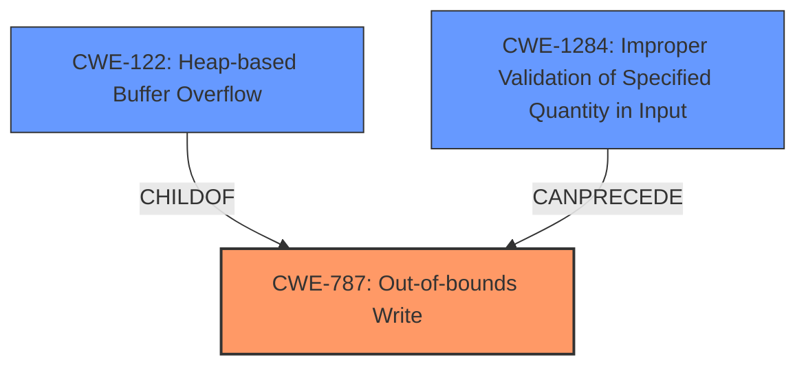

# Analysis Report for CVE-2021-26259

# Vulnerability Analysis Report: CVE-2021-26259

## Description

A flaw was found in htmldoc in v1.9.12. Heap buffer overflow in render_table_row(),in ps-pdf.cxx may lead to arbitrary code execution and denial of service.

## Vulnerability Description Key Phrases

**Rootcause:** Heap buffer overflow
**Impact:** ['arbitrary code execution', 'denial of service']
**Product:** htmldoc
**Version:** v1.9.12
**Component:** render_table_row() in ps-pdf.cxx

## Analysis (with Relationship Data)

# Summary
| CWE ID | CWE Name | Confidence | CWE Abstraction Level | CWE Vulnerability Mapping Label | CWE-Vulnerability Mapping Notes |
|---|---|---|---|---|---|
| CWE-122 | Heap-based Buffer Overflow | 0.95 | Variant | Allowed | Primary CWE |
| CWE-1284 | Improper Validation of Specified Quantity in Input | 0.75 | Base | Allowed | Secondary Candidate |

## Evidence and Confidence

*   **Confidence Score:** 0.90
*   **Evidence Strength:** HIGH

- **Analysis and Justification:**  
  - *Explanation:* The vulnerability is described as a "**Heap buffer overflow**" in the `render_table_row()` function of `ps-pdf.cxx` within `htmldoc`. The CVE Reference Links Content Summary confirms that a crafted HTML document with a large or invalid border attribute triggers this overflow. The code **does not properly validate the `border` attribute**, leading to data being written beyond the allocated buffer size on the heap. Therefore, CWE-122 (Heap-based Buffer Overflow) is the most accurate primary mapping because it explicitly describes a buffer overflow occurring in the heap memory region. This aligns with the nature of the vulnerability and the affected memory region. The Usage is "Allowed" according to MITRE.
  - *Relationship Analysis:* CWE-122 is a variant of CWE-119 (Improper Restriction of Operations within the Bounds of a Memory Buffer), providing more specific context regarding the location of the overflow. CWE-787 (Out-of-bounds Write) is a parent of CWE-122. Also, the content summary states that the vulnerability is caused by **insufficient input validation** of the `border` attribute, suggesting CWE-1284 as a secondary mapping.

- **Confidence Score:**  
  - Confidence: 0.95 (High confidence due to explicit mention of heap buffer overflow and supporting details)

---
- **Analysis and Justification:**  
  - *Explanation:* The CVE Reference Links Content Summary notes that "**Insufficient Input Validation**" of the `border` attribute in the HTML `<table>` tag is a contributing factor. Specifically, the code "**does not properly validate the `border` attribute** of the HTML `<table>` tag. Specifically, it fails to check if the border value is within a reasonable range and can result in an extremely large value." CWE-1284 (Improper Validation of Specified Quantity in Input) accurately describes this aspect, where the "quantity" is the size of the border. The lack of validation on this quantity leads to the allocation of an excessively large buffer on the heap, which is then overflowed. This complements the primary CWE-122 by detailing the root cause of the heap overflow, which is a failure to validate the input size.
  - *Relationship Analysis:* CWE-1284 is a base level CWE and a child of CWE-20 (Improper Input Validation). While the summary states the attacker needs to provide a crafted HTML file to trigger the overflow, insufficient input validation is the reason why the overflow occurs in the first place, which makes it a valid related CWE.

- **Confidence Score:**  
  - *Example:* Confidence: 0.75 (Medium confidence because while input validation is involved, the primary issue is the heap buffer overflow itself)

## Criticism of Analysis

Okay, I have reviewed the provided analysis and CWE specifications and offer the following critique:

**Overall Assessment:**

The analysis is generally good and identifies the primary CWE (CWE-122) correctly with a high degree of confidence. The inclusion of CWE-1284 as a secondary mapping is also reasonable and helpful in understanding the root cause.

**Critique of Individual CWE Mappings:**

*   **CWE-122: Heap-based Buffer Overflow**
    *   **Strengths:** The justification is well-supported by the vulnerability description.  The analysis clearly links the heap buffer overflow to the failure to validate the border attribute, which is directly allocated on the heap.
    *   **Weaknesses:** While CWE-122 is the most direct mapping for the *type* of vulnerability, it could be argued that CWE-787 (Out-of-bounds Write) is a better *base* CWE.  CWE-122 is a *variant* of CWE-787 and provides the specific location, while CWE-787 describes more precisely *what* happens: memory is written past the intended boundaries.
    *   **Improvement Suggestions:**  Consider stating the relationship between CWE-122 and CWE-787, noting that CWE-122 provides a specific *location* for the out-of-bounds write.
    *   **Confidence:** Justified and appropriate.

*   **CWE-1284: Improper Validation of Specified Quantity in Input**
    *   **Strengths:**  The analysis correctly identifies the lack of input validation on the "border" attribute as a contributing factor. Linking the "quantity" to the size of the border is accurate.
    *   **Weaknesses:** The confidence level of 0.75 is appropriate. The primary driver for the vulnerability is still the heap overflow, and the *lack* of validation *enables* the overflow but isn't necessarily the central event itself. CWE-20 itself is discouraged, and the guidance suggests to use a more specific variant where applicable (such as CWE-1284 in this instance).
    *   **Improvement Suggestions:** While sufficient, consider briefly discussing why the use of the "border" size makes the code vulnerable to an out-of-bounds write.
    *   **Confidence:** Justified and appropriate.

**Critique of Other Retriever Results:**

The Top Combined Retriever Results also point to some other potential relevant CWEs:

*   **CWE-193: Off-by-one Error:**  This is unlikely, as the overflow is a result of a size mismatch rather than an "off-by-one" in a loop or calculation. Should be disregarded.
*   **CWE-190: Integer Overflow or Wraparound:** If the border size is an integer, and if the multiplication of the border size with some other factor causes an integer overflow which result in a smaller buffer being allocated, then CWE-190 could be relevant, however, the description doesn't go into that detail, making it unlikely.
*   **CWE-125: Out-of-bounds Read:** This is not applicable as it's an Out-of-bounds Write. Should be disregarded.
*   **CWE-121: Stack-based Buffer Overflow:** This is incorrect as the vulnerability is a Heap-based Buffer Overflow. Should be disregarded.
*   **CWE-835: Loop with Unreachable Exit Condition ('Infinite Loop'):** This is not applicable and is likely a false positive.
*   **CWE-787: Out-of-bounds Write:** As previously stated, CWE-787 is highly relevant and is a parent of CWE-122.
*   **CWE-131: Incorrect Calculation of Buffer Size:** This is also related, as the incorrect handling of a large size due to missing validation is a factor in calculating the appropriate buffer size.
*   **CWE-126: Buffer Over-read:** This is incorrect as it's an Out-of-bounds Write.
*   **CWE-120: Buffer Copy without Checking Size of Input ('Classic Buffer Overflow'):** This could be considered if the vulnerable code involves copying data into the heap allocated buffer without checking the size of the data being copied.

**General Improvements:**

*   **Chaining:** While the analysis mentions relationships between CWEs, it could be made clearer through explicit chaining (e.g., "CWE-1284 -> CWE-122" to indicate that improper input validation leads to a heap-based buffer overflow).
*   **Clarity on Buffer Size Issue:** The analysis could benefit from a more explicit explanation of how the unvalidated `border` attribute directly affects the buffer allocation size. A sentence like "The unvalidated 'border' attribute is used to calculate the size of a buffer on the heap; a large border value results in an attempt to allocate an excessively large buffer" would be helpful.
*   **Mitigation Discussion:** While not strictly required, briefly mentioning potential mitigations (perhaps drawing from the CWE specifications) could strengthen the analysis. For example, "Mitigation involves validating the border attribute to ensure it is within acceptable limits, preventing an excessively large buffer allocation."

**Revised Summary Table (Incorporating Suggestions):**

| CWE ID | CWE Name | Confidence | CWE Abstraction Level | CWE Vulnerability Mapping Label | CWE-Vulnerability Mapping Notes |
|---|---|---|---|---|---|
| CWE-122 | Heap-based Buffer Overflow | 0.95 | Variant | Allowed | Primary CWE; location of out-of-bounds write. |
| CWE-1284 | Improper Validation of Specified Quantity in Input | 0.75 | Base | Allowed | Secondary Candidate; unvalidated 'border' size leads to large allocation. |
| CWE-787 | Out-of-bounds Write | 0.60 | Base | Allowed | Contributing; improper write outside buffer boundary. |

By incorporating these suggestions, the analysis can provide a more comprehensive and nuanced understanding of the vulnerability.

## Final Resolution

# Summary
| CWE ID | CWE Name | Confidence | CWE Abstraction Level | CWE Vulnerability Mapping Label | CWE-Vulnerability Mapping Notes |
|---|---|---|---|---|---|
| **CWE-787** | **Out-of-bounds Write** | 0.95 | Base | Allowed | Primary CWE; Improper write outside buffer boundary. |
| CWE-1284 | Improper Validation of Specified Quantity in Input | 0.75 | Base | Allowed | Secondary Candidate; unvalidated 'border' size leads to large allocation. |

## Evidence and Confidence

*   **Confidence Score:** 0.90
*   **Evidence Strength:** HIGH

## Relationship Analysis
The primary relationship impacting the decision is the parent-child relationship between CWE-787 (**Out-of-bounds Write**) and CWE-122 (Heap-based Buffer Overflow). While the vulnerability manifests as a heap-based buffer overflow, the root cause is an out-of-bounds write operation. CWE-787 is a more general **WEAKNESS** that accurately describes the core issue. CWE-1284 (Improper Validation of Specified Quantity in Input) contributes to the vulnerability chain by allowing an excessively large buffer allocation, which is then overflowed due to the **OUT-OF-BOUNDS WRITE**.

## Vulnerability Chain
The vulnerability chain begins with CWE-1284 (Improper Validation of Specified Quantity in Input). The product **does not properly validate the `border` attribute**, allowing a large or invalid size. This leads to an attempt to allocate an excessively large buffer on the heap. The subsequent write operation then overflows this buffer, resulting in CWE-787 (**Out-of-bounds Write**), which overwrites memory beyond the allocated buffer boundaries.

## Summary of Analysis
The initial analysis correctly identified CWE-122 (Heap-based Buffer Overflow) as a significant aspect of the vulnerability. However, the criticism highlighted the importance of identifying the base **WEAKNESS**, which is the **OUT-OF-BOUNDS WRITE**.
The vulnerability description states, "Heap buffer overflow in render_table_row(),in ps-pdf.cxx may lead to arbitrary code execution and denial of service."
The content summary adds, "Insufficient Input Validation of the border attribute in the HTML <table> tag is a contributing factor."

Based on the CWE descriptions and relationships, CWE-787 (**Out-of-bounds Write**) is the most appropriate primary CWE because it describes the fundamental action causing the vulnerability. CWE-122 is a more specific variant, providing context about the location of the overflow (heap), but CWE-787 captures the core issue more accurately. CWE-1284 remains a relevant secondary CWE because it explains how the excessively large buffer allocation becomes possible in the first place.

My decision is based on a combination of the provided evidence, the CWE relationships, and the need to identify the most fundamental **WEAKNESS**. By mapping the vulnerability to CWE-787 (**Out-of-bounds Write**) as the primary cause, we accurately represent the core issue, while still acknowledging the contribution of CWE-1284.

CWE-787 (**Out-of-bounds Write**) is selected as the primary CWE as it is at the optimal level of specificity, representing the **ROOTCAUSE** of the vulnerability.

*Report generated on 2025-03-17 23:28:41*
