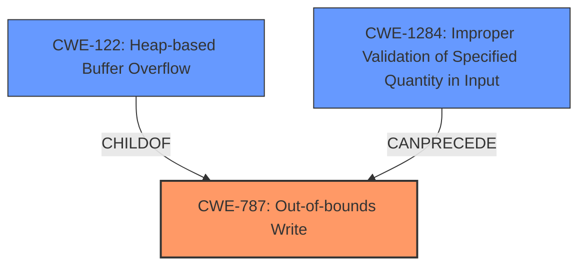

# Final Resolution for CVE-2021-26259

# Summary
| CWE ID | CWE Name | Confidence | CWE Abstraction Level | CWE Vulnerability Mapping Label | CWE-Vulnerability Mapping Notes |
|---|---|---|---|---|---|
| **CWE-787** | **Out-of-bounds Write** | 0.95 | Base | Allowed | Primary CWE; Improper write outside buffer boundary. |
| CWE-1284 | Improper Validation of Specified Quantity in Input | 0.75 | Base | Allowed | Secondary Candidate; unvalidated 'border' size leads to large allocation. |

## Evidence and Confidence

*   **Confidence Score:** 0.90
*   **Evidence Strength:** HIGH

## Relationship Analysis
The primary relationship impacting the decision is the parent-child relationship between CWE-787 (**Out-of-bounds Write**) and CWE-122 (Heap-based Buffer Overflow). While the vulnerability manifests as a heap-based buffer overflow, the root cause is an out-of-bounds write operation. CWE-787 is a more general **WEAKNESS** that accurately describes the core issue. CWE-1284 (Improper Validation of Specified Quantity in Input) contributes to the vulnerability chain by allowing an excessively large buffer allocation, which is then overflowed due to the **OUT-OF-BOUNDS WRITE**.

## Vulnerability Chain
The vulnerability chain begins with CWE-1284 (Improper Validation of Specified Quantity in Input). The product **does not properly validate the `border` attribute**, allowing a large or invalid size. This leads to an attempt to allocate an excessively large buffer on the heap. The subsequent write operation then overflows this buffer, resulting in CWE-787 (**Out-of-bounds Write**), which overwrites memory beyond the allocated buffer boundaries.

## Summary of Analysis
The initial analysis correctly identified CWE-122 (Heap-based Buffer Overflow) as a significant aspect of the vulnerability. However, the criticism highlighted the importance of identifying the base **WEAKNESS**, which is the **OUT-OF-BOUNDS WRITE**.
The vulnerability description states, "Heap buffer overflow in render_table_row(),in ps-pdf.cxx may lead to arbitrary code execution and denial of service."
The content summary adds, "Insufficient Input Validation of the border attribute in the HTML <table> tag is a contributing factor."

Based on the CWE descriptions and relationships, CWE-787 (**Out-of-bounds Write**) is the most appropriate primary CWE because it describes the fundamental action causing the vulnerability. CWE-122 is a more specific variant, providing context about the location of the overflow (heap), but CWE-787 captures the core issue more accurately. CWE-1284 remains a relevant secondary CWE because it explains how the excessively large buffer allocation becomes possible in the first place.

My decision is based on a combination of the provided evidence, the CWE relationships, and the need to identify the most fundamental **WEAKNESS**. By mapping the vulnerability to CWE-787 (**Out-of-bounds Write**) as the primary cause, we accurately represent the core issue, while still acknowledging the contribution of CWE-1284.

CWE-787 (**Out-of-bounds Write**) is selected as the primary CWE as it is at the optimal level of specificity, representing the **ROOTCAUSE** of the vulnerability.