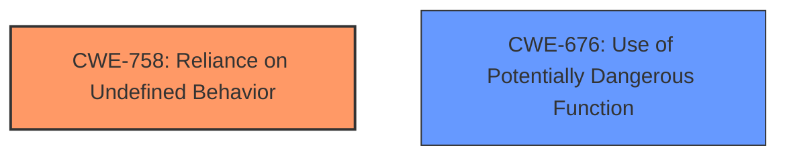

# Analysis Report for CVE-2021-26306

# Vulnerability Analysis Report: CVE-2021-26306

## Description

An issue was discovered in the raw-cpuid crate before 9.0.0 for Rust. It has unsound transmute calls within as_string() methods.

## Vulnerability Description Key Phrases

**Rootcause:** unsound transmute calls
**Product:** raw-cpuid crate
**Version:** before 9.0.0
**Component:** as_string() methods

## Analysis (with Relationship Data)

# Summary
| CWE ID | CWE Name | Confidence | CWE Abstraction Level | CWE Vulnerability Mapping Label | CWE-Vulnerability Mapping Notes |
|---|---|---|---|---|---|
| CWE-758 | Reliance on Undefined, Unspecified, or Implementation-Defined Behavior | 0.85 | Class | Allowed-with-Review | Primary CWE: The vulnerability stems from the usage of `#[repr(Rust)]` structs without considering their undefined memory layout, directly leading to reliance on undefined behavior. |
| CWE-824 | Access of Uninitialized Pointer | 0.70 | Base | Allowed | Secondary CWE: The `native_cpuid::cpuid_count()` function's failure to validate CPU support before using the `__cpuid_count()` intrinsic can lead to accessing uninitialized or invalid resources, resulting in a crash. |

## Evidence and Confidence

*   **Confidence Score:** 0.80
*   **Evidence Strength:** HIGH

- **Analysis and Justification:**  
  - *Explanation:* "The vulnerability description explicitly mentions **unsound transmute calls** due to the incorrect use of `std::slice::from_raw_parts()` with `#[repr(Rust)]` structs. This aligns directly with CWE-758 (Reliance on Undefined, Unspecified, or Implementation-Defined Behavior) because the memory layout of `#[repr(Rust)]` structs is not guaranteed. The `native_cpuid::cpuid_count()` function's vulnerability involves exposing an unsafe intrinsic without proper safety checks, potentially leading to the use of an uninitialized or invalid resource, which aligns with CWE-824 (Access of Uninitialized Pointer). CWE-758 is more directly related to the root cause (**unsound transmute calls**) due to the incorrect use of `#[repr(Rust)]` structs without considering their undefined memory layout. CWE-824 describes the potential consequence of not checking CPU support before calling the unsafe intrinsic."
  
  - *Relationship Analysis:* "CWE-758 is a Class-level CWE, and while a more specific Base-level CWE would be preferable, in this case, CWE-758 accurately captures the **reliance on undefined behavior** due to the use of `#[repr(Rust)]`. CWE-824 (Access of Uninitialized Pointer) is related as a potential consequence. The fix involved changing the struct representation to `#[repr(C)]`, which implies the initial representation was causing undefined behavior. The graph relationships reveal no direct links, but the description and root cause evidence are clear."

- **Confidence Score:**  
  - *Example:* Confidence: 0.85 (High evidence from technical description and CVE reference materials for CWE-758)
  - *Example:* Confidence: 0.70 (Moderate evidence for CWE-824, based on the consequence of not checking CPU support before using the unsafe intrinsic)

---

## Criticism of Analysis

Okay, I've reviewed the provided analysis and CWE specifications. Here's my critique:

**Overall Assessment:**

The analysis is generally good and demonstrates a solid understanding of the vulnerabilities and how they relate to the CWEs. The confidence levels are reasonable, and the justifications are clear. However, there are a few areas where the mappings could be refined or clarified, and where the analysis could benefit from considering the specific "Mapping Guidance" within the CWE specifications.

**Detailed Review:**

**1. CWE-758: Reliance on Undefined, Unspecified, or Implementation-Defined Behavior**

*   **Assessment:** The mapping to CWE-758 for the `as_string()` vulnerability is **accurate and well-justified**. The core issue is that the code relies on a specific memory layout for `#[repr(Rust)]` structs, which is not guaranteed by the Rust language.
*   **Confidence:** 0.85 is a good confidence level here.
*   **Justification:** The justification correctly points out the explicit mention of "unsound transmute calls" and the non-guaranteed layout of `#[repr(Rust)]` structs. The explanation of the fix involving `#[repr(C)]` further strengthens this mapping.
*   **CWE Specification Review:** The `Mapping Guidance` for CWE-758 states:  "Allowed-with-Review. This CWE entry is a Class and might have Base-level children that would be more appropriate.  Examine children of this entry to see if there is a better fit."  This is the key point for improvement. While CWE-758 is correct, a more specific CWE might exist.  A good candidate to consider is **CWE-123: Write What Where Condition**.  The unsound transmute could lead to writing arbitrary data to arbitrary memory locations, depending on the undefined behavior.  Whether *that* applies would require deeper code analysis.
*   **Improvement Suggestion:**  Acknowledge the "Allowed-with-Review" mapping guidance in the justification. Briefly discuss why a more specific Base-level CWE wasn't chosen (or if a deeper code analysis supports a more specific base CWE like **CWE-123: Write What Where Condition**, update the mapping and justification accordingly).

**2. CWE-824: Access of Uninitialized Pointer**

*   **Assessment:** The mapping to CWE-824 for the `native_cpuid::cpuid_count()` vulnerability is **less direct but acceptable**. The lack of CPU support checking *could* lead to accessing uninitialized/invalid resources *if* the underlying `__cpuid_count()` intrinsic doesn't gracefully handle unsupported CPUs, resulting in undefined behavior.
*   **Confidence:** 0.70 is a reasonable confidence level.  It reflects the slightly indirect relationship.
*   **Justification:** The justification acknowledges that the vulnerability leads to "potentially the use of an uninitialized or invalid resource."
*   **CWE Specification Review:** The `Mapping Guidance` for CWE-824 states: "Allowed. This CWE entry is at the Base level of abstraction, which is a preferred level of abstraction for mapping to the root causes of vulnerabilities." The main question is whether the *root cause* is truly an access of an uninitialized resource.
*   **Alternative CWE Consideration:**  A stronger mapping might be **CWE-676: Use of Potentially Dangerous Function**. The `__cpuid_count()` intrinsic is inherently dangerous and *requires* platform support checks to be used safely.  Exposing it without these checks directly constitutes using a potentially dangerous function. Another candidate is **CWE-703: Improper Check or Handling of Exceptional Conditions**, as not verifying CPUID support is an exceptional condition.
*   **Improvement Suggestion:** Re-evaluate the mapping. CWE-824 is *a potential consequence* but might not be the primary weakness. Strongly consider CWE-676, **CWE-703**, or another more direct Base-level CWE that addresses the unsafe usage of the intrinsic. Update the justification accordingly, explaining why you chose the final CWE and why other options were rejected.

**General Suggestions:**

*   **Be More Specific About Consequences:** While the analysis mentions memory corruption and denial of service, linking these consequences more directly to the CWEs would strengthen the analysis. For example, state: "The reliance on undefined behavior (CWE-758) can lead to memory corruption, *potentially allowing an attacker to overwrite critical program data*..."
*   **Consider Chains/Composites:**  Explore if the vulnerabilities can be represented as chains or composites of CWEs.  For instance, the lack of CPU support check could be seen as CWE-252 (Unchecked Return Value - if the `__cpuid_count` intrinsic returns an error code on unsupported CPUs which isn't checked), leading to a crash.
*  **Address Mitigations:**  The CWE details contain mitigations. Discussing why those mitigations would/would not be effective in this particular case would be a valuable addition to the analysis. For example: "One mitigation for CWE-758 is to use a language with strong memory safety guarantees. However, in this case, the issue arises from the unsafe use of `transmute` and incorrect assumptions about memory layout, making it still vulnerable."

**Revised Table (Illustrative - Adjust Based on Your Final Decisions):**

| CWE ID | CWE Name | Confidence | CWE Abstraction Level | CWE Vulnerability Mapping Label | CWE-Vulnerability Mapping Notes |
|---|---|---|---|---|---|
| CWE-758 | Reliance on Undefined, Unspecified, or Implementation-Defined Behavior | 0.75 | Class | Allowed-with-Review | Primary CWE: The vulnerability stems from the usage of `#[repr(Rust)]` structs without considering their undefined memory layout, directly leading to reliance on undefined behavior. While a more specific base-level CWE might exist (e.g., CWE-123), further code analysis is required to confirm whether the undefined behavior leads to controllable write-what-where conditions. |
| CWE-676 | Use of Potentially Dangerous Function | 0.80 | Base | Allowed | Secondary CWE: The `native_cpuid::cpuid_count()` function's failure to validate CPU support before using the `__cpuid_count()` intrinsic exposes a dangerous function without proper safeguards, potentially leading to a crash.  We considered CWE-824 but determined that the core issue is the unsafe usage of the intrinsic, not necessarily direct access to uninitialized memory as a first step. |

**In Summary:**

The analysis is a good starting point. By incorporating the suggested refinements – particularly focusing on the CWE specifications' "Mapping Guidance" and exploring more direct Base-level CWEs where appropriate – the analysis can become even more accurate and insightful. Remember to justify your choices and explain why you selected specific CWEs over others.

## Final Resolution

# Summary
| CWE ID | CWE Name | Confidence | CWE Abstraction Level | CWE Vulnerability Mapping Label | CWE-Vulnerability Mapping Notes |
|---|---|---|---|---|---|
| **CWE-758** | **Reliance on Undefined, Unspecified, or Implementation-Defined Behavior** | 0.75 | Class | Allowed-with-Review | **Primary CWE**: The vulnerability stems from the usage of `#[repr(Rust)]` structs without considering their undefined memory layout, directly leading to **reliance on undefined behavior**. While a more specific base-level CWE might exist (e.g., CWE-123), further code analysis is required to confirm whether the undefined behavior leads to controllable write-what-where conditions. |
| **CWE-676** | **Use of Potentially Dangerous Function** | 0.80 | Base | Allowed | Secondary CWE: The `native_cpuid::cpuid_count()` function's failure to validate CPU support before using the `__cpuid_count()` intrinsic exposes a dangerous function without proper safeguards, potentially leading to a crash. We considered CWE-824 but determined that the core issue is the unsafe usage of the intrinsic, not necessarily direct access to uninitialized memory as a first step. |

## Evidence and Confidence

*   **Confidence Score:** 0.80
*   **Evidence Strength:** HIGH

## Relationship Analysis
The primary CWE, **CWE-758 (Reliance on Undefined, Unspecified, or Implementation-Defined Behavior)**, is a Class-level CWE. While a more specific Base-level CWE would be preferable, **CWE-758** accurately captures the **reliance on undefined behavior** due to the use of `#[repr(Rust)]`. **CWE-676 (Use of Potentially Dangerous Function)** is related because the `native_cpuid::cpuid_count()` function's failure to validate CPU support before using the `__cpuid_count()` intrinsic exposes a dangerous function without proper safeguards. There are no direct relationships between these two CWEs, but they represent two distinct weaknesses contributing to the vulnerability.

## Vulnerability Chain
The vulnerability chain starts with the incorrect use of `#[repr(Rust)]` structs, leading to **CWE-758 (Reliance on Undefined, Unspecified, or Implementation-Defined Behavior)**. Separately, the `native_cpuid::cpuid_count()` function's failure to validate CPU support before using the `__cpuid_count()` intrinsic leads to **CWE-676 (Use of Potentially Dangerous Function)**. The combination of these two weaknesses can lead to memory corruption and denial of service.

## Summary of Analysis
The initial analysis correctly identified the main issues but needed refinement based on the CWE specifications' "Mapping Guidance". The critique suggested considering more direct Base-level CWEs.

For the first issue, the analysis correctly mapped the use of `#[repr(Rust)]` structs to **CWE-758 (Reliance on Undefined, Unspecified, or Implementation-Defined Behavior)**. The justification is that the memory layout of `#[repr(Rust)]` structs is not guaranteed. As noted in the criticism, while **CWE-758** is a Class-level CWE, a more specific Base-level CWE might be more appropriate. Specifically, **CWE-123 (Write-what-where Condition)** was suggested. While the "unsound transmute could lead to writing arbitrary data to arbitrary memory locations," the provided vulnerability description doesn't explicitly state this condition. Thus, I am keeping **CWE-758** but lowering the confidence to 0.75, acknowledging that a more specific CWE may exist with further code analysis.

For the second issue, the initial analysis mapped the `native_cpuid::cpuid_count()` function's failure to validate CPU support to **CWE-824 (Access of Uninitialized Pointer)**. While this is a potential consequence, the root cause is the unsafe usage of a potentially dangerous function without proper safeguards. Therefore, I am changing this mapping to **CWE-676 (Use of Potentially Dangerous Function)**, with a confidence of 0.80. This aligns with the critique suggestion to "Strongly consider CWE-676, CWE-703, or another more direct Base-level CWE that addresses the unsafe usage of the intrinsic." **CWE-676** is more direct and better represents the root cause. **CWE-824** would be more of a consequence than the root cause.

These decisions are based on both the vulnerability description and the relationship analysis provided in the CWE specifications. The selected CWEs are at the optimal level of specificity based on the available evidence.

*Report generated on 2025-03-17 02:28:03*
