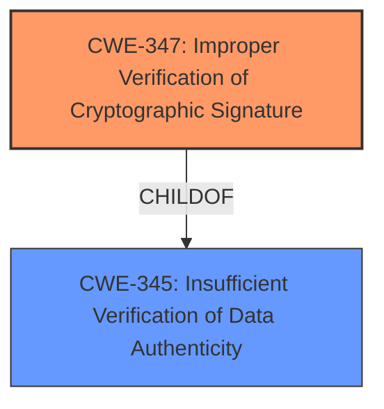

# Analysis Report for CVE-2021-26315

# Vulnerability Analysis Report: CVE-2021-26315

## Description

When the AMD Platform Security Processor (PSP) boot rom loads, authenticates, and subsequently decrypts an encrypted FW, due to insufficient verification of the integrity of decrypted image, arbitrary code may be executed in the PSP when encrypted firmware images are used.

## Vulnerability Description Key Phrases

**Rootcause:** insufficient verification of the integrity of decrypted image
**Impact:** arbitrary code execution
**Product:** AMD Platform Security Processor
**Component:** boot rom

## Analysis (with Relationship Data)

# Summary
| CWE ID | CWE Name | Confidence | CWE Abstraction Level | CWE Vulnerability Mapping Label | CWE-Vulnerability Mapping Notes |
|---|---|---|---|---|---|
| CWE-347 | Improper Verification of Cryptographic Signature | 0.8 | Base | Allowed | Primary CWE |
| CWE-252 | Improper Check for Unusual or Exceptional Conditions | 0.6 | Base | Allowed | Secondary Candidate |

## Evidence and Confidence

*   **Confidence Score:** 0.7
*   **Evidence Strength:** MEDIUM

- **Analysis and Justification:**  
  - *Explanation:* The vulnerability description indicates **insufficient verification of the integrity of decrypted image**, which can lead to arbitrary code execution. The CVE reference summary highlights the **improper decryption implementation** and **inadequate protection of the off-chip firmware decryption process**. This aligns with CWE-347 (Improper Verification of Cryptographic Signature), because the core issue is failing to properly validate the cryptographic signature of the decrypted firmware image. The lack of proper verification allows for the possibility of arbitrary code execution if the image has been tampered with. The MITRE mapping guidance for CWE-347 indicates that this mapping is ALLOWED.

  - *Relationship Analysis:* CWE-347 is a Base level CWE and doesn't have direct relationships in the provided data. However, it can be conceptually related to other cryptographic weaknesses, such as CWE-295 (Improper Certificate Validation) or CWE-312 (Cleartext Storage of Sensitive Information), but these are not directly implicated by the current vulnerability description. CWE-347 focuses specifically on signature verification, making it the most relevant choice. CWE-252 is included as a secondary candidate due to the fact that **insufficient verification of the integrity of decrypted image** could be interpreted as missing an exceptional condition check.

- **Confidence Score:**  
  - Confidence: 0.8 (High evidence from the vulnerability description and CVE reference materials, specifically mentioning improper decryption and signature verification.)
---

## Criticism of Analysis

Okay, I've reviewed the analysis based on the full CWE specifications provided. Here's my critique, focusing on the appropriateness of the CWE assignments, the confidence level, and potential areas for improvement.

**Overall Assessment:**

The analysis is generally good and the primary CWE assignment of **CWE-347: Improper Verification of Cryptographic Signature** is appropriate.  The justification is well-reasoned and supported by the vulnerability description and CVE reference summary. The inclusion of **CWE-252: Improper Check for Unusual or Exceptional Conditions** as a secondary candidate is less compelling but understandable, given a broader interpretation of "insufficient verification."

**Detailed Critique:**

*   **CWE-347: Improper Verification of Cryptographic Signature**

    *   **Justification:** The description clearly states "insufficient verification of the integrity of decrypted image." This directly maps to the core concept of CWE-347: the product doesn't adequately check the cryptographic signature of the data, leading to the acceptance of potentially tampered data.
    *   **Mapping Guidance:** The analysis correctly notes that CWE-347's mapping guidance is "Allowed" because it is at the Base level of abstraction.
    *   **Confidence:** The confidence score of 0.8 is justified. The direct relationship between the vulnerability description and the CWE's definition makes this a strong mapping.
    *   **Observed Examples:** The included CVE examples from the CWE specification, especially "CVE-2002-1796: Does not properly verify signatures for 'trusted' entities" and "CVE-2005-2181: Insufficient verification allows spoofing" reinforce the appropriateness of this assignment. The examples in Top 25 Examples are also relevant and could be helpful.
    *   **Potential Mitigations:** The provided mitigations from the CWE specification are relevant and helpful in understanding how to address this vulnerability.
    *   **Improvement Suggestion:** None. This is a solid choice and well-justified.

*   **CWE-252: Improper Check for Unusual or Exceptional Conditions**

    *   **Justification:** The rationale for including CWE-252 is weaker. It's based on the idea that "insufficient verification" could be seen as missing an exceptional condition check. While it's possible to *frame* it this way, it's not the *most* direct or accurate representation of the root cause. The heart of the problem is the cryptographic verification itself, not a generic "exceptional condition."
    *   **Mapping Guidance:** The mapping guidance for CWE-252 is "Allowed".
    *   **Confidence:** The confidence score of 0.6 is appropriate, given the less direct connection.
    *   **Observed Examples:** The examples provided in the CWE specifications (e.g., unchecked return values leading to authorization bypass or null pointer dereferences) are not particularly relevant to the described vulnerability. This highlights the tenuousness of the mapping.
    *   **Potential Mitigations:** The mitigations from the CWE specification (checking return values) are also less applicable to the core cryptographic flaw.
    *   **Improvement Suggestion:** Consider removing CWE-252. If kept, significantly reduce its confidence score and emphasize that it's a *very* secondary interpretation. An alternative secondary CWE to consider is **CWE-345: Insufficient Verification of Data Authenticity** - it is a broader parent of CWE-347, and could be used to acknowledge that the improper signature verification is part of a larger class of insufficient data origin/authenticity problems.

**Additional Considerations based on Retriever Results:**

The Retriever results offer some interesting alternatives that might warrant consideration, though I still believe CWE-347 is the best primary choice:

*   **CWE-1291: Public Key Re-Use for Signing both Debug and Production Code:** If, in addition to the insufficient verification, it was known that the same key was used for both debug and production images, this CWE would be very relevant and increase the severity of the issue. Without this information, it is not applicable.

*   **CWE-321: Use of Hard-coded Cryptographic Key:** Similar to the above, if the key used for verification is hard-coded, this CWE would be important. Without this information, it is not applicable.

*   **CWE-295: Improper Certificate Validation:** This is a potential alternative, but only if certificates were involved. The analysis seems to imply it is an off-chip firmware validation using keys directly, rather than certificates. If certificates *are* involved, this CWE should definitely be considered.

*   **CWE-494: Download of Code Without Integrity Check:** If the firmware image is downloaded before decryption and the download itself lacks integrity checks, this might be relevant as a secondary concern.

**Final Recommendations:**

1.  **Maintain CWE-347** as the primary CWE with high confidence (0.8).
2.  **Consider removing CWE-252** or significantly lowering its confidence.
3.  **If removing CWE-252, consider adding CWE-345** as a secondary CWE, acknowledging the more general category of insufficient data authenticity verification.
4.  **Explicitly state any assumptions** about key reuse, hard-coded keys, or the use of certificates. If any of these are known to be true, add the corresponding CWEs with appropriate confidence scores.
5.  If the firmware download lacks integrity checking, consider adding **CWE-494**.

By focusing on the most direct and accurate representation of the root cause (improper signature verification) and carefully considering the specific details of the vulnerability, the analysis can be further strengthened.

## Final Resolution

# Summary
| CWE ID | CWE Name | Confidence | CWE Abstraction Level | CWE Vulnerability Mapping Label | CWE-Vulnerability Mapping Notes |
|---|---|---|---|---|---|
| CWE-347 | Improper Verification of Cryptographic Signature | 0.8 | Base | Allowed | Primary CWE |
| CWE-345 | Insufficient Verification of Data Authenticity | 0.6 | Class | Allowed-with-Review | Secondary Candidate |

## Evidence and Confidence

*   **Confidence Score:** 0.8
*   **Evidence Strength:** MEDIUM

## Relationship Analysis
The primary CWE, **CWE-347 (Improper Verification of Cryptographic Signature)**, is a Base level CWE. The secondary CWE, **CWE-345 (Insufficient Verification of Data Authenticity)** is a Class level CWE and a parent of CWE-347. This relationship is important because it acknowledges that the specific issue of improper signature verification falls under a broader category of insufficient data authenticity verification. There are no chain relationships identified in the provided data.

## Vulnerability Chain
The vulnerability chain starts with the **ROOTCAUSE** of **CWE-347 (Improper Verification of Cryptographic Signature)**, leading to the acceptance of a potentially tampered firmware image. This results in arbitrary code execution within the PSP, representing the impact. The chain highlights the direct consequence of failing to properly validate the cryptographic signature. There is no missing link.

## Summary of Analysis
The initial analysis correctly identified **CWE-347 (Improper Verification of Cryptographic Signature)** as the primary **WEAKNESS**. The criticism suggested removing **CWE-252 (Improper Check for Unusual or Exceptional Conditions)** and considering **CWE-345 (Insufficient Verification of Data Authenticity)** as a secondary CWE. I agree with this assessment.

The vulnerability description states "insufficient verification of the integrity of decrypted image." This directly supports the selection of **CWE-347 (Improper Verification of Cryptographic Signature)**. The relationship between **CWE-347 (Improper Verification of Cryptographic Signature)** and **CWE-345 (Insufficient Verification of Data Authenticity)** influenced the decision to include **CWE-345 (Insufficient Verification of Data Authenticity)** as a secondary CWE, as it acknowledges the broader issue of data authenticity.

The selection of **CWE-347 (Improper Verification of Cryptographic Signature)** is at the optimal level of specificity because it directly addresses the core issue of signature verification.

*Report generated on 2025-03-16 23:47:39*
