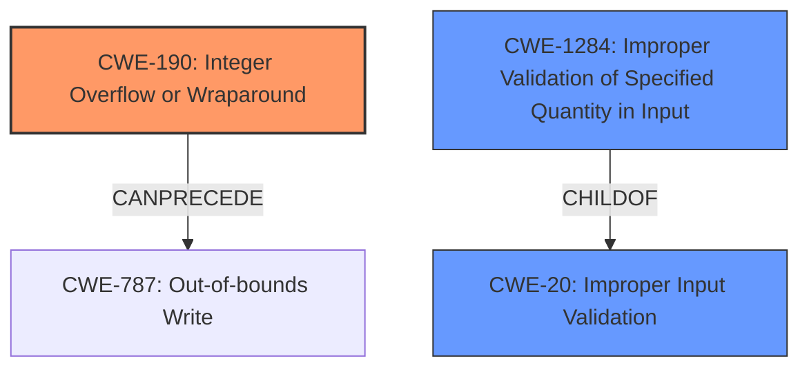

# Analysis Report for CVE-2021-26347

# Vulnerability Analysis Report: CVE-2021-26347

## Description

Failure to validate the integer operand in ASP (AMD Secure Processor) bootloader may allow an attacker to introduce an integer overflow in the L2 directory table in SPI flash resulting in a potential denial of service.

## Vulnerability Description Key Phrases

**Rootcause:** integer overflow
**Impact:** denial of service
**Attacker:** attacker
**Product:** AMD Secure Processor (ASP)

## Analysis (with Relationship Data)

# Summary
| CWE ID | CWE Name | Confidence | CWE Abstraction Level | CWE Vulnerability Mapping Label | CWE-Vulnerability Mapping Notes |
|---|---|---|---|---|---|
| CWE-190 | Integer Overflow or Wraparound | 1.0 | Base | Allowed | Primary CWE |

## Evidence and Confidence

*   **Confidence Score:** 1.0
*   **Evidence Strength:** HIGH

- **Analysis and Justification:**  
  - *Explanation:* The vulnerability description explicitly states "**integer overflow** in the L2 directory table in SPI flash." The CVE Reference Links Content Summary reinforces this by stating "Integer overflow vulnerability in the L2 directory table in SPI flash." CWE-190 (Integer Overflow or Wraparound) is a direct match for this vulnerability. The description of CWE-190 states: "The product performs a calculation that can produce an **integer overflow** or wraparound when the logic assumes that the resulting value will always be larger than the original value." This aligns precisely with the **rootcause** outlined in the vulnerability description. The usage for CWE-190 is ALLOWED.

  - *Relationship Analysis:* No direct relationships found but CWE-190 is related to numeric errors and improper calculations.

- **Confidence Score:**  
  - *Example:* Confidence: 1.0 (Direct match with high evidence from vulnerability description and CVE reference)

## Criticism of Analysis

Okay, here's a review of the provided analysis, incorporating the full CWE specifications to assess the accuracy and completeness of the CWE mapping, as well as consider potential alternative mappings and mitigations:

**Overall Assessment:**

The analysis correctly identifies CWE-190 (Integer Overflow or Wraparound) as the primary CWE. The confidence score of 1.0 is justified based on the explicit mention of "integer overflow" in the vulnerability description and CVE summary. The detailed justification provided is also accurate and well-reasoned. However, considering the context and the retriever results, the analysis could benefit from including CWE-20 and potentially CWE-1284 to capture the lack of input validation aspect.

**Detailed Review:**

| CWE ID | CWE Name | Confidence | CWE Abstraction Level | CWE Vulnerability Mapping Label | CWE-Vulnerability Mapping Notes | Review Comments |
|---|---|---|---|---|---|---|
| CWE-190 | Integer Overflow or Wraparound | 1.0 | Base | Allowed | Primary CWE | **Correct.** The analysis is accurate. The vulnerability description explicitly mentions integer overflow as the root cause. The provided justification is strong and aligns with the CWE-190 description. The provided examples from the database further support this analysis. |
| CWE-20 | Improper Input Validation | 0.6 | Class | Allowed |  | **Suggested Addition.** The description notes "Failure to validate the integer operand". CWE-20 is a parent of CWE-190, and while it's often discouraged to map directly to CWE-20, in this case it could be added in addition to CWE-190 to capture the broader issue of missing input validation. The `attacker` is able to supply/modify the integer operand. CWE-20 is an "Improper Input Validation" problem, so the lack of validation is a key element. The Mapping Guidance for CWE-20 states: "Consider lower-level children such as Improper Use of Validation Framework (CWE-1173) or improper validation involving specific types or properties of input such as Specified Quantity (CWE-1284); Specified Index, Position, or Offset (CWE-1285)". Since validation is missing, CWE-1284 is more appropriate and discussed below. |
| CWE-1284 | Improper Validation of Specified Quantity in Input | 0.5 | Base | Allowed |  | **Suggested Addition.** This could be considered instead of, or in addition to, CWE-20 to provide more detail on the lack of input validation. As previously mentioned, the vulnerability stems from "Failure to validate the integer operand," indicating that the ASP bootloader does not properly check the quantity. The mitigations for CWE-1284 also directly relate to this type of vulnerability. The retriever results also list this as the second highest rated CWE. |

**Justification for Suggested Additions:**

*   **CWE-20 & CWE-1284 - Input Validation:**  The vulnerability description mentions the "failure to validate the integer operand." This indicates a lack of proper input validation, which is a key aspect of this vulnerability. As the attacker is able to modify the operand, it is a key piece in the exploit.

**Mitigation Considerations:**

The analysis focuses on CWE-190's mitigations, which are relevant. However, including CWE-20 and/or CWE-1284 prompts consideration of additional mitigation strategies related to input validation:

*   **Input Validation (CWE-20 & CWE-1284):**
    *   **Phase:** Implementation
    *   **Description:** Implement robust input validation to ensure the integer operand falls within acceptable bounds. Use an "accept known good" approach, defining the acceptable range of values and rejecting any input outside that range.
    *   **Phase:** Architecture and Design
    *   **Description:** Consider using a language-theoretic security (LangSec) approach.

**Revised Summary Table:**

| CWE ID | CWE Name | Confidence | CWE Abstraction Level | CWE Vulnerability Mapping Label | CWE-Vulnerability Mapping Notes |
|---|---|---|---|---|---|
| CWE-190 | Integer Overflow or Wraparound | 1.0 | Base | Allowed | Primary CWE |
| CWE-1284 | Improper Validation of Specified Quantity in Input | 0.6 | Base | Allowed | Secondary CWE: captures the absence of input validation |

**Conclusion:**

The original analysis is sound in its identification of CWE-190 as the core vulnerability. However, adding CWE-1284 provides a more complete picture by explicitly addressing the lack of input validation on the integer operand, which is the direct cause of the vulnerability and a key aspect of the attack surface. This also enables the inclusion of additional relevant mitigation strategies. The retriever results and CVE description support this addition.

## Final Resolution

# Summary
| CWE ID | CWE Name | Confidence | CWE Abstraction Level | CWE Vulnerability Mapping Label | CWE-Vulnerability Mapping Notes |
|---|---|---|---|---|---|
| CWE-190 | Integer Overflow or Wraparound | 1.0 | Base | Allowed | Primary CWE |
| CWE-1284 | Improper Validation of Specified Quantity in Input | 0.6 | Base | Allowed | Secondary CWE: captures the absence of input validation |

## Evidence and Confidence

*   **Confidence Score:** 0.9
*   **Evidence Strength:** HIGH

## Relationship Analysis
The primary relationship considered is the parent-child relationship between CWE-20 (Improper Input Validation) and CWE-190 (**Integer Overflow or Wraparound**). While CWE-20 is a parent, it's too general. CWE-1284 (Improper Validation of Specified Quantity in Input) is considered as a more specific form of input validation failure, directly related to the vulnerability description's mention of "failure to validate the integer operand." The abstraction levels are considered, choosing Base level CWEs for optimal specificity.

## Vulnerability Chain
The vulnerability chain starts with the **ROOTCAUSE** being the **failure to validate the integer operand** (CWE-1284). This leads to an **integer overflow** (CWE-190) during the calculation of the L2 directory table size. The overflow results in an incorrect size being used, potentially leading to a denial of service (impact).

## Summary of Analysis
The initial analysis correctly identified CWE-190 (**Integer Overflow or Wraparound**) as a primary **WEAKNESS**. The criticism suggested adding CWE-20 (Improper Input Validation) to capture the broader issue of missing input validation. However, CWE-1284 (Improper Validation of Specified Quantity in Input) is a more specific and appropriate choice than CWE-20, since the description mentions "failure to validate the integer operand". The evidence supporting this decision comes directly from the vulnerability description: "Failure to validate the integer operand in ASP (AMD Secure Processor) bootloader may allow an attacker to introduce an integer overflow...". The graph relationships influenced the decision by highlighting the need for specificity; while CWE-20 is related, CWE-1284 provides a more accurate representation of the **ROOTCAUSE**. Both selected CWEs are at the Base level of abstraction, which is the optimal level for this vulnerability. Therefore, the final determination is to classify this vulnerability as CWE-190 (Primary) and CWE-1284 (Secondary).

*Report generated on 2025-03-17 23:29:15*
