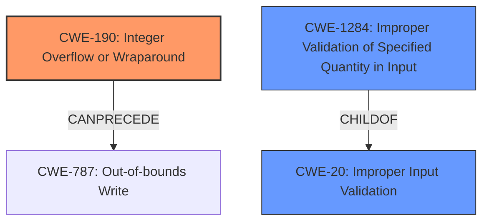

# Final Resolution for CVE-2021-26347

# Summary
| CWE ID | CWE Name | Confidence | CWE Abstraction Level | CWE Vulnerability Mapping Label | CWE-Vulnerability Mapping Notes |
|---|---|---|---|---|---|
| CWE-190 | Integer Overflow or Wraparound | 1.0 | Base | Allowed | Primary CWE |
| CWE-1284 | Improper Validation of Specified Quantity in Input | 0.6 | Base | Allowed | Secondary CWE: captures the absence of input validation |

## Evidence and Confidence

*   **Confidence Score:** 0.9
*   **Evidence Strength:** HIGH

## Relationship Analysis
The primary relationship considered is the parent-child relationship between CWE-20 (Improper Input Validation) and CWE-190 (**Integer Overflow or Wraparound**). While CWE-20 is a parent, it's too general. CWE-1284 (Improper Validation of Specified Quantity in Input) is considered as a more specific form of input validation failure, directly related to the vulnerability description's mention of "failure to validate the integer operand." The abstraction levels are considered, choosing Base level CWEs for optimal specificity.

## Vulnerability Chain
The vulnerability chain starts with the **ROOTCAUSE** being the **failure to validate the integer operand** (CWE-1284). This leads to an **integer overflow** (CWE-190) during the calculation of the L2 directory table size. The overflow results in an incorrect size being used, potentially leading to a denial of service (impact).

## Summary of Analysis
The initial analysis correctly identified CWE-190 (**Integer Overflow or Wraparound**) as a primary **WEAKNESS**. The criticism suggested adding CWE-20 (Improper Input Validation) to capture the broader issue of missing input validation. However, CWE-1284 (Improper Validation of Specified Quantity in Input) is a more specific and appropriate choice than CWE-20, since the description mentions "failure to validate the integer operand". The evidence supporting this decision comes directly from the vulnerability description: "Failure to validate the integer operand in ASP (AMD Secure Processor) bootloader may allow an attacker to introduce an integer overflow...". The graph relationships influenced the decision by highlighting the need for specificity; while CWE-20 is related, CWE-1284 provides a more accurate representation of the **ROOTCAUSE**. Both selected CWEs are at the Base level of abstraction, which is the optimal level for this vulnerability. Therefore, the final determination is to classify this vulnerability as CWE-190 (Primary) and CWE-1284 (Secondary).