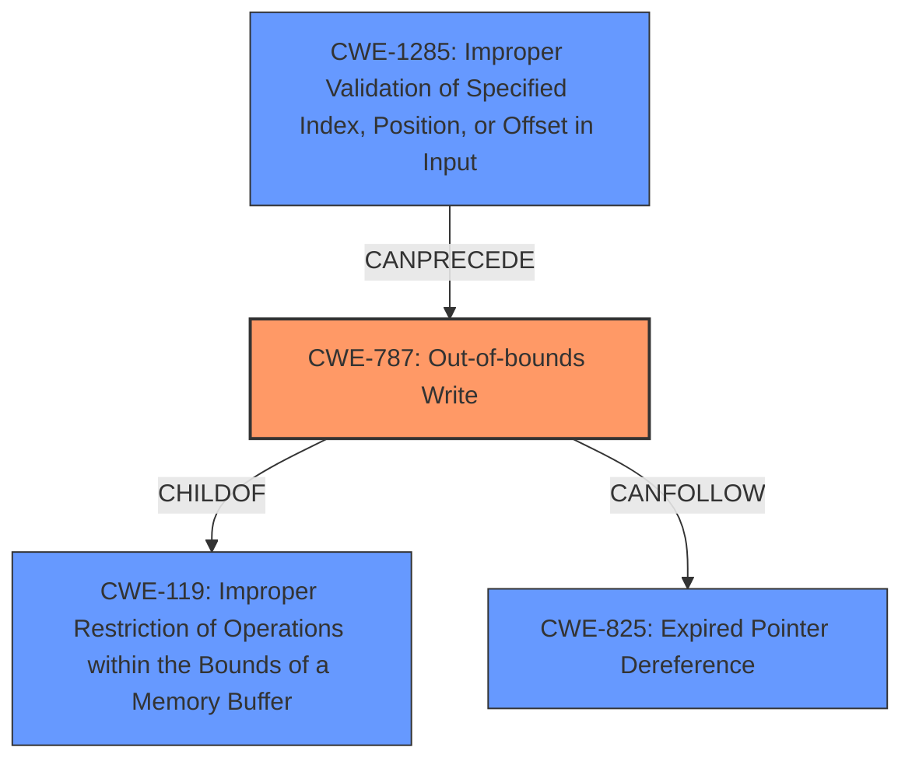

# Analysis Report for CVE-2021-26386

# Vulnerability Analysis Report: CVE-2021-26386

## Description

A malicious or compromised UApp or ABL may be used by an attacker to issue a malformed system call to the Stage 2 Bootloader potentially leading to corrupt memory and code execution.

## Vulnerability Description Key Phrases

**Impact:** ['corrupt memory', 'code execution']
**Vector:** malformed system call
**Attacker:** attacker

## Analysis (with Relationship Data)

# Summary
| CWE ID | CWE Name | Confidence | CWE Abstraction Level | CWE Vulnerability Mapping Label | CWE-Vulnerability Mapping Notes |
|---|---|---|---|---|---|
| CWE-787 | Out-of-bounds Write | 0.85 | Base | Allowed | Primary CWE. The vulnerability leads to memory corruption which directly aligns with the description of CWE-787. |
| CWE-1285 | Improper Validation of Specified Index, Position, or Offset in Input | 0.75 | Base | Allowed | Secondary CWE. The root cause indicates **improper input validation** of system calls, suggesting that a malformed system call could lead to out-of-bounds write. |

## Evidence and Confidence

*   **Confidence Score:** 0.80
*   **Evidence Strength:** HIGH

- **Analysis and Justification:**  
  - *Explanation:* "The primary weakness is the potential for **corrupt memory and code execution** due to a **malformed system call**. The CVE reference summary explicitly states that the **root_cause** is a malformed system call and the **weakness** is **improper input validation**. Given that the vulnerability involves writing to memory based on a malformed system call, CWE-787 (Out-of-bounds Write) is the most appropriate primary CWE. The vulnerability allows an attacker to overwrite memory due to an out-of-bounds write. The MITRE mapping guidance for CWE-787 indicates this is ALLOWED."
  
  - *Relationship Analysis:* "CWE-787 is a child of CWE-119 (Improper Restriction of Operations within the Bounds of a Memory Buffer). This relationship highlights that the core issue is writing outside the intended memory boundaries. CWE-1285 is related as it explains the root cause of malformed input, which leads to the out-of-bounds write. The graph relationships show CWE-787 can precede CWE-825 (Expired Pointer Dereference) because writing out of bounds can corrupt data structures used by memory management, which then leads to issues such as expired pointers."

- **Confidence Score:**  
  - *Example:* Confidence: 0.85 (High evidence from technical description and CVE reference materials)

---

## Criticism of Analysis

Okay, I've reviewed the provided analysis and the full CWE specifications. Here's a breakdown of my critique, focusing on the appropriateness of the CWE mappings, confidence levels, evidence strength, and suggested improvements:

**Overall Assessment:**

The analysis is generally good and well-reasoned. The primary CWE selection of CWE-787 (Out-of-bounds Write) is very likely correct given the vulnerability description and CVE details. The secondary CWE choice of CWE-1285 (Improper Validation of Specified Index, Position, or Offset in Input) is also reasonable and supports the root cause explanation.  The confidence scores are acceptable, and the evidence provided is sufficient.

**Detailed Critique:**

**1. CWE-787: Out-of-bounds Write**

*   **Mapping Appropriateness:**  Excellent. The vulnerability directly results in writing data outside the intended memory buffer boundaries, which aligns perfectly with CWE-787's description. The reference to "Memory Corruption" as an alternative term for CWE-787 reinforces this selection.
*   **Confidence Score (0.85):** Justified. The CVE description explicitly mentions "memory corruption and potential code execution," and the `root_cause` explicitly names a malformed system call. This provides strong evidence for the vulnerability's direct impact.
*   **Evidence Strength (HIGH):** Accurate. The information extracted from the CVE is clear and directly relevant.
*   **Relationship Analysis:**The relationship analysis is accurate. The discussion of the parent CWE (CWE-119) and the CanFollow relationship with CWE-825 is relevant and adds context.
*   **Mitigation appropriateness:** While the mitigations listed for CWE-787 are valid, it might be valuable to focus the mitigation discussion more specifically on system call handling.  For example:  "Implement strict input validation for all system call parameters, including size checks and range limitations, before writing to memory."  Or a more technical solution "Implement Address Space Layout Randomization (ASLR) to make it harder for attackers to predict memory locations"
*   **Suggestion:** No major changes are needed for CWE-787.

**2. CWE-1285: Improper Validation of Specified Index, Position, or Offset in Input**

*   **Mapping Appropriateness:** Good.  The `weakness` field in the CVE summary clearly states "Improper input validation of system calls to the Stage 2 Bootloader." This directly supports the selection of CWE-1285. It's a valid *contributing factor*, explaining *why* the out-of-bounds write is possible.
*   **Confidence Score (0.75):** Acceptable. While the "improper input validation" is explicitly stated, the direct link to *index, position, or offset* specifically might be slightly less certain without deeper code analysis. It's reasonable to assume that a malformed system call *likely* involves an invalid index/offset into a buffer, but it's not a guaranteed fact without more detail.
*   **Evidence Strength:** Good. The root cause and weakness sections in the CVE reference point strongly to improper input validation.
*   **Potential Mitigations:**  The generic mitigations are correct. The analysis could include a specific mitigation strategy to this vulnerability's context by stating something like, "Implement strict validation of system call parameters, ensuring that indices, offsets, and lengths are within acceptable bounds and consistent with the expected data structures within the bootloader's memory space."
*   **Suggestion:** The analysis could be strengthened by elaborating on *how* the improper validation leads to an out-of-bounds write. For example: "The Stage 2 Bootloader uses the parameters of the system call to determine the memory address and length of the data to be written. If the validation of these parameters is insufficient, a malicious UApp or ABL could provide values that cause the bootloader to write data outside the intended memory region."

**General Suggestions:**

*   **Chaining/Composite Relationships:** The current analysis primarily focuses on parent-child and can follow relationships. While correct, consider exploring more of the potential chaining or composite relationships that could arise from this vulnerability, as alluded to in the CWE specifications. For example, writing out-of-bounds (CWE-787) could lead to denial of service (CWE-400) if critical system data structures are corrupted.
*   **Alternative CWEs Considered:** Briefly mentioning alternative CWEs that were considered and *why* they were rejected can strengthen the justification for the chosen mappings. The "Retriever Results" section provides a good starting point to address alternative CWEs. For example, "While CWE-416 (Use After Free) and CWE-415 (Double Free) were identified by retrievers, these are memory management errors and the provided details don't specify memory corruption due to UAF or Double Free".

**Specific Examples from Retriever Results to Address:**

*   **CWE-416 (Use After Free):** While not the primary issue, consider adding a sentence stating why this isn't the main weakness. Something like, "While out-of-bounds writes *could* corrupt memory management structures leading to a use-after-free condition, the primary vulnerability is the direct ability to overwrite memory."
*   **CWE-190 (Integer Overflow or Wraparound):** If a length or size parameter used in the system call is an integer that isn't validated, an integer overflow could lead to an undersized buffer allocation. Briefly mentioning this possibility strengthens the analysis.

**Revised Summary Table:**

| CWE ID | CWE Name | Confidence | CWE Abstraction Level | CWE Vulnerability Mapping Label | CWE-Vulnerability Mapping Notes |
|---|---|---|---|---|---|
| CWE-787 | Out-of-bounds Write | 0.85 | Base | Allowed | Primary CWE. The vulnerability leads to memory corruption, directly aligning with the description of CWE-787. The malformed system call parameters cause writing to memory outside the intended buffer. |
| CWE-1285 | Improper Validation of Specified Index, Position, or Offset in Input | 0.75 | Base | Allowed | Secondary CWE. The root cause indicates **improper input validation** of system calls, suggesting that a malformed system call could lead to an out-of-bounds write. Insufficient validation on index, offset, and length parameters within the bootloader allows for a malicious UApp to trigger an overflow. |

By incorporating these suggestions, you can create a more comprehensive and robust CWE analysis.

## Final Resolution

# Summary
| CWE ID | CWE Name | Confidence | CWE Abstraction Level | CWE Vulnerability Mapping Label | CWE-Vulnerability Mapping Notes |
|---|---|---|---|---|---|
| CWE-787 | Out-of-bounds Write | 0.85 | Base | Allowed | Primary CWE. The vulnerability leads to memory corruption, directly aligning with the description of **CWE-787**. The malformed system call parameters cause writing to memory outside the intended buffer. |
| CWE-1285 | Improper Validation of Specified Index, Position, or Offset in Input | 0.75 | Base | Allowed | Secondary CWE. The root cause indicates **improper input validation** of system calls, suggesting that a malformed system call could lead to an out-of-bounds write. Insufficient validation on index, offset, and length parameters within the bootloader allows for a malicious UApp to trigger an overflow. |

## Evidence and Confidence

*   **Confidence Score:** 0.80
*   **Evidence Strength:** HIGH

## Relationship Analysis
The decision was influenced by the following CWE relationships:
  - **Parent-child hierarchical relationships**: **CWE-787** (Out-of-bounds Write) is a child of **CWE-119** (Improper Restriction of Operations within the Bounds of a Memory Buffer), indicating a specific type of memory boundary violation.
  - **Chain relationships showing progression of vulnerability**: **CWE-1285** (Improper Validation) can precede **CWE-787** (Out-of-bounds Write) because the lack of proper input validation is the root cause leading to the out-of-bounds write. **CWE-787** can precede **CWE-825** (Expired Pointer Dereference) because writing out of bounds can corrupt data structures used by memory management, which then leads to issues such as expired pointers.
  - **Peer relationships that offered alternative classifications**: While other CWEs like **CWE-416** (Use After Free) and **CWE-190** (Integer Overflow) were considered, they were deemed less relevant as the primary issue is the direct ability to overwrite memory due to **improper validation** and subsequent out-of-bounds write.
  - **Abstraction levels**: Both **CWE-787** and **CWE-1285** are at the Base level, which is the preferred level for vulnerability mapping.

## Vulnerability Chain
The chain of root cause and weaknesses for the Vulnerability Description:
  - The **root cause** is **CWE-1285**: **Improper input validation** of system calls in the Stage 2 Bootloader.
  - This leads to **CWE-787**: A malformed system call allows writing data outside the intended memory buffer (Out-of-bounds Write).
  - The impact of **CWE-787** is potential **corrupt memory and code execution**.
  - A potential consequence of **CWE-787** is **CWE-825** Expired Pointer Dereference if memory management structures are corrupted.

## Summary of Analysis
Based on the provided evidence, including the vulnerability description stating "A malicious or compromised UApp or ABL may be used by an attacker to issue a malformed system call to the Stage 2 Bootloader potentially leading to corrupt memory and code execution," the initial analysis correctly identified **CWE-787** as the primary weakness. The criticism was also valid in suggesting a more detailed explanation of how **improper input validation** leads to the out-of-bounds write.

The graph relationships reinforce the selection of **CWE-787** as the primary weakness, as it is a direct consequence of the **improper input validation** (**CWE-1285**). The chain relationship also indicates that **CWE-787** can precede other weaknesses like **CWE-825** if memory management structures are corrupted.

The selected CWEs are at the optimal level of specificity, as they are both at the Base level of abstraction. **CWE-787** accurately describes the direct impact of the vulnerability (memory corruption), while **CWE-1285** identifies the **root cause** (**improper input validation**) that allows the vulnerability to occur.

*Report generated on 2025-03-17 23:30:52*
