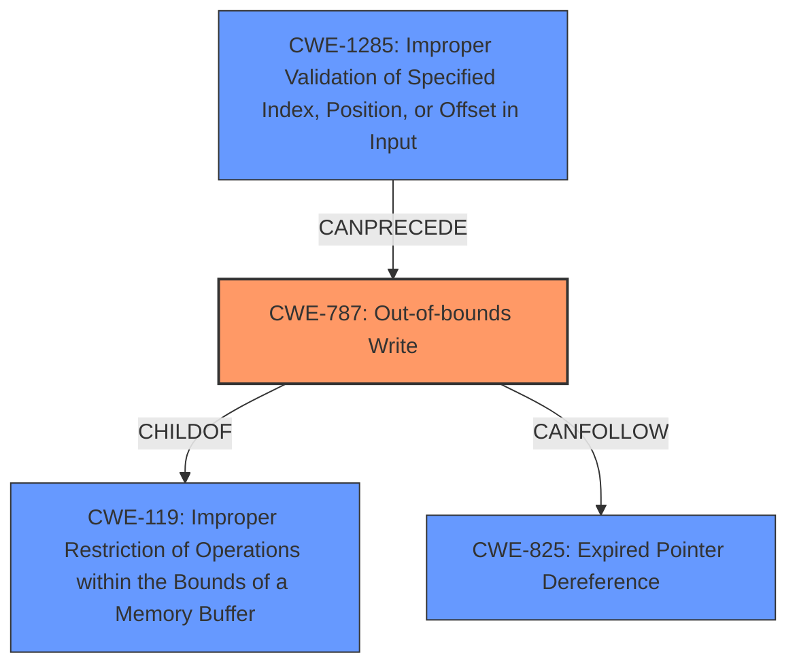

# Final Resolution for CVE-2021-26386

# Summary
| CWE ID | CWE Name | Confidence | CWE Abstraction Level | CWE Vulnerability Mapping Label | CWE-Vulnerability Mapping Notes |
|---|---|---|---|---|---|
| CWE-787 | Out-of-bounds Write | 0.85 | Base | Allowed | Primary CWE. The vulnerability leads to memory corruption, directly aligning with the description of **CWE-787**. The malformed system call parameters cause writing to memory outside the intended buffer. |
| CWE-1285 | Improper Validation of Specified Index, Position, or Offset in Input | 0.75 | Base | Allowed | Secondary CWE. The root cause indicates **improper input validation** of system calls, suggesting that a malformed system call could lead to an out-of-bounds write. Insufficient validation on index, offset, and length parameters within the bootloader allows for a malicious UApp to trigger an overflow. |

## Evidence and Confidence

*   **Confidence Score:** 0.80
*   **Evidence Strength:** HIGH

## Relationship Analysis
The decision was influenced by the following CWE relationships:
  - **Parent-child hierarchical relationships**: **CWE-787** (Out-of-bounds Write) is a child of **CWE-119** (Improper Restriction of Operations within the Bounds of a Memory Buffer), indicating a specific type of memory boundary violation.
  - **Chain relationships showing progression of vulnerability**: **CWE-1285** (Improper Validation) can precede **CWE-787** (Out-of-bounds Write) because the lack of proper input validation is the root cause leading to the out-of-bounds write. **CWE-787** can precede **CWE-825** (Expired Pointer Dereference) because writing out of bounds can corrupt data structures used by memory management, which then leads to issues such as expired pointers.
  - **Peer relationships that offered alternative classifications**: While other CWEs like **CWE-416** (Use After Free) and **CWE-190** (Integer Overflow) were considered, they were deemed less relevant as the primary issue is the direct ability to overwrite memory due to **improper validation** and subsequent out-of-bounds write.
  - **Abstraction levels**: Both **CWE-787** and **CWE-1285** are at the Base level, which is the preferred level for vulnerability mapping.

## Vulnerability Chain
The chain of root cause and weaknesses for the Vulnerability Description:
  - The **root cause** is **CWE-1285**: **Improper input validation** of system calls in the Stage 2 Bootloader.
  - This leads to **CWE-787**: A malformed system call allows writing data outside the intended memory buffer (Out-of-bounds Write).
  - The impact of **CWE-787** is potential **corrupt memory and code execution**.
  - A potential consequence of **CWE-787** is **CWE-825** Expired Pointer Dereference if memory management structures are corrupted.

## Summary of Analysis
Based on the provided evidence, including the vulnerability description stating "A malicious or compromised UApp or ABL may be used by an attacker to issue a malformed system call to the Stage 2 Bootloader potentially leading to corrupt memory and code execution," the initial analysis correctly identified **CWE-787** as the primary weakness. The criticism was also valid in suggesting a more detailed explanation of how **improper input validation** leads to the out-of-bounds write.

The graph relationships reinforce the selection of **CWE-787** as the primary weakness, as it is a direct consequence of the **improper input validation** (**CWE-1285**). The chain relationship also indicates that **CWE-787** can precede other weaknesses like **CWE-825** if memory management structures are corrupted.

The selected CWEs are at the optimal level of specificity, as they are both at the Base level of abstraction. **CWE-787** accurately describes the direct impact of the vulnerability (memory corruption), while **CWE-1285** identifies the **root cause** (**improper input validation**) that allows the vulnerability to occur.