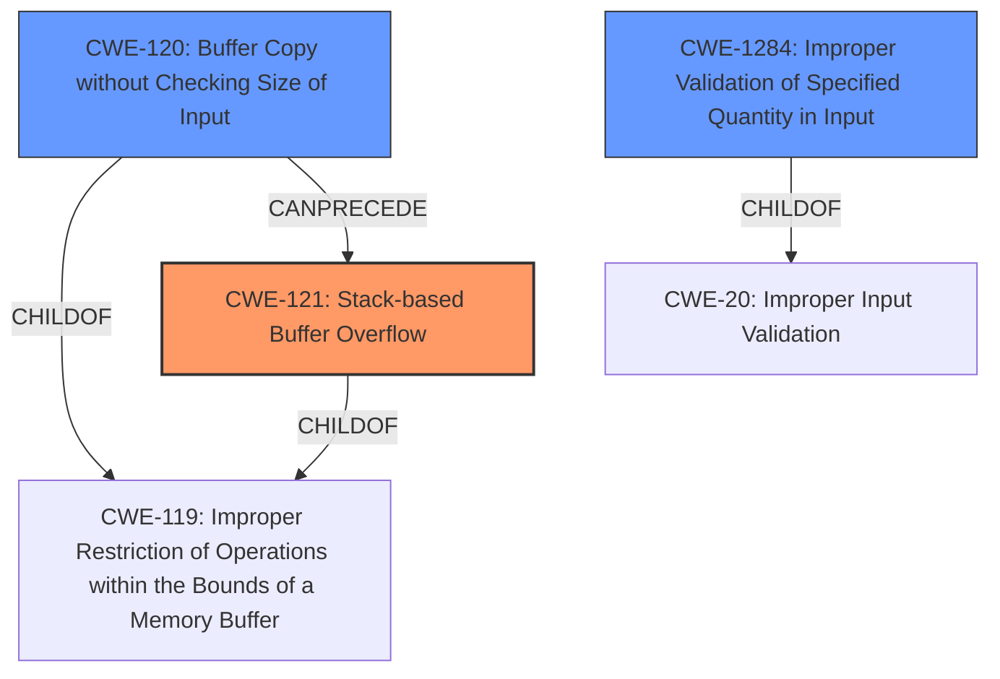

# Final Resolution for CVE-2021-26567

# Summary
| CWE ID | CWE Name | Confidence | CWE Abstraction Level | CWE Vulnerability Mapping Label | CWE-Vulnerability Mapping Notes |
|---|---|---|---|---|---|
| CWE-121 | Stack-based Buffer Overflow | 1.0 | Variant | Primary | Allowed |
| CWE-120 | Buffer Copy without Checking Size of Input ('Classic Buffer Overflow') | 0.7 | Base | Secondary | Allowed-with-Review |
| CWE-1284 | Improper Validation of Specified Quantity in Input | 0.5 | Base | Supporting | Allowed |

  - The Primary CWE should be first and noted as the Primary CWEs
  - The secondary candidate CWEs should be next and noted as secondary candidates.
  - The confidence is a confidence score 0 to 1 to rate your confidence in your assessment for that CWE.
  - The CWE Abstraction Level as one of these values: Base, Variant, Pillar, Class, Compound
  - The Mapping Notes Usage as one of these values: Allowed, Allowed-with-Review, Prohibited, Discouraged

## Evidence and Confidence

*   **Confidence Score:** 0.9
*   **Evidence Strength:** MEDIUM

## Relationship Analysis
The primary CWE, CWE-121, is a variant of CWE-119, providing a more specific classification. CWE-120, as a base CWE, represents the classic buffer overflow scenario but is less specific than CWE-121 in this context. CWE-1284 highlights the lack of input validation that often leads to buffer overflows.

## Vulnerability Chain
The vulnerability chain starts with the lack of input validation (**CWE-1284**), leading to a buffer copy operation without proper size checks (**CWE-120**). This results in a stack-based buffer overflow (**CWE-121**), allowing attackers to potentially execute arbitrary code.

## Summary of Analysis
The initial analysis correctly identified **CWE-121 (Stack-based Buffer Overflow)** as the primary weakness, supported by the vulnerability description mentioning a "stack-based buffer overflow." The inclusion of **CWE-120 (Buffer Copy without Checking Size of Input ('Classic Buffer Overflow'))** is also reasonable, as the overflow likely occurs during a buffer copy operation.

The criticism suggests considering **CWE-1284 (Improper Validation of Specified Quantity in Input)**, which is a valuable addition. The filename and pathname options, if not properly validated for length, can lead to the buffer overflow. This highlights that the **ROOTCAUSE** isn't just the buffer copy but also the insufficient input validation.

The graph relationships support the selection of **CWE-121** as the most specific classification, being a variant of **CWE-119 (Improper Restriction of Operations within the Bounds of a Memory Buffer)**. The chain relationship shows how **CWE-1284** can lead to **CWE-120**, which in turn can lead to **CWE-121**.

The final decision is to include **CWE-1284** as a supporting CWE to represent the initial lack of input validation. This provides a more complete picture of the vulnerability's **ROOTCAUSE** and its progression. The confidence score for **CWE-120** has been raised slightly to 0.7, reflecting the better understanding of the copy operation involved, and the confidence score for **CWE-1284** is set to 0.5.

The selected CWEs are at the optimal level of specificity. **CWE-121** is a variant that directly matches the stack-based nature of the overflow. **CWE-120** is a base CWE that explains the overflow due to unchecked buffer copying. **CWE-1284** is a base CWE that describes the lack of input validation.