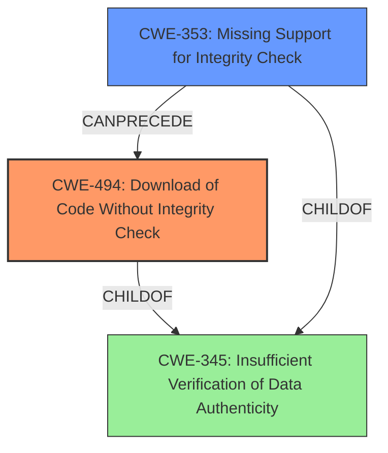

# Final Resolution for CVE-2021-26608

# Summary
| CWE ID | CWE Name | Confidence | CWE Abstraction Level | CWE Vulnerability Mapping Label | CWE-Vulnerability Mapping Notes |
|---|---|---|---|---|---|
| CWE-494 | Download of Code Without Integrity Check | 0.95 | Base | Allowed | Primary CWE. The vulnerability involves downloading code without verifying its integrity. |
| CWE-353 | Missing Support for Integrity Check | 0.75 | Base | Allowed | Secondary CWE. This relates to the core issue of missing integrity checks. |

## Evidence and Confidence

*   **Confidence Score:** 0.9
*   **Evidence Strength:** HIGH

## Relationship Analysis
The primary relationship considered was the hierarchical relationship between CWE-345 (Parent) and CWE-347 and CWE-494 (Children). CWE-345 is too abstract, and the analysis correctly identifies that CWE-494 is a better fit.
CWE-353 is a more general case of missing integrity checks, and CWE-494 is the more precise case of downloading code without integrity checks. The chain relationship is such that the missing integrity check (CWE-353) `CANPRECEDE` the download of code without integrity check.

## Vulnerability Chain
The vulnerability chain starts with the **ROOTCAUSE** of missing integrity check (**CWE-353**), leading to the download of code without integrity check (**CWE-494**), which can result in arbitrary code execution.

## Summary of Analysis
The initial analysis and criticism were both accurate in identifying CWE-494 as the primary **WEAKNESS**. The evidence is strong because the vulnerability description explicitly mentions the "missing support for integrity check of download URL or downloaded file hash". This aligns directly with CWE-494's description of downloading code without sufficient verification. CWE-353 is a relevant secondary **WEAKNESS**, providing context of missing integrity checks.

The graph relationships confirm that CWE-494 is more specific than its parent CWE-345, making it the optimal choice. The analysis also considered and rejected other potential CWEs, such as CWE-427, because they did not accurately represent the vulnerability.

The selection of CWE-494 and CWE-353 are at the optimal level of specificity, as they accurately capture the root cause and contributing factors of the vulnerability. I am increasing the confidence slightly for both as the criticism reinforced the original assessment.