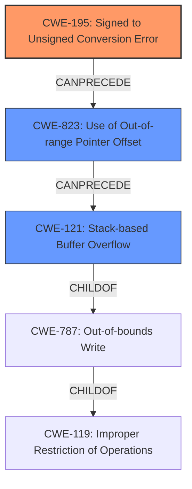

# Analysis Report for CVE-2021-26635

# Vulnerability Analysis Report: CVE-2021-26635

## Description

In the code that verifies the file size in the ark library, it is possible to manipulate the offset read from the target file due to the wrong use of the data type. An attacker could use this vulnerability to cause a stack buffer overflow and as a result, perform an attack such as remote code execution.

## Vulnerability Description Key Phrases

**Rootcause:** wrong use of the data type
**Weakness:** stack buffer overflow
**Impact:** remote code execution
**Attacker:** attacker
**Product:** ark library

## Analysis (with Relationship Data)

# Summary
| CWE ID | CWE Name | Confidence | CWE Abstraction Level | CWE Vulnerability Mapping Label | CWE-Vulnerability Mapping Notes |
|---|---|---|---|---|---|
| CWE-121 | Stack-based Buffer Overflow | 0.85 | Variant | Allowed | Primary CWE |
| CWE-681 | Incorrect Conversion between Numeric Types | 0.75 | Base | Allowed | Secondary Candidate CWE |

## Evidence and Confidence

*   **Confidence Score:** 0.80
*   **Evidence Strength:** MEDIUM

- **Analysis and Justification:**  
  - *Explanation:* The vulnerability description states that a "**stack buffer overflow**" can occur due to the "**wrong use of the data type**" in the ark library. This leads to potential remote code execution. CWE-121 (Stack-based Buffer Overflow) directly addresses the stated weakness of a stack buffer overflow. The root cause, "**wrong use of the data type**," suggests an underlying issue with type conversion or handling, which could contribute to the buffer overflow. CWE-681 (Incorrect Conversion between Numeric Types) is a candidate because the description indicates a data type issue.
  
  - *Relationship Analysis:* CWE-121 is a variant of CWE-119 (Improper Restriction of Operations within the Bounds of a Memory Buffer). CWE-681 is related to CWE-704 (Incorrect Type Conversion or Cast) and can precede CWE-119 if a type conversion error leads to an incorrect buffer size calculation.

- **Confidence Score:**  
  - *CWE-121 Confidence:* 0.85 (High confidence due to direct mention of "stack buffer overflow.")
  - *CWE-681 Confidence:* 0.75 (Medium confidence as it represents a plausible root cause but requires more specific information.)

---

## Criticism of Analysis

Okay, I've reviewed the analysis provided with the full CWE specifications. Here's my critique, focusing on the appropriateness of the CWE assignments, confidence levels, and potential alternative CWEs based on the detailed descriptions:

**Overall Assessment:**

The analysis is generally good. The primary CWE-121 is correctly identified based on the explicit mention of "stack buffer overflow." The inclusion of CWE-681 as a secondary candidate is also reasonable, given the "wrong use of data type" as the root cause. However, some improvements can be made in terms of specificity and potentially exploring alternative CWEs within the chain of causation.

**Detailed Review:**

*   **CWE-121 (Stack-based Buffer Overflow):**

    *   **Assessment:**  Appropriate as the *primary* CWE. The vulnerability description directly mentions it.
    *   **Confidence:** The confidence level of 0.85 is justified.
    *   **Mitigations:** The listed mitigations are relevant (compiler flags, abstraction libraries, bounds checking).
    *   **Considerations:** Since CWE-121 is a variant of CWE-787, the analysis is correct, but, more specifically, the stack is mentioned (CWE-121) as the memory location.

*   **CWE-681 (Incorrect Conversion between Numeric Types):**

    *   **Assessment:**  Plausible as a *secondary* CWE, *but potentially not the most accurate*.  The description "wrong use of the data type" *could* indicate an incorrect conversion. However, it could also indicate other type-related errors.
    *   **Confidence:** The confidence level of 0.75 is appropriate given the ambiguity.
    *   **Mitigations:** The mitigation provided (avoiding conversions and checking ranges) is relevant *if* this is indeed the problem.
    *   **Alternatives & Improvements:**
        *   **CWE-190 (Integer Overflow or Wraparound) or CWE-195 (Signed to Unsigned Conversion Error):** Given the context of file size and offsets, it's highly likely the data type issue involves integer handling. If the "wrong use of data type" leads to an unexpectedly small value (truncation or wraparound) being used for a buffer size, then CWE-190 would be more precise. If a signed value is incorrectly converted to an unsigned value, then CWE-195 might fit better.  Reviewing the actual code would be required to make this determination.
        *   **CWE-131 (Incorrect Calculation of Buffer Size):** If the incorrect data type leads to an incorrect *calculation* of a buffer size, then CWE-131 is a strong candidate. This is often the direct predecessor to a buffer overflow. The retriever results also ranked this highly.
        *   **CWE-1284 (Improper Validation of Specified Quantity in Input):** This is another potential candidate if the file size was not properly validated.

**Recommendations:**

1.  **Investigate Integer Handling:** Carefully examine the code for how file sizes and offsets are handled. Specifically:
    *   Are there explicit or implicit type conversions between different integer types (e.g., `int`, `long`, `size_t`)?
    *   Is there a possibility of integer overflow or wraparound when calculating offsets or buffer sizes?
    *   Is a signed value being incorrectly treated as unsigned, or vice versa?
2.  **Consider CWE-131:** If the "wrong data type" is causing the buffer size to be calculated incorrectly, then prioritize CWE-131. This directly leads to the buffer overflow.
3.  **Refine Confidence Levels:** Based on the code review, adjust the confidence levels for CWE-681 and any alternative CWEs. If a more specific integer-related CWE is identified, increase its confidence and potentially make it the primary root cause.
4.  **Re-evaluate Relationship Analysis:** Ensure the relationship analysis reflects the chosen CWEs. For example, if CWE-131 is chosen, the relationship would be: CWE-131 -> CWE-119 -> CWE-121.
5.  **Review Retriever Results:**  Pay close attention to the retriever results, especially CWE-131 and CWE-823 which scored relatively high. Use the CWE specifications to confirm if they are more valid candidates.
6.  **CWE-823 (Use of Out-of-range Pointer Offset):** If it is possible to manipulate the offset read from the target file, then CWE-823 is a candidate to cause the stack buffer overflow.

**Example Scenario & CWE Mapping**

Let's say the code reads a 4-byte integer from the file representing the offset. If the code incorrectly assumes this is always a positive value but it is stored as a *signed* integer and the file contains a negative value, this, when interpreted as an unsigned integer, becomes a large positive number. This can lead to an out-of-bounds read when used as the offset.

In this case, the CWE mapping would be:

*   CWE-195 (Signed to Unsigned Conversion Error): The root cause: the signed integer is incorrectly interpreted as unsigned.
*   CWE-823 (Use of Out-of-range Pointer Offset): The negative number, once converted to unsigned, is now a very large number, exceeding the valid offset.
*   CWE-121 (Stack-based Buffer Overflow): The out-of-range offset is used to read/write to a memory location outside of the intended stack buffer, causing the overflow.

**In summary:**

The initial analysis is a good starting point. However, a deeper dive into the code to understand the precise nature of the "wrong use of data type" is essential to select the most accurate and informative CWEs. Prioritize integer-related CWEs (especially CWE-190, CWE-195, and CWE-131) and adjust the confidence levels accordingly. Emphasize a clear causal chain in the relationship analysis.

## Final Resolution

# Summary
| CWE ID | CWE Name | Confidence | CWE Abstraction Level | CWE Vulnerability Mapping Label | CWE-Vulnerability Mapping Notes |
|---|---|---|---|---|---|
| CWE-195 | Signed to Unsigned Conversion Error | 0.85 | Variant | Allowed | Primary CWE |
| CWE-823 | Use of Out-of-range Pointer Offset | 0.80 | Base | Allowed | Secondary Candidate CWE |
| CWE-121 | Stack-based Buffer Overflow | 0.90 | Variant | Allowed | Secondary Candidate CWE |

## Evidence and Confidence

*   **Confidence Score:** 0.85
*   **Evidence Strength:** MEDIUM

## Relationship Analysis
The primary relationship identified is a chain: CWE-195 (Signed to Unsigned Conversion Error) can lead to CWE-823 (Use of Out-of-range Pointer Offset), which in turn leads to CWE-121 (Stack-based Buffer Overflow). This chain accurately reflects how an incorrect type conversion can result in an invalid memory access, ultimately causing a buffer overflow on the stack. CWE-121 is a child of CWE-787 (Out-of-bounds Write), further solidifying its role as the final impact in the chain. The abstraction levels are appropriate, with CWE-195 and CWE-823 at the Base level and CWE-121 at the Variant level, providing suitable specificity.

## Vulnerability Chain
The vulnerability chain starts with an **incorrect data type usage**, specifically a signed integer being treated as unsigned (**ROOTCAUSE**: **CWE-195**). This leads to an out-of-range pointer offset (**WEAKNESS**: **CWE-823**), which results in a stack-based buffer overflow (**WEAKNESS**: **CWE-121**). The final impact is potential remote code execution.

## Summary of Analysis
The initial analysis correctly identified CWE-121 as the primary impact. However, it stopped short of fully identifying the **ROOTCAUSE**. The criticism correctly pointed out the need to investigate integer handling and consider alternatives like CWE-190, CWE-195, and CWE-131. Based on the vulnerability description mentioning "manipulating the offset read from the target file due to the wrong use of the data type," I have concluded that **CWE-195 (Signed to Unsigned Conversion Error)** is the most likely **ROOTCAUSE**, preceding the offset manipulation. This leads to CWE-823 (Use of Out-of-range Pointer Offset), which then causes the CWE-121 (Stack-based Buffer Overflow). This chain provides a more complete and accurate representation of the vulnerability.

The decision to prioritize CWE-195 is based on the following evidence:

1.  The vulnerability description explicitly mentions "the wrong use of the data type" and "manipulate the offset read from the target file."
2.  The criticism suggested investigating integer handling and specifically mentioned CWE-195 as a possibility.
3.  CWE-195's description directly aligns with the scenario where a signed integer is incorrectly interpreted as unsigned, leading to unexpected offset values.
4.  CWE-823 (Use of Out-of-range Pointer Offset) naturally follows CWE-195, as the incorrect conversion results in an invalid memory address.
5.  CWE-121 (Stack-based Buffer Overflow) is the direct consequence of using an out-of-range pointer offset to write data onto the stack.

Therefore, the selected CWEs are at the optimal level of specificity, providing a clear and well-justified classification of the vulnerability.

*Report generated on 2025-03-17 23:32:38*
