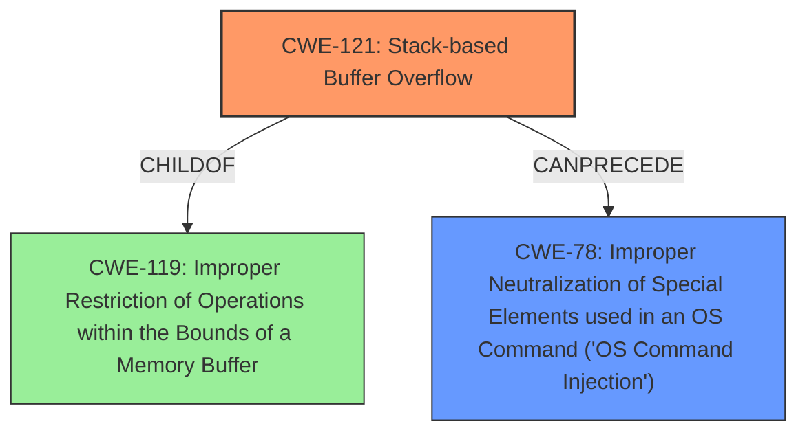

# Final Resolution for CVE-2021-26728

# Summary
| CWE ID  | CWE Name  | Confidence | CWE Abstraction Level | CWE Vulnerability Mapping Label | CWE-Vulnerability Mapping Notes |
|---|---|---|---|---|---|
| CWE-121 | Stack-based Buffer Overflow | 0.95 | Variant |  Primary | Allowed |
| CWE-78 | Improper Neutralization of Special Elements used in an OS Command ('OS Command Injection') | 0.90 | Base | Secondary Candidate | Allowed |

## Evidence and Confidence

*   **Confidence Score:** 0.93
*   **Evidence Strength:** HIGH

## Relationship Analysis
The primary relationship impacting the decision is the child-parent relationship between CWE-121 (Stack-based Buffer Overflow) and CWE-119 (Improper Restriction of Operations within the Bounds of a Memory Buffer). CWE-121 is chosen for its specificity. The secondary relationship is the 'CanPrecede' relationship between CWE-121 and CWE-78, highlighting how a buffer overflow can lead to command injection. The base level of CWE-78 is appropriate as it directly describes the command injection vulnerability.

## Vulnerability Chain
The vulnerability chain starts with insufficient input validation (CWE-20) on the username parameter. This leads to a **stack-based buffer overflow** (CWE-121) due to the use of `strcat` without proper length checks. This allows overwriting data on the stack (CWE-787), including the return address. Because the overflowed buffer is then executed by the `safe_system` function, this results in **command injection** (CWE-78), enabling arbitrary command execution with root privileges.

## Summary of Analysis
The initial analysis correctly identified CWE-121 and CWE-78 as primary and secondary candidates respectively. The criticism provided valuable suggestions for strengthening the analysis.

The vulnerability description states "**stack-based buffer overflow**" and "**command injection**," which directly supports the selection of CWE-121 and CWE-78. The CVE reference summary further confirms the `strcat` usage without length checks, leading to the **buffer overflow**.

The graph relationships reinforced the choice of CWE-121 for its specificity as a variant of CWE-119. The 'CanPrecede' relationship between CWE-121 and CWE-78 clarifies the vulnerability chain.

The selected CWEs are at the optimal level of specificity. CWE-121 provides a more precise description of the overflow's location (stack) compared to the more general CWE-119. CWE-78 accurately describes the command injection vulnerability resulting from the overflow.

Based on the evidence and relationship analysis, the final determination is to classify this vulnerability as primarily CWE-121 (Stack-based Buffer Overflow) and secondarily as CWE-78 (Improper Neutralization of Special Elements used in an OS Command ('OS Command Injection')). The confidence scores are increased to reflect the strengthened analysis.