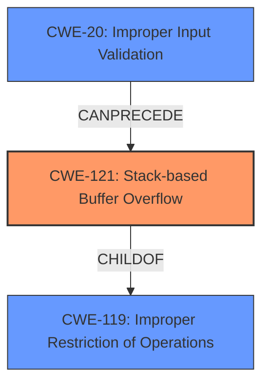

# Final Resolution for CVE-2021-26730

# Summary
| CWE ID | CWE Name | Confidence | CWE Abstraction Level | CWE Vulnerability Mapping Label | CWE-Vulnerability Mapping Notes |
|---|---|---|---|---|---|
| CWE-121 | Stack-based Buffer Overflow | 1.0 | Variant | Allowed | Primary CWE |
| CWE-119 | Improper Restriction of Operations within the Bounds of a Memory Buffer | 0.7 | Class | Allowed | Parent of CWE-121, representing the broader class of buffer boundary errors. |
| CWE-20 | Improper Input Validation | 0.6 | Class | Discouraged | A likely contributing factor due to missing input size validation. Further analysis needed to identify the specific validation failure. |

## Evidence and Confidence

*   **Confidence Score:** 0.9
*   **Evidence Strength:** MEDIUM

## Relationship Analysis
The primary relationship impacting the decision is the hierarchical relationship between CWE-121 and CWE-119. CWE-121 is a variant of CWE-119, providing a more specific classification for a stack-based buffer overflow. While CWE-119 is a broader class, acknowledging it provides context. CWE-20 is included as a likely contributing factor.

## Vulnerability Chain
The vulnerability chain starts with a potential lack of input validation (**CWE-20**). This allows an attacker to provide input that exceeds the buffer's capacity. The lack of bounds checking leads to a **stack-based buffer overflow (CWE-121)**. The consequence is arbitrary code execution with root privileges.

## Summary of Analysis
The initial analysis correctly identified **CWE-121 (Stack-based Buffer Overflow)** as the primary **WEAKNESS**. The vulnerability description explicitly mentions "stack-based buffer overflow," justifying a confidence level of 1.0. The criticism highlighted the importance of acknowledging **CWE-119 (Improper Restriction of Operations within the Bounds of a Memory Buffer)** as the parent class. The criticism also correctly identified **CWE-20 (Improper Input Validation)** as a potential contributing factor because a buffer overflow is often caused by a failure to properly validate the size or content of input before writing it to the buffer. While the exact validation failure isn't known, acknowledging the absence of proper validation is important. My assessment incorporates these suggestions, resulting in a more comprehensive analysis. The final classification reflects the optimal level of specificity based on the available evidence. The inclusion of CWE-119 and CWE-20 provides a more complete picture of the **ROOTCAUSE** and potential contributing factors. I am basing my decision on the provided vulnerability description and the relationships between the CWEs.