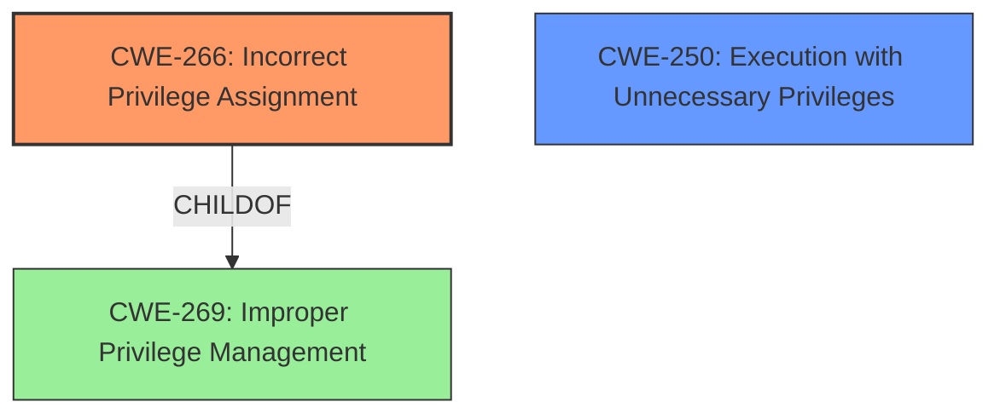

# Final Resolution for CVE-2021-26868

# Summary
| CWE ID | CWE Name | Confidence | CWE Abstraction Level | CWE Vulnerability Mapping Label | CWE-Vulnerability Mapping Notes |
|---|---|---|---|---|---|
| CWE-266 | Incorrect Privilege Assignment | 0.75 | Base | Primary | Allowed |
| CWE-250 | Execution with Unnecessary Privileges | 0.65 | Base | Secondary Candidate | Allowed |

## Evidence and Confidence

*   **Confidence Score:** 0.7
*   **Evidence Strength:** MEDIUM

## Relationship Analysis
The initial assessment correctly identified CWE-269 as a potential candidate, but it's a Class-level CWE. The criticism correctly points out that CWE-269 should be avoided if more specific information is unavailable. The analysis of the retriever results identified CWE-266 and CWE-250 as more specific candidates. I agree with the criticism that these should be investigated.

CWE-266 is a child of CWE-269.
CWE-250 is not directly related, but it is a base-level CWE, and it is related to privilege management.
CWE-266 is a more specific Base-level CWE than CWE-269, which is a Class-level CWE.
CWE-250 could amplify the consequences of CWE-266.

## Vulnerability Chain
The vulnerability chain begins with the **ROOTCAUSE** of an **incorrect privilege assignment (CWE-266)**, potentially amplified by **execution with unnecessary privileges (CWE-250)**. This leads to the **WEAKNESS** of an elevation of privilege, as stated in the vulnerability description. The final impact is unauthorized access or actions due to the elevated privileges.

## Summary of Analysis
The initial analysis identified CWE-269 (Improper Privilege Management) as a potential candidate, with a confidence score of 0.6. The criticism correctly pointed out that CWE-269 is a Class-level CWE and should be avoided if more specific information is available.

The vulnerability description states: "Windows Graphics Component Elevation of Privilege Vulnerability".

The retriever results included CWE-266 (Incorrect Privilege Assignment) and CWE-250 (Execution with Unnecessary Privileges).

CWE-266 is a Base-level CWE and a child of CWE-269. It is a more specific classification than CWE-269. The description explicitly indicates that an incorrect privilege is assigned to a particular actor, creating an unintended sphere of control.

CWE-250 is a Base-level CWE. If the graphics component is already running with more privileges than necessary, any flaw could be amplified, leading to privilege escalation.

I am changing the primary CWE to CWE-266 (Incorrect Privilege Assignment) with a confidence score of 0.75. I am also adding CWE-250 (Execution with Unnecessary Privileges) as a secondary candidate with a confidence score of 0.65. These are more specific and better reflect the **ROOTCAUSE** than CWE-269. They also take into account the execution environment in the Windows Graphics Component.