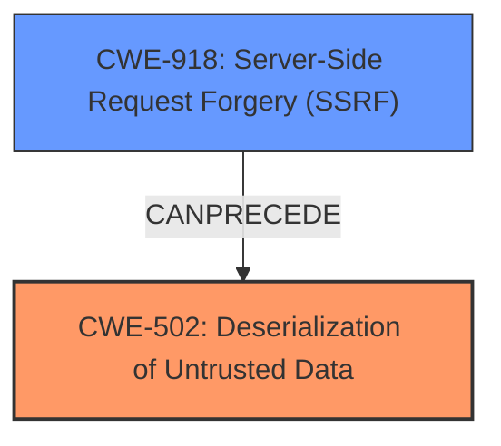

# Final Resolution for CVE-2021-27065

# Summary
| CWE ID | CWE Name | Confidence | CWE Abstraction Level | CWE Vulnerability Mapping Label | CWE-Vulnerability Mapping Notes |
|---|---|---|---|---|---|
| **CWE-502** | **Deserialization of Untrusted Data** | 0.7 | Base | N/A | Allowed |
| CWE-918 | Server-Side Request Forgery (SSRF) | 0.5 | Base | N/A | Allowed |

## Evidence and Confidence

*   **Confidence Score:** 0.7
*   **Evidence Strength:** MEDIUM

## Relationship Analysis
The primary relationship considered here is the potential chain between CWE-918 (SSRF) and CWE-502 (**Deserialization of Untrusted Data**). The analysis suggests that SSRF could *precede* deserialization, where an attacker uses SSRF to fetch malicious serialized data that is then deserialized by the server, leading to remote code execution. Both are at the Base level of abstraction. There isn't sufficient information to concretely confirm this chain, but it remains a strong possibility based on the vulnerability description (RCE in Exchange Server) and the retriever results.

## Vulnerability Chain
The vulnerability chain starts with a potential SSRF (**CWE-918**) where the attacker can control the URL from which the Exchange server retrieves data. The server then processes this data, which contains serialized objects. The lack of proper validation during deserialization (**CWE-502**) allows the attacker to inject malicious code, ultimately leading to remote code execution. The root cause is the improper handling of untrusted data during deserialization.

## Summary of Analysis
The initial analysis was insufficient, stopping at CWE-NVD-noinfo without considering the implications of the "Remote Code Execution" impact and the context of Microsoft Exchange Server. The criticism correctly points out the importance of using the retriever results to identify more specific CWEs.

Based on the retriever results and the nature of Exchange Server vulnerabilities, **CWE-502 (Deserialization of Untrusted Data)** is the most likely root cause. The evidence is based on the common occurrence of deserialization vulnerabilities leading to RCE in complex applications like Exchange Server. While there is no explicit mention of deserialization in the initial vulnerability description, the possibility is strong enough to warrant assigning it as the primary CWE with a confidence score of 0.7, pending further investigation.

CWE-918 (SSRF) is considered as a secondary CWE with a lower confidence score (0.5) because it could be a contributing factor, potentially serving as a prerequisite for the deserialization vulnerability. The attacker could use SSRF to deliver the malicious serialized data.

The chosen CWEs are at the Base level of abstraction, which is preferred for mapping to root causes. They provide more specific information than CWE-NVD-noinfo and align with the potential attack vectors in Exchange Server. The final decision is based on the evidence available and the relationships between CWEs, particularly the potential chaining of SSRF and deserialization.