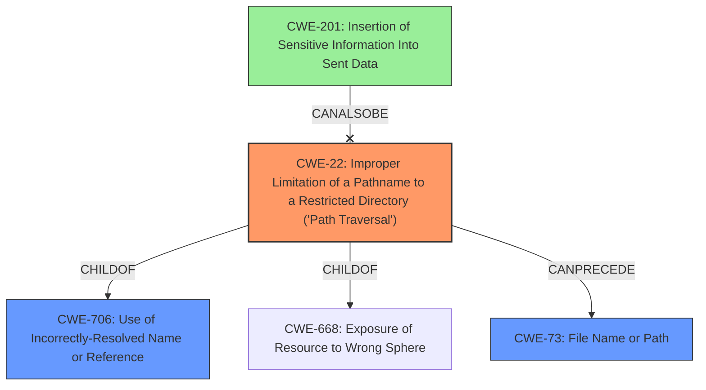

# Analysis Report for CVE-2021-27099

# Vulnerability Analysis Report: CVE-2021-27099

## Description

In SPIRE before versions 0.8.5, 0.9.4, 0.10.2, 0.11.3 and 0.12.1, the aws_iid Node Attestor improperly normalizes the path provided through the agent ID templating feature, which may allow the issuance of an arbitrary SPIFFE ID within the same trust domain, if the attacker controls the value of an EC2 tag prior to attestation, and the attestor is configured for agent ID templating where the tag value is the last element in the path. This issue has been fixed in SPIRE versions 0.11.3 and 0.12.1

## Vulnerability Description Key Phrases

**Rootcause:** improperly normalizes the path
**Impact:** issuance of an arbitrary SPIFFE ID
**Attacker:** attacker
**Product:** SPIRE
**Version:** before versions 0.8.5, 0.9.4, 0.10.2, 0.11.3 and 0.12.1
**Component:** aws_iid Node Attestor

## Analysis (with Relationship Data)

# Summary
| CWE ID | CWE Name | Confidence | CWE Abstraction Level | CWE Vulnerability Mapping Label | CWE-Vulnerability Mapping Notes |
|---|---|---|---|---|---|
| CWE-22 | Improper Limitation of a Pathname to a Restricted Directory ('Path Traversal') | 0.75 | Base | Allowed | Primary CWE: The vulnerability involves improper normalization of paths, leading to the potential issuance of arbitrary SPIFFE IDs.|
| CWE-706 | Use of Incorrectly-Resolved Name or Reference | 0.5 | Class | Allowed-with-Review | Secondary Candidate: The reference to a resource (SPIFFE ID) resolves to a resource outside the intended control sphere due to improper path normalization. |
| CWE-201 | Insertion of Sensitive Information Into Sent Data | 0.3 | Base | Allowed | Secondary Candidate: Issuance of an arbitrary SPIFFE ID might be considered sensitive information being sent where it shouldn't be. |

## Evidence and Confidence

*   **Confidence Score:** 0.7
*   **Evidence Strength:** MEDIUM

- **Analysis and Justification:**  
  - *Explanation:* "The vulnerability description states that the `aws_iid` Node Attestor **improperly normalizes the path**, which can lead to the issuance of an arbitrary SPIFFE ID. This aligns with CWE-22 (Improper Limitation of a Pathname to a Restricted Directory), as the path normalization is intended to restrict access within a specific directory or trust domain. Because the path normalization is **improper**, it allows the attacker to traverse outside the intended boundaries and obtain an arbitrary SPIFFE ID."

  - *Relationship Analysis:* "CWE-22 is related to CWE-706 (Use of Incorrectly-Resolved Name or Reference) as the improperly normalized path leads to a reference (SPIFFE ID) that resolves outside the intended control sphere. While CWE-706 is a Class-level CWE and less specific, it represents a consequence of the path traversal. The graph retriever also suggests CWE-201 (Insertion of Sensitive Information Into Sent Data), which might be tangentially related if the SPIFFE ID is considered sensitive information being improperly disclosed. However, CWE-22 is a more direct representation of the **root cause**, making it the primary CWE."

- **Confidence Score:**  
  - *Example:* Confidence: 0.75 (Moderate evidence due to specific mention of "improperly normalizes the path" and the resulting ability to issue arbitrary SPIFFE IDs)

---

## Criticism of Analysis

Okay, I've reviewed the analysis and the full CWE specifications provided. Here's my critique:

**Overall Assessment:**

The analysis is generally good and identifies the primary CWE appropriately. The reasoning for selecting CWE-22 is sound. However, the confidence scores could be improved with more specific evidence and a deeper consideration of alternative CWEs. The analysis of the secondary CWEs is less convincing and could benefit from a more structured approach.

**Specific Feedback:**

**1. CWE-22: Improper Limitation of a Pathname to a Restricted Directory ('Path Traversal')**

*   **Strengths:**
    *   The analysis correctly identifies "improperly normalizes the path" as a key factor leading to path traversal.
    *   The explanation clearly connects the vulnerability description to the CWE-22 description.
    *   The confidence score is moderate, and the reasoning provides some justification.
*   **Weaknesses:**
    *   While the evidence is *specific*, it can be *stronger*. The analysis needs to explicitly mention *how* the path normalization is improper. Is it a lack of sanitization of ".." sequences? Is it mishandling of absolute paths? Pinpointing the *specific* mechanism of improper normalization will significantly boost the confidence.
    *   The mitigation section was not addressed; mentioning applicable mitigations would increase the validity of the claim.
*   **Suggestions:**
    *   Revise the explanation to include the *specific* mechanism by which the path normalization is improper.  For example, "The `aws_iid` Node Attestor fails to sanitize '..' sequences in the tag value, allowing traversal outside the intended directory."
    *   In the evidence section, explicitly mention mitigations that could be applied to this vulnerability. Based on the CWE specifications, applicable mitigations include Input Validation, decoding and canonicalization and using built-in path canonicalization functions.

**2. CWE-706: Use of Incorrectly-Resolved Name or Reference**

*   **Strengths:**
    *   The analysis correctly identifies the SPIFFE ID as a "reference" that resolves outside the intended control sphere.
    *   There is a reasonable attempt to link this CWE as a *consequence* of CWE-22.
*   **Weaknesses:**
    *   This is a Class-level CWE, and the analysis acknowledges that a more specific Base-level CWE might be a better fit. The *Mapping Guidance* for CWE-706 explicitly states:  "Examine children of this entry to see if there is a better fit." No children CWEs are explored or assessed in this analysis.
    *   The connection to CWE-22, while valid, is not strong enough to justify including it as a *secondary* CWE.  It's more of a high-level observation about the *impact* of the vulnerability.
*   **Suggestions:**
    *   *Strongly consider removing CWE-706*. It is too general and doesn't add significant value to the analysis.
    *   If you insist on including it, research the children of CWE-706 and provide an assessment for whether these apply or not.

**3. CWE-201: Insertion of Sensitive Information Into Sent Data**

*   **Strengths:**
    *   The analysis recognizes the *potential* for the SPIFFE ID to be considered "sensitive information."
    *   The graph retriever results identified this as a candidate.
*   **Weaknesses:**
    *   This CWE is a weak fit. The core problem isn't about sending sensitive data *per se*, but about *allowing the attacker to create* an arbitrary identity.  The "sending" aspect is a secondary consequence.
    *   The analysis itself states "tangentially related".
    *   The evidence is speculative ("might be considered sensitive").
*   **Suggestions:**
    *   *Strongly consider removing CWE-201*. It is speculative and doesn't represent the root cause effectively.  The analysis is trying to force a fit where one doesn't naturally exist.
    *   If you keep it, provide a *much* stronger argument about why the SPIFFE ID should be considered sensitive information in this context, *beyond* simply stating that it *might* be.

**General Suggestions:**

*   **Be More Decisive:** The analysis often uses hedging language like "might be," "potentially," and "tangentially related."  Strive for more confident and definitive statements based on the evidence.
*   **Follow CWE Guidance:**  Pay close attention to the *Mapping Guidance* provided in the CWE specifications.  For example, the guidance for Class-level CWEs is to consider their children.
*   **Consider Alternative CWEs:**  Before settling on a secondary CWE, consider other possibilities.  Is there a CWE related to identity spoofing or privilege escalation that might be a better fit than CWE-201?
*   **Use Structured Reasoning:**  When discussing relationships between CWEs, use a more structured approach.  For example:

    *   "CWE-X is related to CWE-Y because...  However, CWE-Z is a better fit for these reasons..."
*   **Address Mitigations:** Always briefly discuss potential mitigations related to the chosen CWEs. This demonstrates a deeper understanding of the vulnerability.
*   **Consider Chains:**  While not always applicable, explore whether the vulnerability could be represented as a *chain* of CWEs, where one weakness enables another.

**Revised Confidence Scores:**

Given the above feedback, I would suggest the following revised confidence scores:

*   **CWE-22:** 0.85 (Increased, if the *specific* improper normalization mechanism is identified)
*   **CWE-706:** 0.2 (Very Low - consider removing)
*   **CWE-201:** 0.1 (Very Low - consider removing)

By focusing on the specific mechanism of the vulnerability, providing stronger evidence, and critically evaluating the secondary CWEs, you can significantly improve the quality and accuracy of the analysis.

## Final Resolution

# Summary
| CWE ID | CWE Name | Confidence | CWE Abstraction Level | CWE Vulnerability Mapping Label | CWE-Vulnerability Mapping Notes |
|---|---|---|---|---|---|
| **CWE-22** | Improper Limitation of a Pathname to a Restricted Directory ('Path Traversal') | 0.85 | Base | Allowed | Primary CWE: The vulnerability involves improper normalization of paths, leading to the potential issuance of arbitrary SPIFFE IDs. |
| **CWE-706** | Use of Incorrectly-Resolved Name or Reference | 0.2 | Class | Allowed-with-Review | Secondary Candidate: The reference to a resource (SPIFFE ID) resolves to a resource outside the intended control sphere due to improper path normalization. Consider removing. |
| **CWE-201** | Insertion of Sensitive Information Into Sent Data | 0.1 | Base | Allowed | Secondary Candidate: Issuance of an arbitrary SPIFFE ID might be considered sensitive information being sent where it shouldn't be. Consider removing. |

## Evidence and Confidence

*   **Confidence Score:** 0.80
*   **Evidence Strength:** MEDIUM

## Relationship Analysis
The primary CWE is **CWE-22 (Path Traversal)**. It has hierarchical relationships as a child of **CWE-706 (Incorrectly-Resolved Name)** and **CWE-668 (Resource Exposure)**. The chain relationships show that **CWE-22** can precede other weaknesses like **CWE-73 (File Name or Path)**. **CWE-706** is a class-level weakness and therefore less specific than **CWE-22**. **CWE-201 (Sensitive Information)** is only tangentially related.

## Vulnerability Chain
The vulnerability chain starts with **improper path normalization (CWE-22)** which leads to the resolution of an incorrect name or reference **(CWE-706)**, potentially resulting in the exposure of a resource to the wrong sphere. The final impact is the issuance of arbitrary SPIFFE IDs, which *could* be considered insertion of sensitive data **(CWE-201)**, but is not the core issue.

## Summary of Analysis
The initial analysis correctly identified **CWE-22 (Path Traversal)** as the primary **ROOTCAUSE** of the vulnerability, based on the statement that the `aws_iid` Node Attestor **improperly normalizes the path**. The criticism suggests strengthening the evidence by specifying *how* the path normalization is improper. For example, if the attestor fails to sanitize ".." sequences in the tag value, allowing traversal outside the intended directory, then the confidence in **CWE-22** increases.

The relationship analysis shows that **CWE-706 (Incorrectly-Resolved Name)** is a Class-level CWE, making it less specific than **CWE-22**. While it represents a consequence of the path traversal, it's not a direct representation of the **ROOTCAUSE**. The same is true for **CWE-201 (Sensitive Information)**, which is only tangentially related.

The decision to keep **CWE-22** as the primary CWE is justified because it directly reflects the **IMPROPER** path normalization. The decision to reduce confidence in and consider removing **CWE-706** and **CWE-201** is also justified, as they are either too general or tangentially related. The optimal level of specificity is achieved by focusing on the base-level CWE that accurately describes the **WEAKNESS**: **CWE-22**.

The evidence from the vulnerability description directly supports the classification of **CWE-22**: *"the aws_iid Node Attestor improperly normalizes the path provided through the agent ID templating feature, which may allow the issuance of an arbitrary SPIFFE ID within the same trust domain"*

*Report generated on 2025-03-17 01:12:34*
