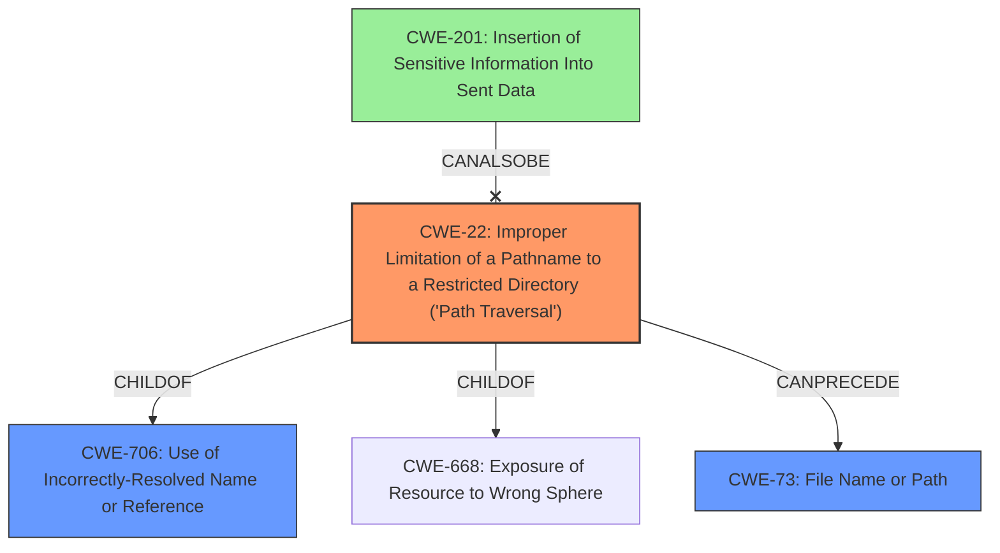

# Final Resolution for CVE-2021-27099

# Summary
| CWE ID | CWE Name | Confidence | CWE Abstraction Level | CWE Vulnerability Mapping Label | CWE-Vulnerability Mapping Notes |
|---|---|---|---|---|---|
| **CWE-22** | Improper Limitation of a Pathname to a Restricted Directory ('Path Traversal') | 0.85 | Base | Allowed | Primary CWE: The vulnerability involves improper normalization of paths, leading to the potential issuance of arbitrary SPIFFE IDs. |
| **CWE-706** | Use of Incorrectly-Resolved Name or Reference | 0.2 | Class | Allowed-with-Review | Secondary Candidate: The reference to a resource (SPIFFE ID) resolves to a resource outside the intended control sphere due to improper path normalization. Consider removing. |
| **CWE-201** | Insertion of Sensitive Information Into Sent Data | 0.1 | Base | Allowed | Secondary Candidate: Issuance of an arbitrary SPIFFE ID might be considered sensitive information being sent where it shouldn't be. Consider removing. |

## Evidence and Confidence

*   **Confidence Score:** 0.80
*   **Evidence Strength:** MEDIUM

## Relationship Analysis
The primary CWE is **CWE-22 (Path Traversal)**. It has hierarchical relationships as a child of **CWE-706 (Incorrectly-Resolved Name)** and **CWE-668 (Resource Exposure)**. The chain relationships show that **CWE-22** can precede other weaknesses like **CWE-73 (File Name or Path)**. **CWE-706** is a class-level weakness and therefore less specific than **CWE-22**. **CWE-201 (Sensitive Information)** is only tangentially related.

## Vulnerability Chain
The vulnerability chain starts with **improper path normalization (CWE-22)** which leads to the resolution of an incorrect name or reference **(CWE-706)**, potentially resulting in the exposure of a resource to the wrong sphere. The final impact is the issuance of arbitrary SPIFFE IDs, which *could* be considered insertion of sensitive data **(CWE-201)**, but is not the core issue.

## Summary of Analysis
The initial analysis correctly identified **CWE-22 (Path Traversal)** as the primary **ROOTCAUSE** of the vulnerability, based on the statement that the `aws_iid` Node Attestor **improperly normalizes the path**. The criticism suggests strengthening the evidence by specifying *how* the path normalization is improper. For example, if the attestor fails to sanitize ".." sequences in the tag value, allowing traversal outside the intended directory, then the confidence in **CWE-22** increases.

The relationship analysis shows that **CWE-706 (Incorrectly-Resolved Name)** is a Class-level CWE, making it less specific than **CWE-22**. While it represents a consequence of the path traversal, it's not a direct representation of the **ROOTCAUSE**. The same is true for **CWE-201 (Sensitive Information)**, which is only tangentially related.

The decision to keep **CWE-22** as the primary CWE is justified because it directly reflects the **IMPROPER** path normalization. The decision to reduce confidence in and consider removing **CWE-706** and **CWE-201** is also justified, as they are either too general or tangentially related. The optimal level of specificity is achieved by focusing on the base-level CWE that accurately describes the **WEAKNESS**: **CWE-22**.

The evidence from the vulnerability description directly supports the classification of **CWE-22**: *"the aws_iid Node Attestor improperly normalizes the path provided through the agent ID templating feature, which may allow the issuance of an arbitrary SPIFFE ID within the same trust domain"*