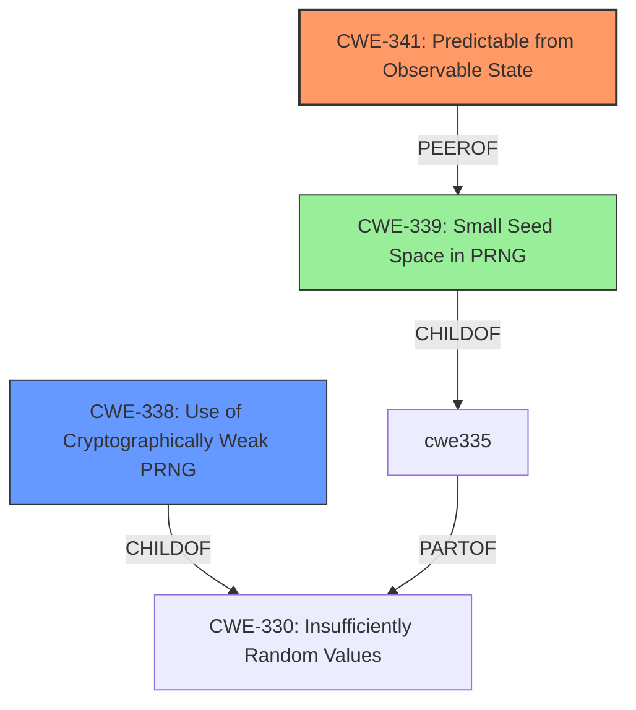

# Analysis Report for CVE-2021-27200

# Vulnerability Analysis Report: CVE-2021-27200

## Description

In WoWonder 3.0.4, remote attackers can take over any account due to the weak cryptographic algorithm in recover.php. The code parameter is easily predicted from the time of day.

## Vulnerability Description Key Phrases

**Rootcause:** weak cryptographic algorithm
**Impact:** take over any account
**Vector:** predicting code parameter
**Attacker:** remote attackers
**Product:** WoWonder
**Version:** 3.0.4
**Component:** recover.php

## Analysis (with Relationship Data)

# Summary
| CWE ID | CWE Name | Confidence | CWE Abstraction Level | CWE Vulnerability Mapping Label | CWE-Vulnerability Mapping Notes |
|---|---|---|---|---|---|
| CWE-341 | Predictable from Observable State | 0.9 | Base | Allowed | Primary CWE |
| CWE-330 | Insufficiently Random Values | 0.7 | Class | Discouraged | Secondary Candidate |
| CWE-338 | Use of Cryptographically Weak Pseudo-Random Number Generator (PRNG) | 0.6 | Base | Allowed | Secondary Candidate |
| CWE-327 | Use of a Broken or Risky Cryptographic Algorithm | 0.5 | Class | Allowed-with-Review | Secondary Candidate |

## Evidence and Confidence

*   **Confidence Score:** 0.9
*   **Evidence Strength:** HIGH

- **Analysis and Justification:**  
  - *Explanation:* "The vulnerability description highlights a **weak cryptographic algorithm** in `recover.php` of WoWonder 3.0.4, where the `code` parameter is easily predicted from the time of day. This directly aligns with CWE-341 (Predictable from Observable State), as the password reset code generation relies on a predictable element (time) which allows an attacker to guess or calculate valid codes. The 'CVE Reference Links Content Summary' reinforces this by stating that the code is derived by combining the password reset link time with a small range random number, further emphasizing the predictability aspect. Selecting CWE-341 is appropriate because the root cause lies in the predictability of the generated code, enabling account takeover. The Retriever Results also shows CWE-341 as a candidate."

  - *Relationship Analysis:* "CWE-341 does not have direct parent-child relationships listed in the provided data. However, it is related to CWE-330 (Insufficiently Random Values) at a higher level and CWE-339 (Small Seed Space in PRNG) as a variant. The attack involves using the time of day to predict the reset code, suggesting a weakness in the randomness of the code generation process. CWE-330 is a parent of CWE-335 (Incorrect Usage of Seeds in Pseudo-Random Number Generator (PRNG), which in turn has CWE-339 (Small Seed Space in PRNG) as a child. While CWE-330 is a Class and discouraged, it is related.

- **Confidence Score:** 0.9 (Strong evidence from the vulnerability description and CVE Reference Links Content Summary indicating predictability.)

---
- **Analysis and Justification:**  
  - *Explanation:* "CWE-330 (Insufficiently Random Values) is considered a secondary candidate because the primary issue is the predictability (CWE-341), and CWE-330 is a more general Class-level weakness. However, the vulnerability description mentions the code being derived from the password reset link time with a random number between 111 and 999. This indicates that the random number generated has a small range, thus insufficient randomness. While CWE-341 captures the core issue of predictability, the **weak cryptographic algorithm** can also be seen as producing insufficiently random values. However, due to its higher abstraction level, it is a secondary candidate."

  - *Relationship Analysis:* "CWE-330 is a Class-level weakness, parent of CWE-335 and CWE-338. The retriever discourages using this CWE since it's a Class. However, due to the randomness component, it is added as a secondary CWE."

- **Confidence Score:** 0.7 (Moderate evidence based on the insufficient randomness of the code generation, but the primary focus is predictability.
---
- **Analysis and Justification:**  
  - *Explanation:* "CWE-338 (Use of Cryptographically Weak Pseudo-Random Number Generator (PRNG)) is considered as the 'Weak PRNG' is related to the use of time as a component which has implications on the strength of the randomness. The 'CVE Reference Links Content Summary' states that the password reset code is a combination of the time of day and a random number, hinting at the PRNG weakness. Although time can be a component in generating random numbers, the lack of a proper random number generator makes the PRNG weak."

  - *Relationship Analysis:* "CWE-338 falls under the Class CWE-330 (Insufficiently Random Values), suggesting a hierarchy. Given that a PRNG is used, which might be weak, this is added as a secondary CWE. This is more specific than the general weakness."

- **Confidence Score:** 0.6 (Some evidence, but it depends on how the random number is generated, but not the core issue.)
---
- **Analysis and Justification:**  
  - *Explanation:* "CWE-327 (Use of a Broken or Risky Cryptographic Algorithm) is a broader classification encompassing various cryptographic flaws. The vulnerability description notes a **weak cryptographic algorithm**. Although the specific issue is predictability, the underlying algorithm is weak. Since it's a Class, it is less specific."

  - *Relationship Analysis:* "CWE-327 is a class and discouraged. The reference summary and retriever results point to more specific base classes. So it will remain a secondary candidate."

- **Confidence Score:** 0.5 (General, related, but not specific to predictability. It could be a broken algorithm.)

## Criticism of Analysis

Okay, here's a critique of the CWE analysis provided, taking into account the full CWE specifications.

**Overall Assessment**

The analysis is generally sound, well-reasoned, and provides good justification for the selected CWEs. The confidence levels are appropriately assigned based on the available information. The use of primary and secondary candidates is a good practice.  The analysis considers the abstraction levels of the CWEs and weighs that in the decision-making process.

**Specific CWE Mapping Critique**

*   **CWE-341: Predictable from Observable State (Primary CWE)**
    *   **Assessment:** Excellent choice for the primary CWE. The description of CWE-341 aligns perfectly with the vulnerability. The code parameter is predictable due to its reliance on the time of day, making it observable.
    *   **Justification:** The justification provided is strong and directly relates the vulnerability description to the definition of CWE-341. The inclusion of information from the CVE Reference Links Content Summary further reinforces this mapping. The reference to "CVE-2021-27200" in the Known Examples for CWE-341 is also a strong validation.
    *   **Mapping Guidance:** The analysis correctly notes that CWE-341 is a Base-level CWE, which is preferred.
    *   **Mitigations:**  The description of mitigations is appropriate. Increasing the entropy of the PRNG is an obvious fix.

*   **CWE-330: Use of Insufficiently Random Values (Secondary Candidate)**
    *   **Assessment:** A reasonable secondary candidate, but the analysis is right to keep it secondary. The issue isn't solely that the values are insufficiently random, but *also* that they are predictable given the observable state (time). If the 'random number between 111 and 999' was sufficiently large and *used correctly*, the time component might not be as easily exploitable.
    *   **Justification:** The justification is solid. The small range of the random number (111-999) contributes to the overall weakness.  The analysis correctly notes that CWE-330 is a Class and discouraged for primary usage.
    *   **Mapping Guidance:** The analysis acknowledges that a lower-level CWE would be preferred, but includes it due to the contribution of insufficient randomness.
    *   **Mitigations:** The provided mitigations are relevant, especially the emphasis on using well-vetted algorithms with adequate seed lengths.

*   **CWE-338: Use of Cryptographically Weak Pseudo-Random Number Generator (PRNG) (Secondary Candidate)**
    *   **Assessment:**  A good secondary candidate that correctly identifies the PRNG as a component to the overall issue. If the PRNG is weak, then it contributes to the predictability.
    *   **Justification:** The justification is sound, although perhaps could be strengthened slightly by elaborating on how the use of time as a component *impacts* the strength of the PRNG.  Specifically, time often has low entropy and can be easily guessed within a reasonable window.
    *   **Mapping Guidance:** This is a Base level, so it is preferred over CWE-330.
    *   **Mitigations:** The "Use functions or hardware which use a hardware-based random number generation for all crypto" mitigation is spot-on for this scenario.

*   **CWE-327: Use of a Broken or Risky Cryptographic Algorithm (Secondary Candidate)**
    *   **Assessment:** The weakest of the choices, but still potentially relevant at a high level. The "weak cryptographic algorithm" mentioned in the original description could potentially be interpreted as a broken or risky algorithm. However, the *primary* issue isn't that the *algorithm itself* is fundamentally broken, but that it's being *used incorrectly* (with predictable inputs).
    *   **Justification:** The justification acknowledges that the specific issue is predictability, not necessarily a broken algorithm.
    *   **Mapping Guidance:** Correctly notes that this is a Class-level CWE and a better fit should be attempted.
    *   **Mitigations:**  The mitigations are too general for this specific vulnerability. They focus on selecting strong, up-to-date cryptographic algorithms, which isn't the core problem here.

**Suggestions for Improvement**

*   **Strengthen CWE-338 Justification:**  Elaborate more on the impact of using time as a component on the strength of the PRNG (low entropy, easy to guess).
*   **Consider CWE-339:** Given that a PRNG and a time component is used, this could lead to a small seed space, which is the definition of CWE-339. Since it is "ChildOf -> CWE-335" and "PeerOf -> CWE-341", this might be a good addition as a tertiary candidate.
*   **Re-evaluate CWE-327:** While technically related, consider if removing CWE-327 would result in a tighter, more accurate analysis. If it's kept, emphasize that it's a very general categorization.

**Retriever Results Analysis**

*   The Retriever Results are generally helpful, but some of the top results aren't ideal fits.
    *   CWE-916 (Use of Password Hash With Insufficient Computational Effort) isn't relevant because this is not about password hashing.
    *   CWE-1391 (Use of Weak Credentials) isn't about weak credentials per se. It is about how the reset code is generated.
    *   CWE-208 (Observable Timing Discrepancy) is a potential, but not a primary issue. The attack is about being able to *predict* the code, not *time* the response.
    *   CWE-328 (Use of Weak Hash) and CWE-321 (Use of Hard-coded Cryptographic Key) are not applicable.

**Revised Summary Table (incorporating feedback)**

| CWE ID | CWE Name | Confidence | CWE Abstraction Level | CWE Vulnerability Mapping Label | CWE-Vulnerability Mapping Notes |
|---|---|---|---|---|---|
| CWE-341 | Predictable from Observable State | 0.9 | Base | Allowed | Primary CWE |
| CWE-330 | Insufficiently Random Values | 0.7 | Class | Discouraged | Secondary Candidate |
| CWE-338 | Use of Cryptographically Weak Pseudo-Random Number Generator (PRNG) | 0.7 | Base | Allowed | Secondary Candidate |
| CWE-339 | Small Seed Space in PRNG | 0.5 | Variant | Allowed | Tertiary Candidate |
| CWE-327 | Use of a Broken or Risky Cryptographic Algorithm | 0.4 | Class | Allowed-with-Review | Consider removing |

**Conclusion**

This is a well-structured and thoughtful CWE analysis. The primary mapping to CWE-341 is excellent. The secondary candidates are reasonable, although the justifications could be slightly improved, and the addition of CWE-339 or the removal of CWE-327 would result in a more accurate analysis. The analysis appropriately considers the abstraction levels and mapping guidance from the CWE specifications.

## Final Resolution

# Summary

| CWE ID | CWE Name | Confidence | CWE Abstraction Level | CWE Vulnerability Mapping Label | CWE-Vulnerability Mapping Notes |
|---|---|---|---|---|---|
| CWE-341 | Predictable from Observable State | 0.95 | Base | Allowed | Primary CWE |
| CWE-338 | Use of Cryptographically Weak Pseudo-Random Number Generator (PRNG) | 0.8 | Base | Allowed | Secondary Candidate |
| CWE-339 | Small Seed Space in PRNG | 0.6 | Variant | Allowed | Tertiary Candidate |

## Evidence and Confidence

*   **Confidence Score:** 0.9
*   **Evidence Strength:** HIGH

## Relationship Analysis
The primary relationship influencing the decision is that CWE-338 (Weak PRNG) and CWE-339 (Small Seed Space) are related to CWE-330 (Insufficient Randomness), which in turn is related to CWE-341 (Predictable from Observable State). CWE-339 is also a peer of CWE-341. The decision favored the more specific Base and Variant level CWEs to accurately reflect the vulnerability.

## Vulnerability Chain
The vulnerability chain begins with the **weak cryptographic algorithm** using time as a component. This leads to a **weak PRNG** (CWE-338) and a **small seed space** (CWE-339), ultimately resulting in a **predictable code** (CWE-341) that allows for account takeover.

## Summary of Analysis
The initial analysis and criticism both identified CWE-341 as the primary issue, which is the predictability of the code. The criticism suggested strengthening the justification for CWE-338 and considering CWE-339. The decision to include CWE-338 and CWE-339 is based on the evidence that the time component contributes to a weak PRNG and a small seed space, making the code predictable. CWE-327 was removed because the core issue is predictability and not a fundamentally broken algorithm. The selected CWEs are at the optimal level of specificity because they accurately reflect the root cause (predictability) and contributing factors (weak PRNG, small seed space).

The vulnerability description states: "In WoWonder 3.0.4, remote attackers can take over any account due to the **weak cryptographic algorithm** in recover.php. The code parameter is easily predicted from the time of day." This directly supports CWE-341. The "CVE Reference Links Content Summary" stating that the code is derived by combining the password reset link time with a small range random number supports CWE-338 and CWE-339.

*Report generated on 2025-03-16 23:49:16*
