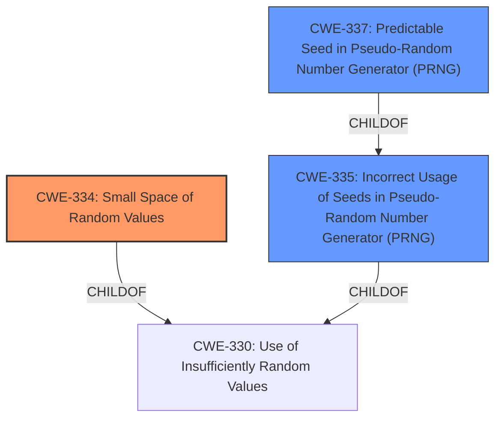

# Final Resolution for CVE-2021-27211

# Summary
| CWE ID  | CWE Name  | Confidence | CWE Abstraction Level | CWE Vulnerability Mapping Label | CWE-Vulnerability Mapping Notes |
|---|---|---|---|---|---|
| CWE-334 | Small Space of Random Values | 0.95 | Base | Allowed | Primary CWE |
| CWE-335 | Incorrect Usage of Seeds in Pseudo-Random Number Generator (PRNG) | 0.85 | Base | Allowed | Secondary Candidate |
| CWE-337 | Predictable Seed in Pseudo-Random Number Generator (PRNG) | 0.80 | Variant | Allowed | Secondary Candidate |

## Evidence and Confidence

*   **Confidence Score:** 0.95
*   **Evidence Strength:** HIGH

## Relationship Analysis
The primary weakness is **CWE-334 (Small Space of Random Values)**. It's a Base CWE, offering good specificity. **CWE-335 (Incorrect Usage of Seeds in Pseudo-Random Number Generator (PRNG))** and **CWE-337 (Predictable Seed in Pseudo-Random Number Generator (PRNG))** are related to **CWE-334** through the shared context of PRNG seeding. **CWE-337** is a Variant of **CWE-335**, indicating a more specific case of incorrect seed usage. **CWE-330 (Use of Insufficiently Random Values)** is a parent Class of **CWE-334** and **CWE-335**, but it's less specific.

## Vulnerability Chain
The vulnerability chain starts with the **ROOTCAUSE** of using a 32-bit seed value, which corresponds to **CWE-334 (Small Space of Random Values)**. The incorrect usage of seeds through MD5 hashing and XORing, represented by **CWE-335 (Incorrect Usage of Seeds in Pseudo-Random Number Generator (PRNG))**, leads to a predictable seed, as described in **CWE-337 (Predictable Seed in Pseudo-Random Number Generator (PRNG))**. This predictability allows attackers to brute-force the seed and detect hidden data, ultimately leading to information disclosure.

## Summary of Analysis
The initial analysis and the provided criticism both converge on **CWE-334 (Small Space of Random Values)** as the primary weakness due to the reliance on a 32-bit seed value in Steghide. The criticism strengthens the justification for including **CWE-335 (Incorrect Usage of Seeds in Pseudo-Random Number Generator (PRNG))** and **CWE-337 (Predictable Seed in Pseudo-Random Number Generator (PRNG))** as secondary candidates by explicitly linking the MD5 hashing and XOR operations to the reduced entropy and predictability of the seed. The provided evidence, particularly the CVE description and the existence of the `stegcrack` tool, strongly supports this assessment.

The graph relationships highlight that **CWE-334** is the most specific Base CWE that captures the core issue, while **CWE-335** and **CWE-337** provide additional context regarding the incorrect and predictable nature of the seed generation process. **CWE-330** is too abstract, and choosing it would lose valuable specificity.

I've increased the confidence in **CWE-335** and **CWE-337** slightly due to the improved justifications suggested in the criticism, particularly the explanation of how MD5 hashing and XORing reduce entropy and increase predictability.

The selected CWEs are at the optimal level of specificity because they directly address the **ROOTCAUSE** of the vulnerability (small seed space) and the factors that contribute to its exploitability (incorrect seed usage and predictability). Using a more general CWE would obscure the specific technical details of the vulnerability.

The final decision is based on the following evidence:

*   "steghide 0.5.1 relies on a certain 32-bit seed value, which makes it easier for attackers to detect hidden data." (Vulnerability Description)
*   The existence of the `stegcrack` tool, which exploits the limited seed space.

These pieces of evidence, combined with the relationship analysis and the mapping guidance, justify the selection of **CWE-334**, **CWE-335**, and **CWE-337** as the most appropriate classifications.