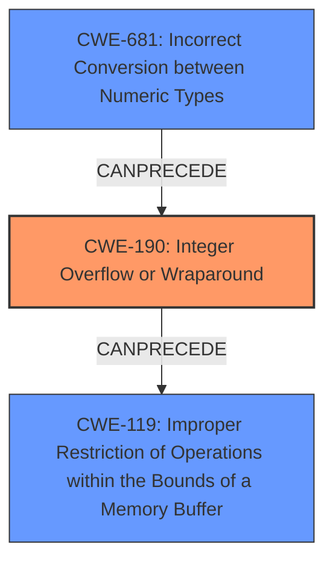

# Final Resolution for CVE-2021-27219

# Summary
| CWE ID | CWE Name | Confidence | CWE Abstraction Level | CWE Vulnerability Mapping Label | CWE-Vulnerability Mapping Notes |
|---|---|---|---|---|---|
| CWE-190 | Integer Overflow or Wraparound | 0.95 | Base | Allowed | Primary CWE |
| CWE-681 | Incorrect Conversion between Numeric Types | 0.70 | Base | Allowed | Secondary Candidate |

## Evidence and Confidence

*   **Confidence Score:** 0.90
*   **Evidence Strength:** HIGH

## Relationship Analysis
The primary **WEAKNESS** is **CWE-190** (Integer Overflow or Wraparound), which is caused by **CWE-681** (Incorrect Conversion between Numeric Types). Specifically, the implicit cast from a 64-bit value to a 32-bit value leads to the overflow. The overflow then causes an incorrect buffer size calculation, potentially leading to a buffer overflow and memory corruption.

## Vulnerability Chain
The vulnerability chain starts with an implicit cast from a 64-bit `gsize` to a 32-bit `guint` (**CWE-681**). This conversion is incorrect because it does not account for values that exceed the maximum value of a 32-bit integer. If a large 64-bit value is cast, it results in an integer overflow (**CWE-190**). The overflowed value is then used in the `g_memdup` function to allocate memory. Because of the overflow, the allocated buffer is smaller than expected. Consequently, when data is copied into this buffer, a heap-based buffer overflow can occur (**CWE-119**), potentially leading to arbitrary code execution or other security impacts. The **ROOTCAUSE** is the type conversion done without appropriate checks, thus causing the integer overflow.

## Summary of Analysis
The initial analysis correctly identified **CWE-190** as the primary **WEAKNESS**, given the explicit mention of "integer overflow" in the vulnerability description and CVE reference. However, the criticism correctly pointed out that **CWE-131** and **CWE-789** were more consequences of the overflow rather than contributing factors. The suggestion to include **CWE-681** is valuable, as the implicit cast is the direct cause of the integer overflow.

The vulnerability description states: "The function g_bytes_new has an integer overflow on 64-bit platforms due to an implicit cast from 64 bits to 32 bits." This clearly indicates that the implicit cast is the **ROOTCAUSE** that leads to the integer overflow, and then consequently, a buffer overflow.

The graph relationships influenced the final selection by clarifying the chain of events. **CWE-681** (Incorrect Conversion between Numeric Types) `CANPRECEDE` **CWE-190** (Integer Overflow or Wraparound), which in turn `CANPRECEDE` **CWE-119** (Improper Restriction of Operations within the Bounds of a Memory Buffer). This chain accurately reflects the vulnerability's progression.

The selected CWEs are at the optimal level of specificity because they directly address the **ROOTCAUSE** (**CWE-681**: the incorrect type conversion) and the immediate result (**CWE-190**: the integer overflow).