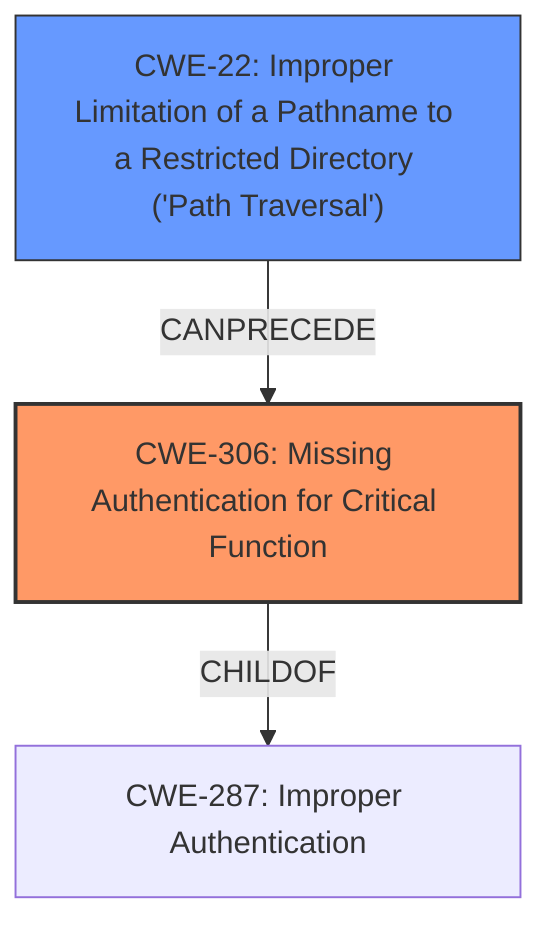

# Final Resolution for CVE-2021-27306

# Summary
| CWE ID | CWE Name | Confidence | CWE Abstraction Level | CWE Vulnerability Mapping Label | CWE-Vulnerability Mapping Notes |
|---|---|---|---|---|---|
| **CWE-306** | Missing Authentication for Critical Function | 0.90 | Base | Allowed | Primary **CWE** |
| **CWE-22** | Improper Limitation of a Pathname to a Restricted Directory ('Path Traversal') | 0.80 | Base | Allowed | Secondary Candidate |

## Evidence and Confidence

*   **Confidence Score:** 0.85
*   **Evidence Strength:** HIGH

## Relationship Analysis
The primary relationship is between **CWE-306** [Missing Authentication for Critical Function] and its parent **CWE-287** [Improper Authentication]. While **CWE-287** [Improper Authentication] could apply, **CWE-306** [Missing Authentication for Critical Function] is more specific because the vulnerability stems from the complete absence of authentication rather than a flaw in its implementation. **CWE-22** [Improper Limitation of a Pathname to a Restricted Directory ('Path Traversal')] is included to show the vulnerability chain with the missing authentication.

## Vulnerability Chain
The vulnerability chain starts with the **ROOTCAUSE** of missing authentication (**CWE-306** [Missing Authentication for Critical Function]). Because there is no authentication mechanism, the path traversal (**CWE-22** [Improper Limitation of a Pathname to a Restricted Directory ('Path Traversal')]) can be exploited to gain unauthorized access.

## Summary of Analysis
The analysis accurately identifies **CWE-306** [Missing Authentication for Critical Function] as the primary **WEAKNESS**. The inclusion of **CWE-22** [Improper Limitation of a Pathname to a Restricted Directory ('Path Traversal')] as a secondary candidate is also valid and adds valuable context.

*   **CWE-306** [Missing Authentication for Critical Function]: This is the most accurate and direct mapping. The description aligns perfectly: "The product does not perform any authentication for functionality that requires a provable user identity..." The vulnerability allows unauthenticated users to access authenticated routes, directly demonstrating the *absence* of authentication. The confidence level is increased to 0.90 to represent a high degree of confidence.
*   **CWE-22** [Improper Limitation of a Pathname to a Restricted Directory ('Path Traversal')]: Confidence increased from 0.65 to 0.80 as the CVE explicitly states the path traversal. The vulnerability is caused by the lack of URI normalization, which allows path traversal to bypass authentication checks.

Based on the CVE reference, "Kong API Gateway prior to 2.3.2.0 does not normalize the incoming request URI before matching against the Router. This allowed an attacker to bypass authentication by using an unauthenticated route with a path traversal."

The parent relationship between **CWE-287** [Improper Authentication] and **CWE-306** [Missing Authentication for Critical Function] helped clarify that **CWE-306** [Missing Authentication for Critical Function] is the more specific and appropriate choice. The chain relationship helped clarify how the **WEAKNESSES** can be chained from missing authentication to path traversal.

Other **CWE**s Considered:
*   **CWE-862** [Missing Authorization]: This **CWE** focuses on the absence of authorization checks *after* a user is authenticated. In this case, the primary issue is getting *past* authentication in the first place, so this is not applicable.
*   **CWE-425** [Direct Request ('Forced Browsing')]: Because the system does not normalize the URI, it could be said that the attacker is performing a direct request to the intended URL through a path traversal. However, this is not as precise as **CWE-22** [Improper Limitation of a Pathname to a Restricted Directory ('Path Traversal')], so this is not applicable.
*   **CWE-863** [Incorrect Authorization]: The analysis mentions that the access control is improper, which can be seen as an incorrect authorization mechanism. However, this is not as accurate as the missing authentication mechanism, so this is not applicable.
*   **CWE-347** [Improper Verification of Cryptographic Signature]: The fact that the system does not require authentication for certain calls means that it does not verify if the JWT signature is valid, which may lead the analyzer to think of **CWE-347** [Improper Verification of Cryptographic Signature]. However, this is a consequence of the missing authentication, so it is not applicable.
*   **CWE-639** [Authorization Bypass Through User-Controlled Key]: Because the URI is not normalized, the attacker can control the key that is used to perform authorization, thus bypassing the authorization mechanism. However, there is no authorization taking place in this case, so this is not applicable.
*   **CWE-807** [Reliance on Untrusted Inputs in a Security Decision]: Because the system does not normalize the URI, the trust on what URL the user is accessing is broken, thus relying on untrusted inputs for the security decision. However, this is a consequence of the missing authentication, so this is not applicable.

The selected **CWE**s are at the optimal level of specificity because **CWE-306** [Missing Authentication for Critical Function] directly addresses the core issue of absent authentication, and **CWE-22** [Improper Limitation of a Pathname to a Restricted Directory ('Path Traversal')] explains what happens as a result.