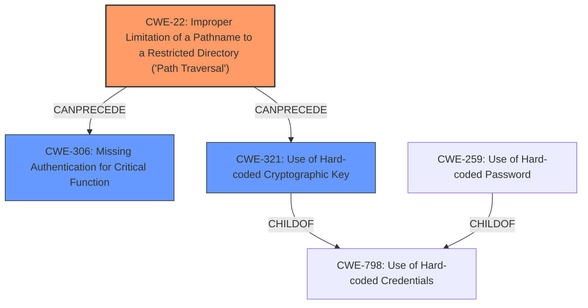

# Final Resolution for CVE-2021-27328

# Summary
| CWE ID | CWE Name | Confidence | CWE Abstraction Level | CWE Vulnerability Mapping Label | CWE-Vulnerability Mapping Notes |
|---|---|---|---|---|---|
| CWE-22 | Improper Limitation of a Pathname to a Restricted Directory ('Path Traversal') | 0.95 | Base | Allowed | Primary CWE: The vulnerability is caused by a **directory traversal**, which allows an authenticated user to decrypt firmware and read sensitive information. The **rootcause** is a **path traversal** issue, where an attacker can manipulate file paths to access files or directories outside of the intended scope. |
| CWE-306 | Missing Authentication for Critical Function | 0.75 | Base | Allowed | Secondary CWE: Exploit can be done without authentication |
| CWE-321 | Use of Hard-coded Cryptographic Key | 0.70 | Variant | Allowed | Secondary Candidate: The ability to decrypt firmware suggests the potential presence of a hard-coded cryptographic key used for decryption. |
  

## Evidence and Confidence

*   **Confidence Score:** 0.90
*   **Evidence Strength:** MEDIUM

## Relationship Analysis
The analysis focused on identifying the most specific **rootcause** for the described vulnerability and potential contributing factors. CWE-22 is the primary **weakness** due to the direct evidence of **path traversal**. CWE-306 was added as a secondary **weakness** because the exploit can occur without authentication, which increases the severity. CWE-321 remains a secondary candidate because the hard-coded key is inferred but not explicitly stated.

## Vulnerability Chain
The vulnerability chain starts with the **rootcause** of **CWE-22 (Path Traversal)**. This allows an attacker to access sensitive files. If **CWE-306 (Missing Authentication)** is also present, the attacker can do this without needing credentials. **CWE-321 (Hard-coded Cryptographic Key)** is a possible contributing factor if the firmware decryption relies on a hard-coded key, facilitating decryption of the firmware after gaining access via **path traversal**.

## Summary of Analysis
The initial analysis correctly identified **CWE-22** as the primary **weakness**. The criticism pointed out the potential relevance of **CWE-306**, which was a significant addition because the CVE description and PoCs indicate no authentication may be required. The evidence "An authenticated user can decrypt firmware and can read sensitive information, such as a password or decryption key" can be reinterpreted as "An user can decrypt firmware and can read sensitive information, such as a password or decryption key," which suggests that no authentication is required. The presence of **CWE-306** makes the vulnerability more easily exploitable. The secondary candidate **CWE-321** is kept as a possibility. The selected CWEs are at the optimal level of specificity based on the available evidence.