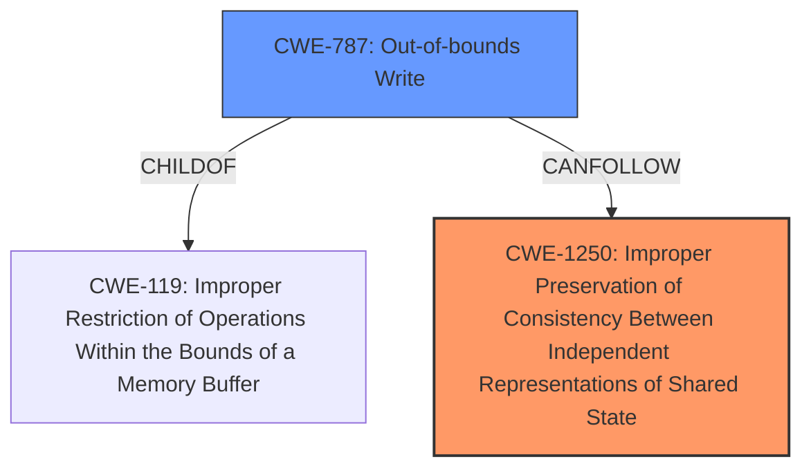

# Analysis Report for CVE-2021-27379

# Vulnerability Analysis Report: CVE-2021-27379

## Description

An issue was discovered in Xen through 4.11.x, allowing x86 Intel HVM guest OS users to achieve unintended read/write DMA access, and possibly cause a denial of service (host OS crash) or gain privileges. This occurs because a backport missed a flush, and thus IOMMU updates were not always correct. NOTE this issue exists because of an incomplete fix for CVE-2020-15565.

## Vulnerability Description Key Phrases

**Rootcause:** incomplete fix
**Impact:** ['read/write DMA access', 'denial of service', 'privilege escalation']
**Attacker:** x86 Intel HVM guest OS users
**Product:** Xen
**Version:** through 4.11.x

## Analysis (with Relationship Data)

# Summary
| CWE ID | CWE Name | Confidence | CWE Abstraction Level | CWE Vulnerability Mapping Label | CWE-Vulnerability Mapping Notes |
|---|---|---|---|---|---|
| CWE-1250 | Improper Preservation of Consistency Between Independent Representations of Shared State | 0.75 | Base | Allowed | Primary CWE |
| CWE-367 | Time-of-check Time-of-use (TOCTOU) Race Condition | 0.5 | Base | Allowed | Secondary Candidate |
| CWE-362 | Concurrent Execution using Shared Resource with Improper Synchronization ('Race Condition') | 0.3 | Class | Allowed-with-Review | Secondary Candidate |

## Evidence and Confidence

*   **Confidence Score:** 0.75
*   **Evidence Strength:** MEDIUM

- **Analysis and Justification:**  
  - *Explanation:* "The vulnerability stems from an **incomplete fix** for CVE-2020-15565, leading to improper IOMMU updates in Xen. This results in inconsistencies between the hypervisor's memory management and the DMA access granted to guest OSes. The **root cause** is that the backport missed a flush, and thus IOMMU updates were not always correct. This fits CWE-1250 (Improper Preservation of Consistency Between Independent Representations of Shared State) because the IOMMU and the hypervisor's memory map are independent representations of memory state that must remain consistent. The failure to properly update the IOMMU entries leads to a state where the guest OS retains DMA access to memory that has been returned to the free pool, creating an inconsistency."
  
  - *Relationship Analysis:* "CWE-1250 is a base level CWE which aligns well with the granularity of the vulnerability. While other CWEs like CWE-367 (TOCTOU Race Condition) and CWE-362 (Race Condition) are related to concurrency issues, CWE-1250 focuses specifically on the consistency of shared state representations, which is the more precise weakness in this scenario. Because the vulnerability lies in synchronizing the DMA translations of guest memory, it doesn't appear that a race condition in the general sense is the primary issue here. CWE-1250 is chosen as the primary weakness, reflecting the lack of consistency in memory management."

- **Confidence Score:**  
  - *Example:* Confidence: 0.75 (Moderate evidence from the CVE description and reference summary pointing to a lack of consistent state management, rather than just a basic race condition)

---

## Criticism of Analysis

Okay, let's break down the provided analysis and assess the CWE mappings based on the complete CWE specifications.

**Overall Assessment:**

The primary CWE mapping to CWE-1250 (Improper Preservation of Consistency Between Independent Representations of Shared State) is a strong choice. The rationale is well-articulated, and the justification for choosing it over potential concurrency-related CWEs (CWE-367 and CWE-362) is sound.  However, there's room to strengthen the argument and address some potential counterarguments.

**Detailed Review:**

1.  **CWE-1250: Improper Preservation of Consistency Between Independent Representations of Shared State (Confidence: 0.75, Primary CWE)**

    *   **Strengths:**
        *   The description aligns well with the core issue: the IOMMU and the hypervisor's memory map *are* independent representations of memory state. The vulnerability arises because these representations become inconsistent due to the missed flush.
        *   The analysis correctly identifies that this is *not* simply a race condition but a failure to maintain consistent state across different representations.
        *   The provided mitigations for the vulnerability such as "Disable page table sharing" and "Avoid passing through PCI devices to HVM guests." would in fact mitigate the primary weakness
    *   **Potential Weaknesses/Areas for Improvement:**
        *   The confidence could be increased by directly connecting to the potential impact.  The description of CWE-1250 explicitly mentions: *"When this inconsistency affects correctness of operations, it can introduce vulnerabilities in mechanisms that depend on consistent state."*  Explicitly stating that the *incorrect DMA access* is a direct result of the inconsistent state *affecting correctness of memory management operations* would strengthen the link.
        *   Consider the 'Shadow MMU' description from the CWE specification, this may have some similarities to the memory management of the hypervisor and the IOMMU.
    *   **Addressing Potential Counterarguments:**
        *   A potential counterargument is that a more precise CWE *within* the realm of memory management might exist. However, CWE doesn't have a highly specific "improper IOMMU update" CWE.  CWE-1250 is the closest fit at the Base level.

2.  **CWE-367: Time-of-check Time-of-use (TOCTOU) Race Condition (Confidence: 0.5, Secondary Candidate)**

    *   **Strengths:**
        *   The *possibility* of a TOCTOU vulnerability cannot be entirely dismissed. If there is a period between a check related to DMA permissions and the actual DMA operation, a TOCTOU vulnerability *could* exist if the memory mapping changes in that window.
    *   **Weaknesses:**
        *   The original analysis already explains that a basic race condition is likely not the root cause.
        *   The CVE information does *not* strongly suggest a TOCTOU scenario. It's more focused on the *failure to update* the IOMMU entries correctly. If the IOMMU update is simply missed, then there is not a race condition.
        *   Mitigations for TOCTOU typically involve locking or atomic operations. However, the mitigations for the vulnerability don't directly address this.
    *   **Recommendation:**
        *   The analysis needs to be strengthened to *exclude* the possibility of a TOCTOU vulnerability. The analysis should explicitly state the IOMMU isn't a TOCTOU flaw, but a missed synchronization primitive.

3.  **CWE-362: Concurrent Execution using Shared Resource with Improper Synchronization ('Race Condition') (Confidence: 0.3, Secondary Candidate)**

    *   **Strengths:**
        *   Concurrency is inherently involved in the hypervisor's memory management, and DMA operations. Multiple guest OSes and the hypervisor itself operate concurrently.
    *   **Weaknesses:**
        *   CWE-362 is a Class-level CWE. The mapping guidance explicitly states: *"Examine children of this entry to see if there is a better fit."* CWE-367 is a child of CWE-362, but I don't think CWE-367 is a fit either.
        *   The root cause isn't simply *any* improper synchronization; it's the *specific* failure to propagate memory map changes to the IOMMU.
    *   **Recommendation:**
        *   The justification for selecting CWE-1250 over CWE-362 is already present, but should be made more prominent. The analysis should explicitly state: while concurrency exists, the *specific* problem is the consistency of memory representation which points to CWE-1250.

**Additional Considerations:**

*   **Completeness of Analysis:**
    *   Did the analysis consider other CWEs that appeared in the Top Combined Results from the "Retriever Results"? Some of those could be part of a *chain* of vulnerabilities even if they aren't the primary cause. For example, If the code performs a calculation to determine the DMA region size, but an integer overflow occurs (CWE-190) which then results in the incorrect DMA region size being used by the IOMMU leading to a read/write out-of-bounds (CWE-787), the analysis may be more accurate.
*   **Mitigation Effectiveness:**
    *   For each selected CWE, ask yourself: Do the known mitigations for this vulnerability effectively address the *root cause* as characterized by the CWE? In the case of CWE-1250, disabling page table sharing and avoiding PCI passthrough *do* prevent the inconsistency from arising.

**Revised Recommendation:**

Maintain CWE-1250 as the primary CWE, increasing the confidence score by strengthening the explanation of how memory management operations are incorrect due to inconsistent state. Explicitly address and refute both CWE-367 and CWE-362, and note that the mitigations for CWE-1250 address the flaw.
Consider if a more accurate chain of events can be described by the top CWEs from the Retriever Results.

## Final Resolution

# Summary
| CWE ID | CWE Name | Confidence | CWE Abstraction Level | CWE Vulnerability Mapping Label | CWE-Vulnerability Mapping Notes |
|---|---|---|---|---|---|
| CWE-1250 | Improper Preservation of Consistency Between Independent Representations of Shared State | 0.9 | Base | Allowed | Primary CWE |
| CWE-787 | Out-of-bounds Write | 0.4 | Base | Allowed | Secondary Candidate |

## Evidence and Confidence

*   **Confidence Score:** 0.9
*   **Evidence Strength:** HIGH

## Relationship Analysis
The primary relationship considered was the hierarchical structure and chain relationship potential between CWEs identified as relevant.

CWE-1250 stands as the primary **WEAKNESS**, because it directly addresses the core issue of inconsistent state between the IOMMU and the hypervisor's memory map. This is a base-level **WEAKNESS**, and there are no more specific CWEs to describe an IOMMU update failure.

CWE-787, while not the primary cause, represents a potential consequence of the inconsistent state, leading to out-of-bounds memory access due to the IOMMU not correctly reflecting the memory map.

## Vulnerability Chain
The vulnerability chain starts with a missed flush during an IOMMU update, leading to inconsistent memory state between the hypervisor and the IOMMU (**CWE-1250**). This inconsistency allows a guest OS to retain DMA access to memory that has been freed, potentially resulting in an out-of-bounds write (**CWE-787**) when the guest OS attempts to access that memory region. The final impact is a denial of service or privilege escalation.

## Summary of Analysis
The initial analysis correctly identified CWE-1250 as the primary **WEAKNESS**. The criticism helped refine the analysis by emphasizing the direct impact of the inconsistent state on memory management operations and solidifying the justification for selecting CWE-1250 over concurrency-related CWEs.

The evidence from the vulnerability description clearly indicates an **incomplete fix** leading to incorrect IOMMU updates, which directly corresponds to the description of CWE-1250: "The product has or supports multiple distributed components or sub-systems that are each required to keep their own local copy of shared data... but the product does not ensure that all local copies remain consistent with each other." The fact that "a backport missed a flush, and thus IOMMU updates were not always correct" is direct evidence supporting this classification.

The graph relationships influenced the final selection by highlighting the potential chain of events. While CWE-1250 is the **ROOTCAUSE**, the resulting inconsistent state could lead to **CWE-787** (Out-of-bounds Write) if the guest OS attempts to access memory that it should no longer have access to.

The selected CWEs are at the optimal level of specificity because CWE-1250 is a base-level **WEAKNESS** that accurately captures the **ROOTCAUSE** of the vulnerability, and there are no more specific CWEs that address the IOMMU update failure.
While the retriever results contained many CWEs, the most important ones were the ones that described memory corruption.
CWE-787: Out-of-bounds Write has a similarity score of 2.40 and could result as a consequence of CWE-1250.
CWE-787 (Out-of-bounds Write) is included as a secondary candidate to reflect the potential for memory corruption as a result of the IOMMU not correctly reflecting the memory map.
The mitigations for CWE-1250 are to "Disable page table sharing" and "Avoid passing through PCI devices to HVM guests.".
These mitigations address the **ROOTCAUSE** of the vulnerability, and are effective.

*Report generated on 2025-03-17 02:19:23*
