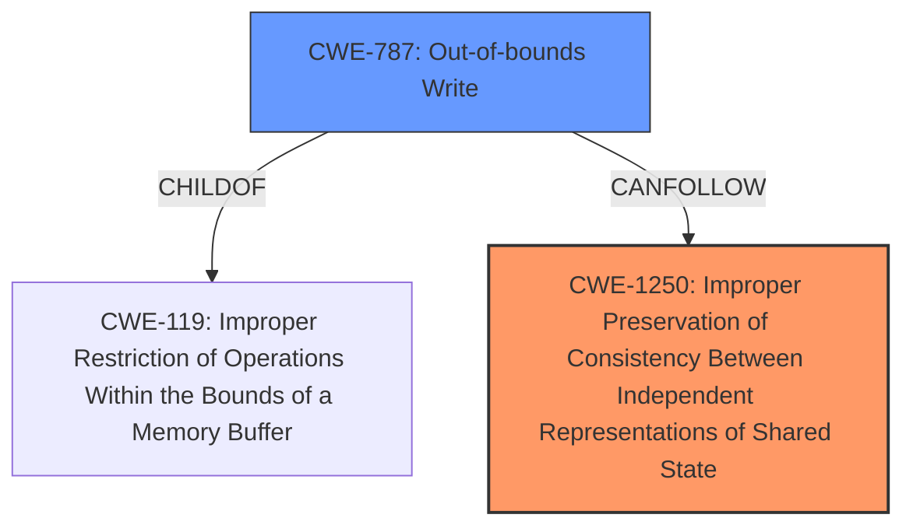

# Final Resolution for CVE-2021-27379

# Summary
| CWE ID | CWE Name | Confidence | CWE Abstraction Level | CWE Vulnerability Mapping Label | CWE-Vulnerability Mapping Notes |
|---|---|---|---|---|---|
| CWE-1250 | Improper Preservation of Consistency Between Independent Representations of Shared State | 0.9 | Base | Allowed | Primary CWE |
| CWE-787 | Out-of-bounds Write | 0.4 | Base | Allowed | Secondary Candidate |

## Evidence and Confidence

*   **Confidence Score:** 0.9
*   **Evidence Strength:** HIGH

## Relationship Analysis
The primary relationship considered was the hierarchical structure and chain relationship potential between CWEs identified as relevant.

CWE-1250 stands as the primary **WEAKNESS**, because it directly addresses the core issue of inconsistent state between the IOMMU and the hypervisor's memory map. This is a base-level **WEAKNESS**, and there are no more specific CWEs to describe an IOMMU update failure.

CWE-787, while not the primary cause, represents a potential consequence of the inconsistent state, leading to out-of-bounds memory access due to the IOMMU not correctly reflecting the memory map.

## Vulnerability Chain
The vulnerability chain starts with a missed flush during an IOMMU update, leading to inconsistent memory state between the hypervisor and the IOMMU (**CWE-1250**). This inconsistency allows a guest OS to retain DMA access to memory that has been freed, potentially resulting in an out-of-bounds write (**CWE-787**) when the guest OS attempts to access that memory region. The final impact is a denial of service or privilege escalation.

## Summary of Analysis
The initial analysis correctly identified CWE-1250 as the primary **WEAKNESS**. The criticism helped refine the analysis by emphasizing the direct impact of the inconsistent state on memory management operations and solidifying the justification for selecting CWE-1250 over concurrency-related CWEs.

The evidence from the vulnerability description clearly indicates an **incomplete fix** leading to incorrect IOMMU updates, which directly corresponds to the description of CWE-1250: "The product has or supports multiple distributed components or sub-systems that are each required to keep their own local copy of shared data... but the product does not ensure that all local copies remain consistent with each other." The fact that "a backport missed a flush, and thus IOMMU updates were not always correct" is direct evidence supporting this classification.

The graph relationships influenced the final selection by highlighting the potential chain of events. While CWE-1250 is the **ROOTCAUSE**, the resulting inconsistent state could lead to **CWE-787** (Out-of-bounds Write) if the guest OS attempts to access memory that it should no longer have access to.

The selected CWEs are at the optimal level of specificity because CWE-1250 is a base-level **WEAKNESS** that accurately captures the **ROOTCAUSE** of the vulnerability, and there are no more specific CWEs that address the IOMMU update failure.
While the retriever results contained many CWEs, the most important ones were the ones that described memory corruption.
CWE-787: Out-of-bounds Write has a similarity score of 2.40 and could result as a consequence of CWE-1250.
CWE-787 (Out-of-bounds Write) is included as a secondary candidate to reflect the potential for memory corruption as a result of the IOMMU not correctly reflecting the memory map.
The mitigations for CWE-1250 are to "Disable page table sharing" and "Avoid passing through PCI devices to HVM guests.".
These mitigations address the **ROOTCAUSE** of the vulnerability, and are effective.