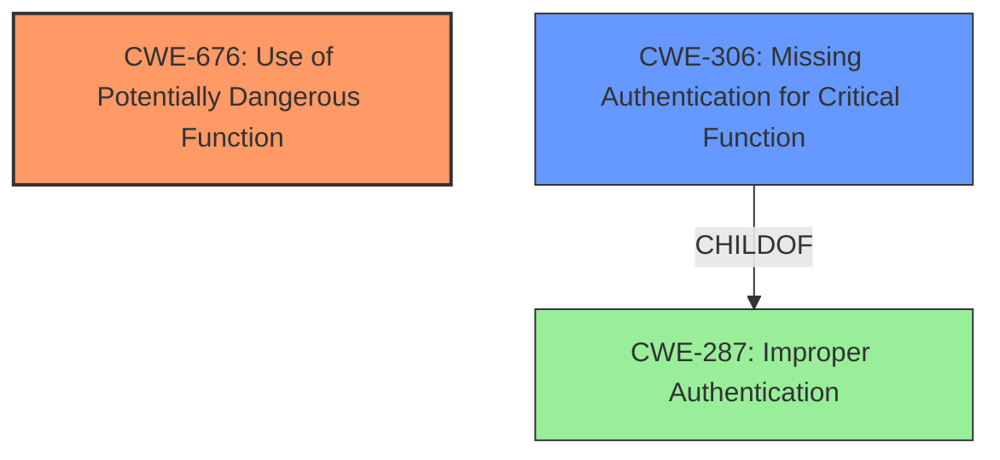

# Analysis Report for CVE-2021-27474

# Vulnerability Analysis Report: CVE-2021-27474

## Description

Rockwell Automation FactoryTalk AssetCentre v10.00 and earlier does not properly restrict all functions relating to IIS remoting services. This vulnerability may allow a remote, unauthenticated attacker to modify sensitive data in FactoryTalk AssetCentre.

## Vulnerability Description Key Phrases

**Impact:** modify sensitive data
**Attacker:** remote unauthenticated attacker
**Product:** Rockwell Automation FactoryTalk AssetCentre
**Version:** v10.00 and earlier
**Component:** functions relating to IIS remoting services

## Analysis (with Relationship Data)

# Summary
| CWE ID | CWE Name | Confidence | CWE Abstraction Level | CWE Vulnerability Mapping Label | CWE-Vulnerability Mapping Notes |
|---|---|---|---|---|---|
| CWE-676 | Use of Potentially Dangerous Function | 0.9 | Base | Primary | Allowed |
| CWE-306 | Missing Authentication for Critical Function | 0.7 | Base | Secondary | Allowed |

## Evidence and Confidence

*   **Confidence Score:** 0.8
*   **Evidence Strength:** HIGH

- **Analysis and Justification:**  
  - *Explanation:* The vulnerability description states that "Rockwell Automation FactoryTalk AssetCentre v10.00 and earlier does not properly restrict all functions relating to IIS remoting services." The CVE Reference Links Content Summary confirms this, stating the root cause is "Improper restriction of functions related to IIS remoting services in FactoryTalk AssetCentre" and "Use of Potentially Dangerous Function (CWE-676): The application doesn't properly restrict functions related to IIS remoting." This aligns directly with CWE-676 (Use of Potentially Dangerous Function), indicating that the application uses a function that, if not properly restricted, can introduce a vulnerability. The impact of this vulnerability is that a "remote, unauthenticated attacker could modify sensitive data within FactoryTalk AssetCentre." The retriever results also list CWE-676 as a candidate. MITRE's mapping guidance for CWE-676 indicates it is ALLOWED.

  - *Relationship Analysis:* CWE-676 is a Base level CWE, which is preferred. While other CWEs like CWE-284 (Improper Access Control) and CWE-287 (Improper Authentication) are related to access control issues, CWE-676 is more specific to the **use of a potentially dangerous function** without proper restrictions, which is the core weakness here.

- **Confidence Score:**  
  - Confidence: 0.9 (High confidence due to direct evidence from the vulnerability description and CVE Reference Links Content Summary)

---

- **Analysis and Justification:**  
  - *Explanation:* The vulnerability enables a "remote, unauthenticated attacker to modify sensitive data." This suggests that authentication is either missing or insufficient for the functions being accessed via IIS remoting services. While CWE-676 describes the use of the dangerous function, CWE-306 (Missing Authentication for Critical Function) highlights the lack of authentication that allows the attacker to exploit that function. The retriever results also identify CWE-306 as the highest-scoring candidate CWE.

  - *Relationship Analysis:* CWE-306 is a child of CWE-287 (Improper Authentication) and is related to the lack of proper authentication mechanisms. While CWE-287 is a Class-level CWE and is discouraged, CWE-306 is a Base-level CWE and is ALLOWED. CWE-306 is considered a secondary weakness as it is enabled by the **improperly restricted function** (CWE-676). The relationship graph shows that CWE-306 can precede other vulnerabilities related to privilege escalation.

- **Confidence Score:**  
  - Confidence: 0.7 (Medium confidence, as it's a contributing factor but not the primary root cause. The primary root cause is the **improperly restricted function**.)

## Criticism of Analysis

Okay, here's a detailed review of the provided analysis, incorporating the full CWE specifications:

**Overall Assessment**

The analysis identifies `CWE-676` and `CWE-306` as the primary and secondary weaknesses, respectively. This is a reasonable assessment given the provided information. The confidence scores are justified and the reasoning provided is sound. The evidence strength is high, as it's directly derived from the vulnerability description and CVE summary.

**Detailed Breakdown**

**1. CWE-676: Use of Potentially Dangerous Function (Primary)**

*   **Confidence Score:** 0.9
*   **Abstraction Level:** Base
*   **CWE Vulnerability Mapping Label:** Primary
*   **CWE Mapping Guidance Compliance:**  The analysis correctly notes that CWE-676 is a Base-level CWE and is "Allowed" according to MITRE's mapping guidance.
*   **Justification:**
    *   The justification clearly connects the vulnerability description ("does not properly restrict all functions relating to IIS remoting services") to the core concept of `CWE-676`.
    *   It correctly highlights that `CWE-676` is more specific than general access control/authentication CWEs (e.g., `CWE-284`, `CWE-287`). It emphasizes the **improper restriction of a potentially dangerous function** as the root cause. This is a key distinction.
*   **Mitigations:** The analysis would be slightly improved by suggesting mitigations related to `CWE-676`, such as identifying and banning prohibited API functions.
*   **Observed Examples:** The analysis doesn't use observed examples but could include examples of similar vulnerabilities related to IIS remoting services or similar.
*   **Summary:**  Excellent justification and correct application of CWE-676.

**2. CWE-306: Missing Authentication for Critical Function (Secondary)**

*   **Confidence Score:** 0.7
*   **Abstraction Level:** Base
*   **CWE Vulnerability Mapping Label:** Secondary
*   **CWE Mapping Guidance Compliance:** The analysis correctly notes that CWE-306 is a Base-level CWE and is "Allowed".
*   **Justification:**
    *   The analysis links the attacker's ability to "modify sensitive data" *without authentication* to `CWE-306`.
    *   The analysis correctly identifies this as a *secondary* weakness, stemming from the initial `CWE-676` (improperly restricted function).  This dependency is crucial.  If the function wasn't potentially dangerous, the missing authentication would be less critical.
    *   The retriever results also support the selection of `CWE-306`.
*   **Relationship Analysis:** The relationship to `CWE-287` is correctly identified. Mentioning that `CWE-306` is a child of `CWE-287` strengthens the argument, especially since `CWE-287` is "Discouraged" for direct mapping.
*   **Mitigations:** The analysis could be improved by discussing how the mitigations for CWE-306 (e.g., dividing software into areas, using centralized authentication) could be applied to this specific scenario.
*   **Observed Examples:** It could have been improved with other examples of similar vulnerabilities where missing authentication exposed dangerous functions.
*   **Summary:**  Appropriate identification of `CWE-306` as a secondary contributing factor. Good justification.

**Critiques and Suggestions**

1.  **Specificity of CWE-676:** While correct, `CWE-676` is somewhat general. Ideally, if more details about the specific IIS remoting functions were available, a more specific variant could be identified. However, based on the information given, `CWE-676` is the best fit.

2.  **Exploitation Detail:**  The analysis could benefit from briefly elaborating on *how* an unauthenticated attacker might exploit the vulnerable IIS remoting services. This could inform the selection of a more specific CWE or highlight the severity of the issue.  For example, is it a simple lack of authentication, or is there a more complex authentication bypass?

3.  **Potential Mitigations Section Expansion:** Include more concrete examples of mitigations specific to the scenario.
    *   For `CWE-676`: "Consider using a safe alternative to the potentially dangerous function, or implement strict input validation and sanitization before invoking the function. Review and harden the configuration of the IIS remoting service itself."
    *   For `CWE-306`: "Implement authentication checks *before* allowing access to the IIS remoting functions. Ensure that all communication channels are appropriately protected."

4.  **Authorization vs Authentication:** The analysis mentions both authentication and access control. It's important to clearly distinguish between these. `CWE-306` implies *missing authentication*, meaning the attacker doesn't need to prove their identity *at all*. If the attacker *can* authenticate but then gains unauthorized access, a CWE related to *authorization* (`CWE-862` or `CWE-863` and its children) would be more fitting *instead* of `CWE-306`. However, given the description of an *unauthenticated* attacker, `CWE-306` is appropriate here.

5.  **CWE-284:** The analysis correctly avoids the high-level `CWE-284` (Improper Access Control). This is excellent. Using the more specific CWEs (`CWE-676` and `CWE-306`) provides more actionable information.

**Revised Summary Table**

| CWE ID | CWE Name | Confidence | CWE Abstraction Level | CWE Vulnerability Mapping Label | CWE-Vulnerability Mapping Notes |
|---|---|---|---|---|---|
| CWE-676 | Use of Potentially Dangerous Function | 0.9 | Base | Primary | Allowed. Review for safe alternatives or enhanced protections to dangerous function. |
| CWE-306 | Missing Authentication for Critical Function | 0.7 | Base | Secondary | Allowed.  Implement authentication checks *before* allowing access to the dangerous function. |

**Conclusion**

The analysis is well-reasoned and accurate, especially in its primary identification of `CWE-676`. The identification of `CWE-306` as a secondary issue is also correct.  The suggestions above would further strengthen the analysis by adding more specific mitigations and clarifying the exploitation path. Overall, this is a solid analysis given the provided information.

## Final Resolution

# Summary

| CWE ID | CWE Name | Confidence | CWE Abstraction Level | CWE Vulnerability Mapping Label | CWE-Vulnerability Mapping Notes |
|---|---|---|---|---|---|
| CWE-676 | Use of Potentially Dangerous Function | 0.9 | Base | Primary | Allowed |
| CWE-306 | Missing Authentication for Critical Function | 0.7 | Base | Secondary | Allowed |

## Evidence and Confidence

*   **Confidence Score:** 0.8
*   **Evidence Strength:** HIGH

## Relationship Analysis
The analysis focuses on the direct relationships of the selected CWEs, particularly the parent-child relationship where CWE-306 is a child of the more general CWE-287 (Improper Authentication). This highlights the importance of selecting the most specific Base-level CWE when possible. No significant chain or peer relationships impacted the decision in this case, as the primary concern was identifying the root cause (**use of a potentially dangerous function**) and a contributing factor (**missing authentication**). The abstraction levels (Base for both CWEs) support the decision to map directly to these specific weaknesses.

## Vulnerability Chain
The vulnerability chain starts with the **use of a potentially dangerous function** (CWE-676) related to IIS remoting services. Because authentication is missing for critical functions (CWE-306), an unauthenticated attacker can exploit this dangerous function. The final impact is the modification of sensitive data in FactoryTalk AssetCentre.

## Summary of Analysis
The initial analysis and the criticism both converge on the selection of CWE-676 as the primary weakness and CWE-306 as the secondary weakness. The evidence is strong, as it is directly stated in the vulnerability description: "Rockwell Automation FactoryTalk AssetCentre v10.00 and earlier does not properly restrict all functions relating to IIS remoting services." This indicates the **improper restriction of functions**, which is characteristic of CWE-676. The fact that the attacker is unauthenticated directly points to CWE-306.

The relationship analysis reinforces this decision, as it confirms that we are using the most specific applicable CWEs at the Base level of abstraction, as recommended by MITRE's mapping guidance.

The selection of CWE-676 is at the optimal level of specificity because while further details about the specific IIS remoting functions would ideally lead to an even more specific variant, the provided information is not detailed enough. Therefore, CWE-676 is the most accurate and actionable classification based on the available evidence. The fact that the attacker is unauthenticated points to CWE-306 as a contributing weakness.

*Report generated on 2025-03-17 02:42:59*
