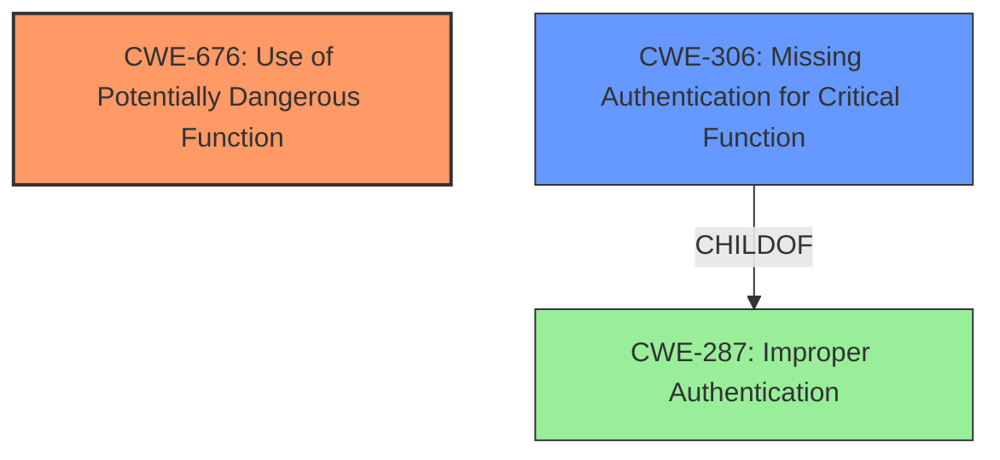

# Final Resolution for CVE-2021-27474

# Summary

| CWE ID | CWE Name | Confidence | CWE Abstraction Level | CWE Vulnerability Mapping Label | CWE-Vulnerability Mapping Notes |
|---|---|---|---|---|---|
| CWE-676 | Use of Potentially Dangerous Function | 0.9 | Base | Primary | Allowed |
| CWE-306 | Missing Authentication for Critical Function | 0.7 | Base | Secondary | Allowed |

## Evidence and Confidence

*   **Confidence Score:** 0.8
*   **Evidence Strength:** HIGH

## Relationship Analysis
The analysis focuses on the direct relationships of the selected CWEs, particularly the parent-child relationship where CWE-306 is a child of the more general CWE-287 (Improper Authentication). This highlights the importance of selecting the most specific Base-level CWE when possible. No significant chain or peer relationships impacted the decision in this case, as the primary concern was identifying the root cause (**use of a potentially dangerous function**) and a contributing factor (**missing authentication**). The abstraction levels (Base for both CWEs) support the decision to map directly to these specific weaknesses.

## Vulnerability Chain
The vulnerability chain starts with the **use of a potentially dangerous function** (CWE-676) related to IIS remoting services. Because authentication is missing for critical functions (CWE-306), an unauthenticated attacker can exploit this dangerous function. The final impact is the modification of sensitive data in FactoryTalk AssetCentre.

## Summary of Analysis
The initial analysis and the criticism both converge on the selection of CWE-676 as the primary weakness and CWE-306 as the secondary weakness. The evidence is strong, as it is directly stated in the vulnerability description: "Rockwell Automation FactoryTalk AssetCentre v10.00 and earlier does not properly restrict all functions relating to IIS remoting services." This indicates the **improper restriction of functions**, which is characteristic of CWE-676. The fact that the attacker is unauthenticated directly points to CWE-306.

The relationship analysis reinforces this decision, as it confirms that we are using the most specific applicable CWEs at the Base level of abstraction, as recommended by MITRE's mapping guidance.

The selection of CWE-676 is at the optimal level of specificity because while further details about the specific IIS remoting functions would ideally lead to an even more specific variant, the provided information is not detailed enough. Therefore, CWE-676 is the most accurate and actionable classification based on the available evidence. The fact that the attacker is unauthenticated points to CWE-306 as a contributing weakness.