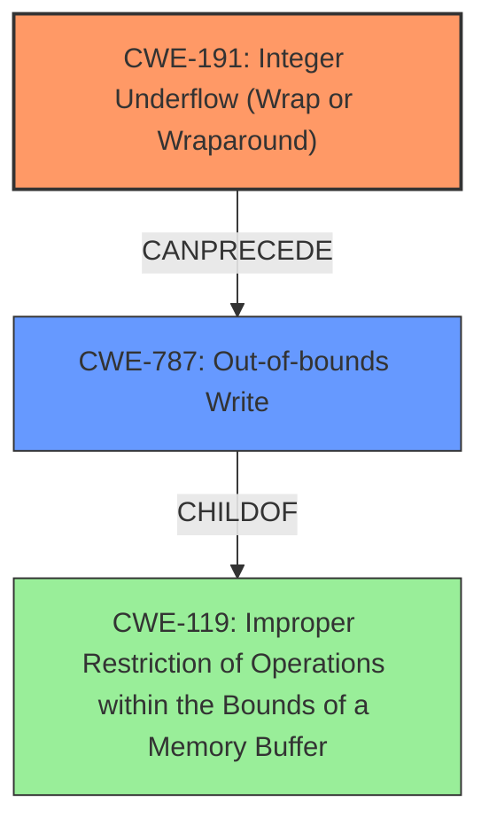

# Final Resolution for CVE-2021-27486

# Summary
| CWE ID | CWE Name | Confidence | CWE Abstraction Level | CWE Vulnerability Mapping Label | CWE-Vulnerability Mapping Notes |
|---|---|---|---|---|---|
| CWE-191 | Integer Underflow (Wrap or Wraparound) | 0.9 | Base | Allowed | Primary CWE: The vulnerability is caused by an integer underflow. |
| CWE-787 | Out-of-bounds Write | 0.7 | Base | Allowed | Secondary Candidate: The integer underflow leads to an out-of-bounds write. |

## Evidence and Confidence

*   **Confidence Score:** 0.85
*   **Evidence Strength:** HIGH

## Relationship Analysis
The primary relationship is a chain where **CWE-191** (Integer Underflow) *CanPrecede* **CWE-787** (Out-of-bounds Write). The underflow results in an incorrect calculation or index that is then used in a write operation, leading to the out-of-bounds write. **CWE-787** is a *ChildOf* **CWE-119** (Improper Restriction of Operations within the Bounds of a Memory Buffer), indicating that it's a specific type of buffer-related issue. No peer relationships significantly impacted the decision, as the other potential CWEs identified by the retriever were less directly relevant than **CWE-191** and **CWE-787**. Both selected CWEs are at the Base level, which is the preferred level of abstraction.

## Vulnerability Chain
The vulnerability chain starts with **CWE-191** (**Integer Underflow**). This underflow leads to an incorrect calculation or index, which then results in **CWE-787** (**Out-of-bounds Write**). The final impact is the ability to execute arbitrary code. There are no missing links in the chain based on the provided information.

## Summary of Analysis
The initial analysis and criticism both agree on the primary and secondary CWE assignments, with the primary **WEAKNESS** being **CWE-191** and the secondary being **CWE-787**.

The vulnerability description explicitly states "FATEK Automation WinProladder Versions 3.30 and prior is vulnerable to an **integer underflow**, which may cause an **out-of-bounds write** and allow an attacker to execute arbitrary code." This statement provides direct evidence for both **CWE-191** and **CWE-787**.

The graph relationships influenced the selection by confirming that **CWE-787** is a valid consequence of **CWE-191**. Both selected CWEs are at the optimal level of specificity (Base), providing a clear and accurate representation of the vulnerability. The choice of Base level CWEs allows for direct mapping to the **root cause** and its immediate consequence, avoiding overly broad or abstract classifications.