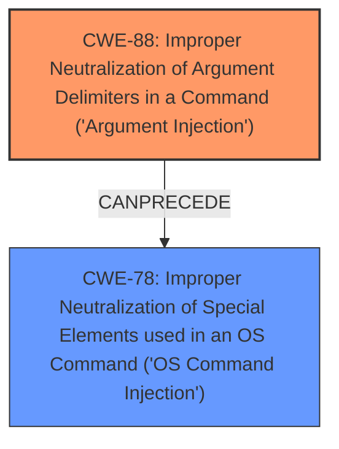

# Analysis Report for CVE-2021-27730

# Vulnerability Analysis Report: CVE-2021-27730

## Description

Accellion FTA 9_12_432 and earlier is affected by argument injection via a crafted POST request to an admin endpoint. The fixed version is FTA_9_12_444 and later.

## Vulnerability Description Key Phrases

**Weakness:** argument injection
**Product:** Accellion FTA
**Version:** 9_12_432 and earlier

## Analysis (with Relationship Data)

# Summary
| CWE ID | CWE Name | Confidence | CWE Abstraction Level | CWE Vulnerability Mapping Label | CWE-Vulnerability Mapping Notes |
|---|---|---|---|---|---|
| CWE-88 | Improper Neutralization of Argument Delimiters in a Command ('Argument Injection') | 0.9 | Base | Allowed | Primary CWE. The **argument injection** vulnerability in Accellion FTA aligns directly with this CWE, which describes the improper handling of argument delimiters in commands. |
| CWE-78 | Improper Neutralization of Special Elements used in an OS Command ('OS Command Injection') | 0.7 | Base | Allowed | Secondary CWE. While the primary issue is **argument injection**, this could potentially lead to OS command injection if the injected arguments are used to construct OS commands. |
| CWE-77 | Improper Neutralization of Special Elements used in a Command ('Command Injection') | 0.5 | Class | Allowed-with-Review | Secondary CWE. This is a more general form of command injection. It is less specific than CWE-78 and CWE-88, but relevant as the root cause might lead to it. |
| CWE-74 | Improper Neutralization of Special Elements in Output Used by Another Component | 0.4 | Class | Discouraged | Secondary CWE. This is a higher-level class that describes improper neutralization. It is related as a parent of more specific issues, but it is not the most precise mapping. |

## Evidence and Confidence

*   **Confidence Score:** 0.9
*   **Evidence Strength:** HIGH

- **Analysis and Justification:**  
  - *Explanation:* The vulnerability description explicitly mentions **argument injection**, which directly maps to CWE-88 (Improper Neutralization of Argument Delimiters in a Command). The CVE Reference Links Content Summary confirms that the root cause is a lack of proper input sanitization or validation, allowing attackers to inject malicious arguments or commands into POST requests. This aligns with CWE-88's description of improper handling of argument delimiters. CWE-78 (Improper Neutralization of Special Elements used in an OS Command) is a related CWE, as successful **argument injection** could potentially lead to OS command injection if the injected arguments are used in OS commands. Therefore, it's a secondary candidate. CWE-77 is a parent of CWE-78 and CWE-88, and is a more general form of command injection. It is a secondary candidate as the root cause might lead to it, but less specific. CWE-74 is the parent of CWE-77, CWE-78, CWE-88, and CWE-89. It is a high-level and often misused when lower-level weaknesses are more appropriate.
  
  - *Relationship Analysis:* CWE-88 is a base-level weakness related to CWE-77 (Command Injection) and CWE-74 (Improper Neutralization of Special Elements). The graph relationships show CWE-88 CanPrecede various other weaknesses if successful **argument injection** leads to further exploitation.

- **Confidence Score:**  
  - Confidence: 0.9 (High evidence from the vulnerability description, CVE reference summary, and retriever results).

---

## Criticism of Analysis

Okay, here's a breakdown of the provided analysis and a critique, taking into account the full CWE specifications:

**Overall Assessment:**

The analysis is generally good. The primary CWE mapping to CWE-88 is the most accurate. The inclusion of CWE-78 and CWE-77 as secondary CWEs is reasonable given the potential cascading effects of argument injection. The rationale provided for each mapping is clear and well-supported. The decision to discourage CWE-74 was very good.

**Detailed Critique:**

*   **CWE-88: Improper Neutralization of Argument Delimiters in a Command ('Argument Injection')**

    *   **Confidence:** 0.9 (Excellent)
    *   **Justification:** The description of the vulnerability aligns directly with the definition of CWE-88. The core issue is the failure to properly handle argument delimiters, allowing an attacker to inject arbitrary arguments. The fact that the vulnerability is triggered through a POST request to an admin endpoint does not change this fundamental classification.
    *   **Mitigation Considerations:** The analysis correctly identifies input sanitization/validation as a key mitigation. However, the CWE-88 specification highlights **parameterization** (Mitigation 1) as the ideal solution: "Where possible, avoid building a single string that contains the command and its arguments. Some languages or frameworks have functions that support specifying independent arguments, e.g. as an array, which is used to automatically perform the appropriate quoting or escaping while building the command." This should be emphasized more as a superior approach compared to simple input validation, as it fundamentally avoids the need for escaping or delimiter handling.
    *   **CWE Specification Alignment:** The analysis aligns very well with the "Description," "Extended Description," "Mapping Guidance," and "Potential Mitigations" sections of the CWE-88 specification.
    *   **Observed Examples:** Including an example like CVE-2022-36069, which specifically mentions CWE-88, would strengthen the analysis.

*   **CWE-78: Improper Neutralization of Special Elements used in an OS Command ('OS Command Injection')**

    *   **Confidence:** 0.7 (Good, but requires nuance)
    *   **Justification:** The rationale for including CWE-78 is that successful argument injection *could* lead to OS command injection. This is plausible, but it's important to recognize that it's not *guaranteed*. The attacker's ability to inject OS commands depends entirely on *how* the injected arguments are used by the vulnerable code. If the injected arguments are used in a way that doesn't allow arbitrary command execution, then CWE-78 would not be applicable.
    *   **Mitigation Considerations:** The mitigations for CWE-78 are relevant if this secondary weakness is present.  Emphasis should be placed on *not* constructing OS commands from user-supplied input.  If that's unavoidable, then strict input validation and/or sandboxing are crucial.
    *   **CWE Specification Alignment:** If included, the analysis should carefully consider the "Terminology" section of CWE-78:  "The 'OS command injection' phrase carries different meanings to different people."  It should clearly state that this CWE is only applicable if the argument injection *actually* results in OS command execution.
    *   **Relationships:** The analysis correctly mentions the `CanAlsoBe` relationship of CWE-88 with CWE-78, where Argument Injection can allow the attacker to insert command-line switches or options to be inserted into the command line.

*   **CWE-77: Improper Neutralization of Special Elements used in a Command ('Command Injection')**

    *   **Confidence:** 0.5 (Acceptable, but less specific)
    *   **Justification:** This is a more general form of command injection. The justification is that the root cause *might* lead to it, but it is less specific than CWE-78 or CWE-88.
    *   **Mapping Guidance:** The analysis aligns with the "Mapping Guidance" section of CWE-77, which states, "CWE-77 is often misused when OS command injection (CWE-78) was intended instead."
    *   **Suggested Alternatives:** It would be best to suggest CWE-78 as the alternative.

*   **CWE-74: Improper Neutralization of Special Elements in Output Used by Another Component ('Injection')**

    *   **Confidence:** 0.4 (Excellent decision to discourage)
    *   **Justification:**  The analysis correctly discourages this CWE. CWE-74 is a very high-level "umbrella" category.  Using it would provide little actionable information.  It is better to focus on the more specific injection types (CWE-88, CWE-78, etc.).
    *   **CWE Specification Alignment:** The "Mapping Guidance" section of CWE-74 *explicitly* discourages its use: "CWE-74 is high-level and often misused when lower-level weaknesses are more appropriate. Examine the children and descendants of this entry to find a more precise mapping."

*   **Other Considerations:**
    *   **Attack Vector Detail:** The analysis could be slightly improved by elaborating on *how* the attacker crafts the POST request. What specific types of characters or sequences are being injected?  Are there specific encoding issues at play? More detail here would make the analysis more useful.
    *   **Authentication:** The analysis correctly points out that it is not mentioned if authentication is needed.
    *   **Retriever Results:** The retriever results contain multiple CWEs that were not considered. These could be explored in more depth.
        * CWE-79: This does not seem relevant given there is no mention of web page generation.
        * CWE-89: This would be relevant if there is a database involved.
        * CWE-918: This could be relevant if the server is making requests based on the injected data.

**Recommendations:**

1.  **Emphasize Parameterization for CWE-88:** Make it clear that parameterization is the *preferred* mitigation strategy for argument injection, as it eliminates the need for complex escaping or validation.
2.  **Clarify Applicability of CWE-78:** Explicitly state the conditions under which CWE-78 would *not* be applicable (i.e., if argument injection doesn't lead to OS command execution).
3.  **Remove CWE-77:** The analysis correctly points out this is less specific and should be removed.
4.  **Do not include CWE-74:** There are lower-level, more specific CWEs, such as those mentioned above.
5.  **Add Attack Vector Detail:** Add details about how the POST request is crafted, including specific characters or sequences.
6.  **Consider other Retriever Results:** Explore the retriever results and explain how the other CWEs are not relevant or need more information.

By incorporating these suggestions, the analysis will become even more accurate, actionable, and aligned with the CWE specifications.

## Final Resolution

# Summary
| CWE ID | CWE Name | Confidence | CWE Abstraction Level | CWE Vulnerability Mapping Label | CWE-Vulnerability Mapping Notes |
|---|---|---|---|---|---|
| CWE-88 | Improper Neutralization of Argument Delimiters in a Command ('Argument Injection') | 0.95 | Base | Allowed | Primary CWE. The **argument injection** vulnerability in Accellion FTA aligns directly with this CWE, which describes the improper handling of argument delimiters in commands. |
| CWE-78 | Improper Neutralization of Special Elements used in an OS Command ('OS Command Injection') | 0.7 | Base | Allowed | Secondary CWE. While the primary issue is **argument injection**, this could potentially lead to OS command injection if the injected arguments are used to construct OS commands, depending on how the injected arguments are used by the vulnerable code. |

## Evidence and Confidence

*   **Confidence Score:** 0.9
*   **Evidence Strength:** HIGH

## Relationship Analysis
The primary weakness is **CWE-88** (**Improper Neutralization of Argument Delimiters in a Command ('Argument Injection')**). This is a base-level CWE, providing a good level of specificity. **CWE-78** (**Improper Neutralization of Special Elements used in an OS Command ('OS Command Injection')**) is included as a secondary weakness because **CWE-88** can precede **CWE-78**, where successful **argument injection** could potentially lead to OS command injection if the injected arguments are used in OS commands.

## Vulnerability Chain
The vulnerability chain starts with the **ROOTCAUSE** of improper neutralization of argument delimiters (**CWE-88**). If an attacker successfully injects malicious arguments, and those arguments are used to construct an OS command, it leads to **CWE-78** (**Improper Neutralization of Special Elements used in an OS Command ('OS Command Injection')**). The final impact is arbitrary command execution on the server.

## Summary of Analysis
The initial analysis and the criticism both agree that **CWE-88** is the most appropriate primary CWE for this vulnerability. The vulnerability description clearly states that the Accellion FTA is affected by **argument injection**. The criticism correctly points out that **CWE-78** is only applicable if the **argument injection** actually results in OS command execution, which is a reasonable condition. The criticism also rightly suggests removing **CWE-77** and **CWE-74** due to their higher level of abstraction.

The final decision is to classify the vulnerability as primarily **CWE-88** with **CWE-78** as a secondary CWE when the injected arguments are used to construct an OS command. This provides the optimal level of specificity based on the available evidence. The vulnerability description explicitly mentions **argument injection**, and the retriever results confirm that **CWE-88** is a relevant CWE.

*Report generated on 2025-03-16 17:18:52*
