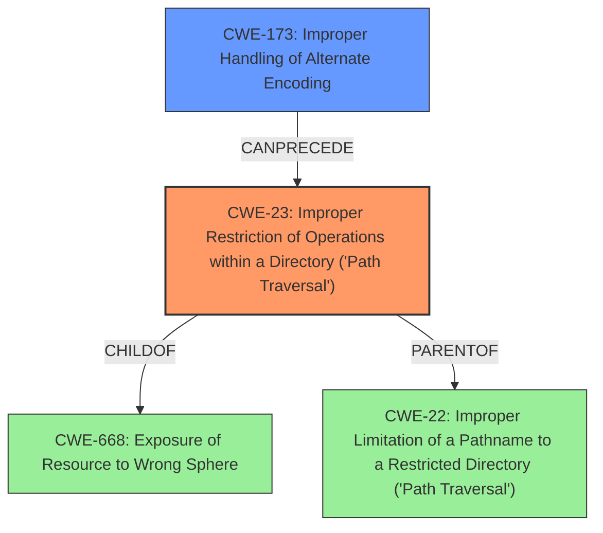

# Final Resolution for CVE-2021-28164

# Summary
| CWE ID | CWE Name | Confidence | CWE Abstraction Level | CWE Vulnerability Mapping Label | CWE-Vulnerability Mapping Notes |
|---|---|---|---|---|---|
| **CWE-23** | Improper Restriction of Operations within a Directory ('Path Traversal') | 0.90 | Base | Allowed | Primary CWE |
| **CWE-173** | Improper Handling of Alternate Encoding | 0.85 | Variant | Allowed | Secondary CWE |

## Evidence and Confidence

*   **Confidence Score:** 0.88
*   **Evidence Strength:** HIGH

## Relationship Analysis
The primary relationship is the chain where improper encoding handling (**CWE-173**) leads to path traversal (**CWE-23**). **CWE-23** is a specific type of **CWE-22 (Improper Limitation of a Pathname to a Restricted Directory ('Path Traversal'))**, focusing on relative paths. **CWE-23** is also a child of **CWE-668 (Exposure of Resource to Wrong Sphere)**, but **CWE-23** provides more specific information.

## Vulnerability Chain
The vulnerability chain starts with the improper handling of URL-encoded characters (**CWE-173**), which allows attackers to bypass path restrictions and traverse directories (**CWE-23**). This ultimately leads to the exposure of sensitive information.
  - **Root Cause:** **CWE-173** (Improper Handling of Alternate Encoding)
  - **Weakness:** **CWE-23** (Improper Restriction of Operations within a Directory ('Path Traversal'))
  - **Impact:** Exposure of sensitive information (e.g., web.xml).

## Summary of Analysis
The initial analysis correctly identified **CWE-22 (Improper Limitation of a Pathname to a Restricted Directory ('Path Traversal'))** as a potential primary CWE and **CWE-200 (Exposure of Sensitive Information to an Unauthorized Actor)** as a secondary CWE. However, the criticism provided valuable insights that led to a more accurate and specific classification.

The decision to shift the primary CWE to **CWE-23 (Improper Restriction of Operations within a Directory ('Path Traversal'))** is based on the fact that the vulnerability description explicitly mentions the use of relative paths (`%2e` and `%2e%2e`). **CWE-23** is a more specific variant of **CWE-22**, and it directly addresses the use of relative paths for directory traversal.

The secondary CWE was changed to **CWE-173 (Improper Handling of Alternate Encoding)** because the **root cause** of the path traversal is the improper handling of URL-encoded characters. This allows attackers to bypass path restrictions and access restricted resources. **CWE-173** is more specific than **CWE-200**, which is a broad class that represents a consequence of a weakness rather than the **root cause** itself.

The vulnerability description states that "the default compliance mode allows requests with URIs that contain %2e or %2e%2e segments to access protected resources within the WEB-INF directory". This directly supports the selection of **CWE-23** and **CWE-173**.

The graph relationships influenced the final selection by highlighting the chain from **CWE-173** to **CWE-23**.