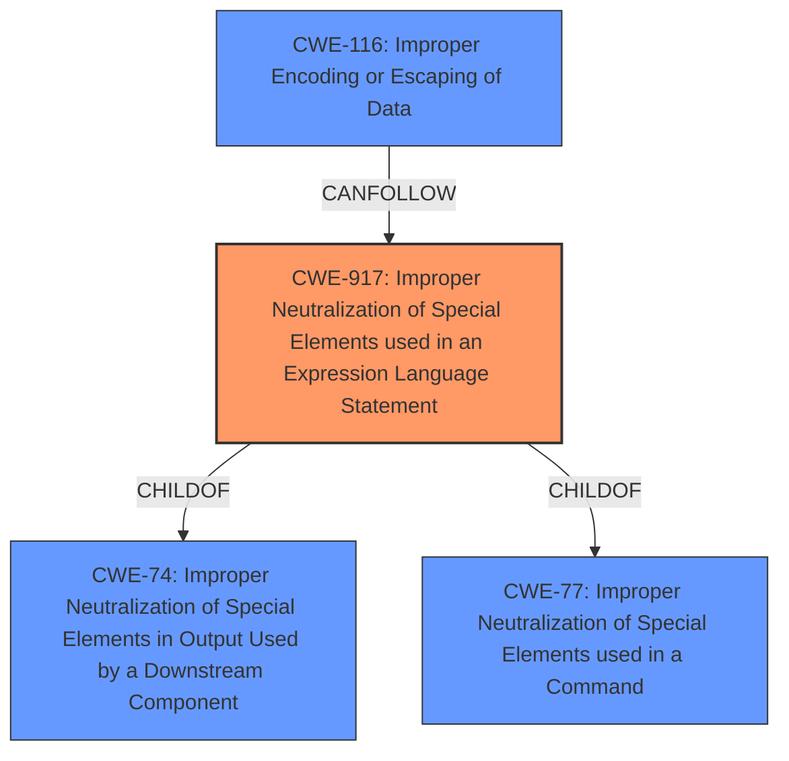

# Final Resolution for CVE-2021-28170

# Summary

| CWE ID | CWE Name | Confidence | CWE Abstraction Level | CWE Vulnerability Mapping Label | CWE-Vulnerability Mapping Notes |
|---|---|---|---|---|---|
| CWE-917 | Improper Neutralization of Special Elements used in an Expression Language Statement ('Expression Language Injection') | 0.9 | Base | Allowed | Primary CWE. The vulnerability involves a bug in the ELParserTokenManager that allows invalid EL expressions to be evaluated, aligning with the CWE's description. |
| CWE-116 | Improper Encoding or Escaping of Data | 0.7 | Class | Allowed-with-Review | Secondary CWE. The vulnerability allows attackers to bypass input sanitization controls, which suggests a problem with encoding or escaping data. |

## Evidence and Confidence

*   **Confidence Score:** 0.8
*   **Evidence Strength:** MEDIUM

## Relationship Analysis
The primary CWE, **CWE-917 (Improper Neutralization of Special Elements used in an Expression Language Statement)**, is a Base level CWE, making it a good candidate for directly mapping to the root cause. It is a child of **CWE-74 (Improper Neutralization of Special Elements in Output Used by a Downstream Component)**, which is a Class level CWE, and **CWE-77 (Improper Neutralization of Special Elements used in a Command)**, also a Class level CWE. While the criticism suggests considering **CWE-77** directly, **CWE-917** is more specific to Expression Language Injection, making it a better fit. **CWE-116 (Improper Encoding or Escaping of Data)** is a Class level CWE and represents a potential consequence of the primary **weakness** rather than the **root cause**. It highlights the failure to properly sanitize input, allowing it to be interpreted in unintended ways by downstream components.

## Vulnerability Chain
The vulnerability chain starts with the **root cause**, a **bug in the ELParserTokenManager** leading to **CWE-917 (Improper Neutralization of Special Elements used in an Expression Language Statement)**. This **weakness** allows attackers to inject malicious EL expressions. The consequence is the bypass of input sanitization controls, which can be represented by **CWE-116 (Improper Encoding or Escaping of Data)**. The ultimate impact could be remote code execution (RCE) or information disclosure, depending on the context of the application using the expression language.

## Summary of Analysis
The initial analysis correctly identified **CWE-917** as the primary **weakness**, supported by the vulnerability description which states, "a **bug in the ELParserTokenManager** enables invalid EL expressions to be evaluated as if they were valid." This directly aligns with **CWE-917**'s definition. The retriever results also listed **CWE-917** as the top candidate, further supporting this assessment.

The criticism raised valid points about the relationship between **CWE-917** and its parent CWEs (**CWE-74** and **CWE-77**). While **CWE-77** was considered as a potential alternative, **CWE-917** provides a more specific description of the **vulnerability** (Expression Language Injection).

**CWE-116** is retained as a secondary CWE because it represents a consequence of the primary **weakness**. The vulnerability allows attackers to bypass input sanitization controls, which suggests an issue with encoding or escaping data.

The decision to classify **CWE-917** as the primary CWE is based on the evidence from the vulnerability description and the retriever results, as well as the fact that **CWE-917** is a Base level CWE, providing the optimal level of specificity. The relationship analysis confirms that **CWE-917** is a suitable choice, and **CWE-116** complements it by highlighting the consequences of the primary **weakness**.

I am updating the confidence score for **CWE-116** to 0.7 due to the analysis of the chain of **weaknesses**.