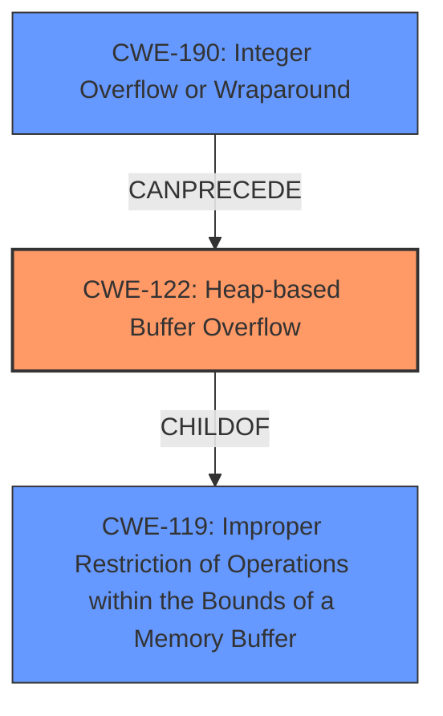

# Analysis Report for CVE-2021-28237

# Vulnerability Analysis Report: CVE-2021-28237

## Description

LibreDWG v0.12.3 was discovered to contain a heap-buffer overflow via decode_preR13.

## Vulnerability Description Key Phrases

**Weakness:** heap-buffer overflow
**Product:** LibreDWG
**Version:** v0.12.3
**Component:** decode_preR13

## Analysis (with Relationship Data)

# Summary
| CWE ID  | CWE Name                     | Confidence | CWE Abstraction Level | CWE Vulnerability Mapping Label | CWE-Vulnerability Mapping Notes |
| :-------- | :--------------------------- | :--------- | :-------------------- | :------------------------------ | :---------------------------- |
| CWE-122 | Heap-based Buffer Overflow | 0.90      | Variant               | Allowed                         | Primary CWE           |

## Evidence and Confidence

*   **Confidence Score:** 0.90
*   **Evidence Strength:** HIGH

- **Analysis and Justification:**
  - *Explanation:* The vulnerability description explicitly states "**heap-buffer overflow** via decode_preR13". The CVE Reference Links Content Summary further clarifies that a heap-buffer-overflow vulnerability exists in the `decode_preR13_section` function when processing malformed DWG files. The ASAN report confirms a write occurring outside the bounds of allocated memory on the heap. This aligns directly with the definition of CWE-122, Heap-based Buffer Overflow.
  - *Relationship Analysis:* CWE-122 is a variant of CWE-119 (Improper Restriction of Operations within the Bounds of a Memory Buffer), which is a more general class. Since the vulnerability is specifically identified as a heap-based overflow, CWE-122 is the more appropriate and specific choice.

- **Confidence Score:**
  - Confidence: 0.90 (Strong evidence from the vulnerability description and CVE reference materials indicating a heap-based buffer overflow.)

---

## Criticism of Analysis

Okay, here's a review of the provided CWE analysis, incorporating the full CWE specifications and focusing on mapping guidance and potential mitigations.

**Overall Assessment:**

The primary CWE assignment of `CWE-122: Heap-based Buffer Overflow` appears to be correct and well-justified. The high confidence level is also appropriate, given the strong evidence from the vulnerability description, ASAN report, and CVE details. The analysis clearly explains why `CWE-122` is more specific than its parent, `CWE-119`, justifying the choice of the more granular CWE.

**Detailed Review:**

**1. CWE-122: Heap-based Buffer Overflow**

*   **Correctness:** The assignment of CWE-122 is accurate. The description matches the vulnerability: a buffer overflow occurring in the heap due to writing beyond allocated memory. The ASAN report provides explicit confirmation of this.
*   **Abstraction Level:** `CWE-122` is a Variant, which is the preferred abstraction level according to the CWE mapping guidance.
*   **Mapping Guidance:** The analysis correctly follows the mapping guidance by choosing a more specific CWE over its parent (CWE-119). The justification for using CWE-122 is clearly explained:  "Since the vulnerability is specifically identified as a heap-based overflow, CWE-122 is the more appropriate and specific choice."
*   **Confidence:** The confidence score of 0.9 is reasonable, reflecting the strong evidence.
*   **Mitigations:** The analysis does not explicitly discuss mitigations for CWE-122, but it is understood that the fix implemented in commit `ea0b952` is the correct path forward. Potential mitigations from the CWE specification that apply include:
    *   **Language Selection:**  Consider using languages with automatic bounds checking (though this is a longer-term architectural decision).
    *   **Abstraction Libraries:** Using safer alternatives to `malloc()` and other heap management functions could help (although this might not be a practical change in an existing codebase).
    *   **Compiler/Environment Hardening:** Using compiler flags like `/GS` (MSVC) or `FORTIFY_SOURCE` (GCC) can help detect buffer overflows at runtime.

**2. Retriever Results Analysis**

The retriever results suggest other CWEs that, while not the primary cause, could be related or contributing factors. Let's examine the top contenders:

*   **CWE-190: Integer Overflow or Wraparound:** This could be relevant if the size of the buffer being allocated on the heap is based on a calculation that is subject to an integer overflow.  If an integer overflow occurs, it could lead to a smaller-than-expected buffer allocation, which could then be overflowed.  *Recommendation: Briefly investigate whether an integer overflow is involved in the calculation of buffer sizes. If so, consider adding CWE-190 as a secondary CWE with a lower confidence level.*

*   **CWE-193: Off-by-one Error:** An off-by-one error during buffer allocation or when writing to the buffer could contribute to the overflow. *Recommendation: Briefly investigate whether an off-by-one error is involved. If so, consider adding CWE-193 as a secondary CWE with a lower confidence level.*

*   **CWE-126: Buffer Over-read:** While the primary issue is a write overflow, there might be a preceding read that accesses data out-of-bounds, leading to incorrect data being used for the size calculation, which then leads to the overflow. *Recommendation: This is less likely than CWE-190 or CWE-193, but consider it if the code involves complex data manipulation before the allocation/write.*

*   **CWE-131: Incorrect Calculation of Buffer Size:** This is a potential contributing factor. If the allocated size is incorrect, this could lead to not enough memory being available to store the data, leading to a buffer overflow.

*   **CWE-839: Numeric Range Comparison Without Minimum Check** This is a possible contributing factor if input validation to the PREP_TABLE is done without a minimum check.

**3. General Recommendations:**

*   **Chain Identification:** While CWE-122 is the direct cause, consider explicitly identifying any potential chaining relationships, especially with CWE-190, CWE-193, CWE-131 or CWE-839 if the investigation warrants it. Example: "The heap-based buffer overflow (CWE-122) may be caused by an integer overflow (CWE-190) during the calculation of the buffer size."
*   **Mitigation Specificity:** Add specific, actionable mitigations relevant to the specific vulnerability in LibreDWG, drawing inspiration from the CWE's "Potential Mitigations" section. For example: "The fix in commit `ea0b952` implemented input validation to prevent integer overflows when calculating buffer sizes."
*   **Contextualize Examples:** When providing examples of CWE-122 or other relevant CWEs, prioritize examples that involve similar data structures or file parsing scenarios, if possible. This makes the examples more relatable and informative.

**Revised Summary Table (Example with Additional CWE)**

| CWE ID  | CWE Name                     | Confidence | CWE Abstraction Level | CWE Vulnerability Mapping Label | CWE-Vulnerability Mapping Notes |
| :-------- | :--------------------------- | :--------- | :-------------------- | :------------------------------ | :---------------------------- |
| CWE-122 | Heap-based Buffer Overflow | 0.90      | Variant               | Allowed                         | Primary CWE           |
| CWE-190 | Integer Overflow or Wraparound | 0.40      | Base               | Allowed                         | Possible contributing factor in buffer size calculation. Needs further investigation.           |

**In summary,** the analysis is good, particularly in its accurate identification and justification of CWE-122.  Strengthening the analysis by investigating and potentially including contributing CWEs (especially CWE-190 or CWE-193), and by adding more specific, actionable mitigation recommendations will make the analysis even more valuable.

## Final Resolution

# Summary
| CWE ID  | CWE Name                     | Confidence | CWE Abstraction Level | CWE Vulnerability Mapping Label | CWE-Vulnerability Mapping Notes |
| :-------- | :--------------------------- | :--------- | :-------------------- | :------------------------------ | :---------------------------- |
| **CWE-122** | Heap-based Buffer Overflow | 0.90      | Variant               | Allowed                         | Primary **CWE**           |
| **CWE-190** | Integer Overflow or Wraparound | 0.40      | Base               | Allowed                         | Secondary Candidate: Possible contributing factor in buffer size calculation. Needs further investigation.           |

## Evidence and Confidence

*   **Confidence Score:** 0.80
*   **Evidence Strength:** MEDIUM

## Relationship Analysis
The primary relationship considered was the parent-child relationship between **CWE-122 (Heap-based Buffer Overflow)** and **CWE-119 (Improper Restriction of Operations within the Bounds of a Memory Buffer)**. **CWE-122** is a variant of **CWE-119**, providing a more specific classification for heap-based overflows. The analysis also explored potential chain relationships, particularly with **CWE-190 (Integer Overflow or Wraparound)**, as an integer overflow in the buffer size calculation could precede the heap overflow.

## Vulnerability Chain
The vulnerability chain starts with a potential **ROOTCAUSE** of **CWE-190 (Integer Overflow or Wraparound)** if the buffer size calculation is vulnerable. This leads to the allocation of an inadequately sized buffer on the heap. Subsequently, when data is written to this buffer without proper bounds checking, it results in **CWE-122 (Heap-based Buffer Overflow)**, leading to memory corruption and potential arbitrary code execution.

Missing links: The description doesn't explicitly state that an integer overflow is involved in the calculation, hence the lower confidence in **CWE-190**.

## Summary of Analysis
The initial analysis correctly identified **CWE-122 (Heap-based Buffer Overflow)** as the primary weakness based on the vulnerability description stating a "heap-buffer overflow via decode_preR13". The ASAN report further supports this classification by confirming a write outside the bounds of allocated heap memory.

The criticism suggested investigating potential contributing factors, particularly **CWE-190 (Integer Overflow or Wraparound)**. While the direct evidence for **CWE-190** is not explicitly provided in the initial description, it's a plausible contributing factor in buffer size calculations.

The graph relationships influenced the decision by highlighting the hierarchical relationship between **CWE-122** and **CWE-119**, reinforcing the choice of the more specific **CWE-122**. The potential chain relationship with **CWE-190** was also considered, leading to its inclusion as a secondary candidate with lower confidence.

The selected **CWEs** are at the optimal level of specificity based on the available evidence. **CWE-122** is a Variant, which is a preferred level of abstraction. While **CWE-190** is a Base, its inclusion is tentative, pending further investigation to confirm its involvement in the buffer size calculation.

*Report generated on 2025-03-17 23:37:27*
