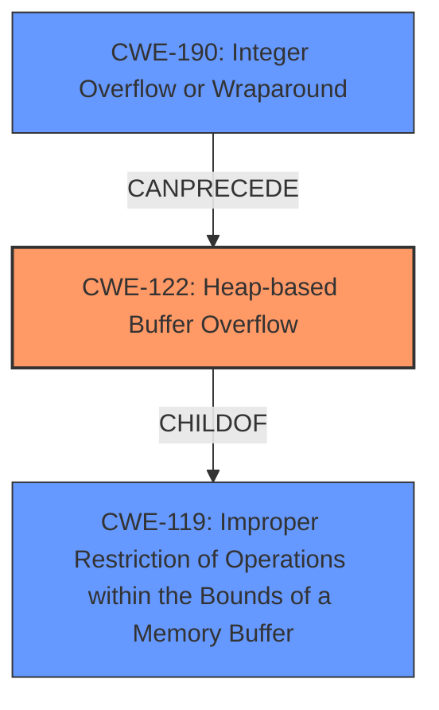

# Final Resolution for CVE-2021-28237

# Summary
| CWE ID  | CWE Name                     | Confidence | CWE Abstraction Level | CWE Vulnerability Mapping Label | CWE-Vulnerability Mapping Notes |
| :-------- | :--------------------------- | :--------- | :-------------------- | :------------------------------ | :---------------------------- |
| **CWE-122** | Heap-based Buffer Overflow | 0.90      | Variant               | Allowed                         | Primary **CWE**           |
| **CWE-190** | Integer Overflow or Wraparound | 0.40      | Base               | Allowed                         | Secondary Candidate: Possible contributing factor in buffer size calculation. Needs further investigation.           |

## Evidence and Confidence

*   **Confidence Score:** 0.80
*   **Evidence Strength:** MEDIUM

## Relationship Analysis
The primary relationship considered was the parent-child relationship between **CWE-122 (Heap-based Buffer Overflow)** and **CWE-119 (Improper Restriction of Operations within the Bounds of a Memory Buffer)**. **CWE-122** is a variant of **CWE-119**, providing a more specific classification for heap-based overflows. The analysis also explored potential chain relationships, particularly with **CWE-190 (Integer Overflow or Wraparound)**, as an integer overflow in the buffer size calculation could precede the heap overflow.

## Vulnerability Chain
The vulnerability chain starts with a potential **ROOTCAUSE** of **CWE-190 (Integer Overflow or Wraparound)** if the buffer size calculation is vulnerable. This leads to the allocation of an inadequately sized buffer on the heap. Subsequently, when data is written to this buffer without proper bounds checking, it results in **CWE-122 (Heap-based Buffer Overflow)**, leading to memory corruption and potential arbitrary code execution.

Missing links: The description doesn't explicitly state that an integer overflow is involved in the calculation, hence the lower confidence in **CWE-190**.

## Summary of Analysis
The initial analysis correctly identified **CWE-122 (Heap-based Buffer Overflow)** as the primary weakness based on the vulnerability description stating a "heap-buffer overflow via decode_preR13". The ASAN report further supports this classification by confirming a write outside the bounds of allocated heap memory.

The criticism suggested investigating potential contributing factors, particularly **CWE-190 (Integer Overflow or Wraparound)**. While the direct evidence for **CWE-190** is not explicitly provided in the initial description, it's a plausible contributing factor in buffer size calculations.

The graph relationships influenced the decision by highlighting the hierarchical relationship between **CWE-122** and **CWE-119**, reinforcing the choice of the more specific **CWE-122**. The potential chain relationship with **CWE-190** was also considered, leading to its inclusion as a secondary candidate with lower confidence.

The selected **CWEs** are at the optimal level of specificity based on the available evidence. **CWE-122** is a Variant, which is a preferred level of abstraction. While **CWE-190** is a Base, its inclusion is tentative, pending further investigation to confirm its involvement in the buffer size calculation.