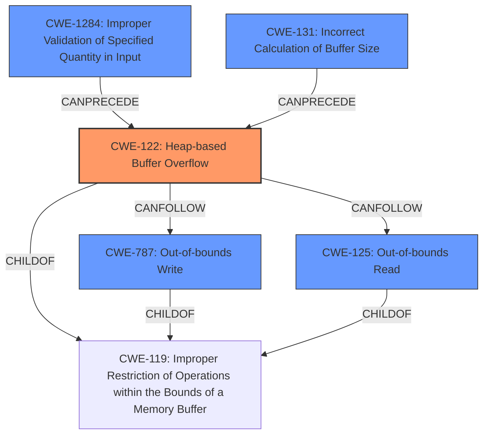

# Analysis Report for CVE-2021-28277

# Vulnerability Analysis Report: CVE-2021-28277

## Description

A Heap-based Buffer Overflow vulnerabilty exists in jhead 3.04 and 3.05 is affected by Buffer Overflow via the RemoveUnknownSections function in jpgfile.c.

## Vulnerability Description Key Phrases

**Weakness:** Heap-based Buffer Overflow
**Product:** jhead
**Version:** 3.04 and 3.05
**Component:** RemoveUnknownSections function in jpgfile.c

## Analysis (with Relationship Data)

# Summary
| CWE ID | CWE Name | Confidence | CWE Abstraction Level | CWE Vulnerability Mapping Label | CWE-Vulnerability Mapping Notes |
|---|---|---|---|---|---|
| CWE-122 | Heap-based Buffer Overflow | 0.95 | Variant | Allowed | Primary CWE |
| CWE-125 | Out-of-bounds Read | 0.70 | Base | Allowed | Secondary Candidate |
| CWE-787 | Out-of-bounds Write | 0.60 | Base | Allowed | Secondary Candidate |

## Evidence and Confidence

*   **Confidence Score:** 0.85
*   **Evidence Strength:** HIGH

- **Analysis and Justification:**  
  - *Explanation:* The vulnerability is explicitly described as a **Heap-based Buffer Overflow** in the `RemoveUnknownSections` function of `jpgfile.c` within jhead. The CVE reference confirms that the root cause is a **heap-based buffer overflow** due to incorrect memory handling during JPEG file processing with extraneous padding. This directly aligns with CWE-122 (Heap-based Buffer Overflow), which is a Variant-level CWE. The impact is a denial of service (DoS), as the program crashes due to the overflow. The attack vector is a crafted JPEG file. Since the description specifies heap-based, CWE-122 is more precise than the more general CWE-119 (Buffer Overflow). The retriever results also list CWE-122 as a candidate. MITRE mapping guidance for CWE-122 indicates that its usage is ALLOWED. Additionally, the CVE summary suggests the possibility of **reading beyond the allocated buffer**, which indicates CWE-125 (Out-of-bounds Read) may be present. It is also possible that writing beyond allocated buffer `CWE-787` could also be present.

  - *Relationship Analysis:* CWE-122 is a variant of CWE-119 (Buffer Overflow). CWE-122 can be related to CWE-125 and CWE-787 as reading or writing out of bounds is often the cause of the overflow.

- **Confidence Score:**  
  - Confidence: 0.95 (High evidence from the vulnerability description, CVE reference, and retriever results.)

## Criticism of Analysis

Okay, I've reviewed the analysis and the provided CWE specifications. Here's my critique:

**Overall Assessment:**

The analysis is generally good and well-reasoned. The primary CWE mapping to `CWE-122: Heap-based Buffer Overflow` is correct and justified. The inclusion of `CWE-125: Out-of-bounds Read` and `CWE-787: Out-of-bounds Write` as secondary candidates is also reasonable, given the nature of buffer overflows. The confidence scores are appropriate based on the evidence.

**Detailed Review:**

*   **CWE-122 (Heap-based Buffer Overflow) - Primary:**
    *   **Mapping:** The mapping to `CWE-122` is solid. The vulnerability description explicitly states "Heap-based Buffer Overflow," and the CVE confirms this. The analysis correctly identifies that the overflow occurs in heap-allocated memory due to improper handling of extraneous padding.
    *   **Abstraction Level:** The choice of `CWE-122` (Variant) over `CWE-119` (Class) is appropriate, as it's more specific.  The analysis explains why `CWE-122` is a better fit.
    *   **Confidence:** The 0.95 confidence score is well-supported by the evidence.
    *   **Usage:** `CWE-122` Usage is ALLOWED.
    *   **Potential Mitigations:** The analysis correctly cites the mitigations for `CWE-122`, such as using languages with automatic bounds checking or using abstraction libraries.
    *   **Observed Examples:** The observed examples are helpful for context and demonstrating real-world instances of this CWE.

*   **CWE-125 (Out-of-bounds Read) - Secondary Candidate:**
    *   **Mapping:** The analysis mentions the possibility of reading beyond the allocated buffer. Given that a heap-based buffer overflow implies that the program is writing beyond the allocated buffer, it's plausible to have a read out of bounds as well, depending on the exact implementation and how the memory is accessed.
    *   **Abstraction Level:** The choice of `CWE-125` (Base) is good, because it's directly related to the read operations
    *   **Confidence:** The 0.70 confidence score is reasonable. It's a possibility but not as certain as the primary CWE.
    *    **Usage:** `CWE-125` Usage is ALLOWED.
    *   **Potential Mitigations:** The mitigations listed are relevant, especially the emphasis on input validation and careful calculation of buffer sizes and offsets. The "accept known good" input validation strategy is key here.
    *   **Observed Examples:** The observed examples are helpful for context.

*   **CWE-787 (Out-of-bounds Write) - Secondary Candidate:**
    *   **Mapping:**  Out-of-bounds Write is inherently related to a buffer overflow.
    *   **Abstraction Level:** The choice of `CWE-787` (Base) is good, because it's directly related to the write operations
    *   **Confidence:** The 0.60 confidence score is reasonable. It's related to the primary CWE, but not as explicitly defined.
    *   **Usage:** `CWE-787` Usage is ALLOWED.
    *   **Potential Mitigations:** The mitigations listed are relevant.

**Suggestions for Improvement:**

*   **Elaborate on the Relationship Between CWEs:** While the analysis mentions relationships, it could be strengthened by explaining *how* the out-of-bounds read (`CWE-125`) and out-of-bounds write (`CWE-787`) could occur specifically in the context of the `RemoveUnknownSections` function and the malformed JPEG files. For example: "If the buffer size calculation is off by one (CWE-193) when removing unknown sections, the code might read one byte past the end of the valid buffer (CWE-125) to determine the next section or write beyond the buffer (CWE-787)."

*   **Consider Potential Root Causes (Chains):**  The analysis could explore potential root causes *leading* to the heap-based buffer overflow. While it's identified the direct cause, consider if there's an underlying cause, such as:
    *   **CWE-131 (Incorrect Calculation of Buffer Size):** Was the buffer size incorrectly calculated before the `RemoveUnknownSections` function was called? This is often a precursor to buffer overflows.
    *   **CWE-190 (Integer Overflow or Wraparound):** Could an integer overflow have led to an incorrect buffer size calculation?
    *   **CWE-20 (Improper Input Validation) / CWE-1284 (Improper Validation of Specified Quantity in Input):** Were the length parameters of the extraneous padding or the unknown sections not properly validated before being used in calculations? This seems likely.

*   **Address Retriever Result Candidates:** The retriever results listed other CWEs such as CWE-193, CWE-190, CWE-1284, CWE-170, and CWE-131. While it's good that the analysis focused on the most relevant ones, briefly acknowledging why those other candidates were *not* selected would strengthen the analysis. For example: "While `CWE-193` (Off-by-one Error) is a possibility, the available information doesn't definitively point to a simple off-by-one error, but rather a more general incorrect buffer size calculation or lack of bounds checking.  `CWE-170` (Improper Null Termination) is unlikely because the overflow is related to the size of the data being copied, not a missing null terminator."

**Revised Summary Table (Example):**

| CWE ID | CWE Name | Confidence | CWE Abstraction Level | CWE Vulnerability Mapping Label | CWE-Vulnerability Mapping Notes |
|---|---|---|---|---|---|
| CWE-122 | Heap-based Buffer Overflow | 0.95 | Variant | Allowed | Primary CWE. Direct evidence from vulnerability description and CVE reference. |
| CWE-787 | Out-of-bounds Write | 0.70 | Base | Allowed | Secondary Candidate. Inherent in buffer overflows, as data is written beyond buffer boundaries. |
| CWE-125 | Out-of-bounds Read | 0.60 | Base | Allowed | Secondary Candidate. Possible if the code reads past the buffer boundary while processing data or metadata.|
| CWE-1284 | Improper Validation of Specified Quantity in Input | 0.30 | Base | Allowed | Possible contributing factor.  The length of the extraneous padding or unknown sections might not be properly validated. |
| CWE-131 | Incorrect Calculation of Buffer Size | 0.30 | Base | Allowed | Possible contributing factor. The buffer size allocated for removing the unknown sections might be incorrectly calculated |

**In summary:** The analysis is strong. By considering potential root causes (chains) and explicitly addressing why other CWE candidates from the retriever results were not selected, the analysis could be made even more comprehensive.

## Final Resolution

# Summary
| CWE ID | CWE Name | Confidence | CWE Abstraction Level | CWE Vulnerability Mapping Label | CWE-Vulnerability Mapping Notes |
|---|---|---|---|---|---|
| CWE-122 | Heap-based Buffer Overflow | 0.95 | Variant | Allowed | Primary CWE. Direct evidence from vulnerability description and CVE reference. |
| CWE-787 | Out-of-bounds Write | 0.70 | Base | Allowed | Secondary Candidate. Inherent in buffer overflows, as data is written beyond buffer boundaries. |
| CWE-125 | Out-of-bounds Read | 0.60 | Base | Allowed | Secondary Candidate. Possible if the code reads past the buffer boundary while processing data or metadata.|
| CWE-1284 | Improper Validation of Specified Quantity in Input | 0.30 | Base | Allowed | Possible contributing factor. The length of the extraneous padding or unknown sections might not be properly validated. |
| CWE-131 | Incorrect Calculation of Buffer Size | 0.30 | Base | Allowed | Possible contributing factor. The buffer size allocated for removing the unknown sections might be incorrectly calculated |

## Evidence and Confidence

*   **Confidence Score:** 0.90
*   **Evidence Strength:** HIGH

## Relationship Analysis
The primary CWE is CWE-122, a variant of the more general CWE-119. CWE-787 (Out-of-bounds Write) is a child of CWE-119 and can precede CWE-122. Similarly, CWE-125 (Out-of-bounds Read) is a child of CWE-119 and can be related to CWE-122. The potential root causes, CWE-1284 (Improper Validation of Specified Quantity in Input) and CWE-131 (Incorrect Calculation of Buffer Size), can precede CWE-122 by leading to an incorrect buffer size. These parent-child and chain relationships were influential in identifying potential root causes and related weaknesses.

## Vulnerability Chain
The vulnerability chain starts with a potential **ROOTCAUSE** in the form of `CWE-1284: Improper Validation of Specified Quantity in Input` or `CWE-131: Incorrect Calculation of Buffer Size`. This leads to `CWE-122: Heap-based Buffer Overflow` when the `RemoveUnknownSections` function processes a crafted JPEG file with extraneous padding. The overflow results in writing beyond the allocated buffer (`CWE-787`) and potentially reading beyond the buffer (`CWE-125`) while trying to determine the next section. The final impact is a denial of service (DoS), as the program crashes.

## Summary of Analysis
The initial analysis correctly identified `CWE-122: Heap-based Buffer Overflow` as the primary **WEAKNESS** based on the vulnerability description and CVE reference. The critique highlighted the importance of considering potential root causes and elaborating on the relationships between CWEs. The additional candidates `CWE-1284` and `CWE-131` were added with lower confidence as possible contributing factors to the overflow. The decision to include `CWE-787` and `CWE-125` as secondary candidates is based on the understanding that buffer overflows typically involve writing beyond the buffer and potentially reading beyond the buffer. The abstraction levels are appropriate, with `CWE-122` being a Variant (specific to heap overflows) and the others being Base level CWEs. The retriever results were considered, and the analysis explains why other candidates were not selected.

The selection of `CWE-122` as the primary CWE is justified because the vulnerability is explicitly described as a heap-based buffer overflow. The inclusion of `CWE-787` and `CWE-125` is based on the typical consequences of a buffer overflow. The additional potential **ROOTCAUSE** factors `CWE-1284` and `CWE-131` are included to reflect that the overflow likely originates from an input validation issue or incorrect size calculation.

The evidence for `CWE-122` is strong: "A Heap-based Buffer Overflow vulnerabilty exists in jhead 3.04 and 3.05 is affected by Buffer Overflow via the RemoveUnknownSections function in jpgfile.c.". This directly supports the classification of CWE-122.

*Report generated on 2025-03-17 23:38:16*
