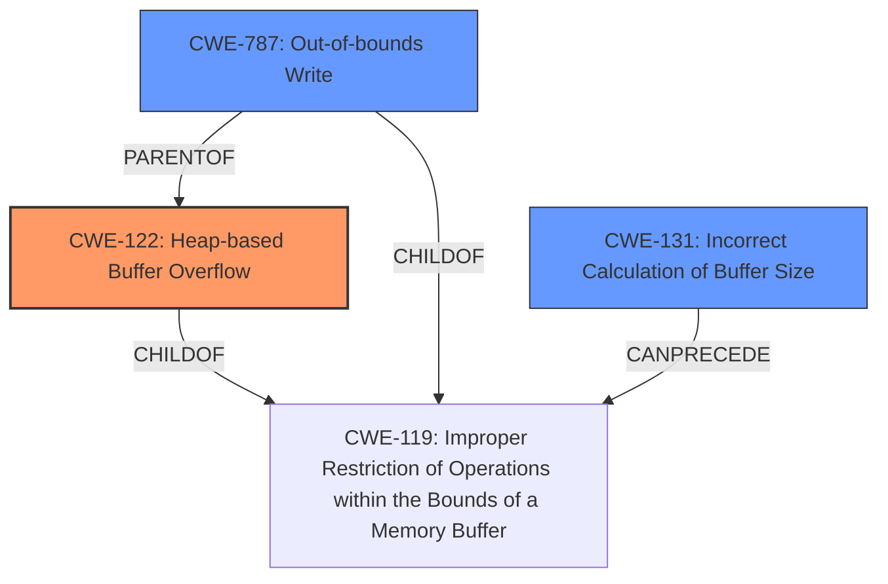

# Final Resolution for CVE-2021-28278

# Summary
| CWE ID | CWE Name | Confidence | CWE Abstraction Level | CWE Vulnerability Mapping Label | CWE-Vulnerability Mapping Notes |
|---|---|---|---|---|---|
| CWE-122 | Heap-based Buffer Overflow | 0.95 | Variant | Primary | Allowed |
| CWE-787 | Out-of-bounds Write | 0.85 | Base | Secondary | Allowed |
| CWE-131 | Incorrect Calculation of Buffer Size | 0.60 | Base | Secondary | Allowed |

## Evidence and Confidence

*   **Confidence Score:** 0.92
*   **Evidence Strength:** MEDIUM

## Relationship Analysis
The primary CWE is CWE-122 (**Heap-based Buffer Overflow**), which is a variant of CWE-119 (**Improper Restriction of Operations within the Bounds of a Memory Buffer**). CWE-787 (**Out-of-bounds Write**) is a child of CWE-119 and a parent of CWE-122. This parent-child relationship confirms that the vulnerability involves writing outside the intended buffer boundaries, which is a core aspect of buffer overflows. CWE-131 (**Incorrect Calculation of Buffer Size**) can precede CWE-119 as an incorrect size calculation can lead to an out-of-bounds write. The relationships help to refine the classification and confirm the root cause.

## Vulnerability Chain
The vulnerability chain starts with a potential **ROOTCAUSE** in **CWE-131** (**Incorrect Calculation of Buffer Size**). This can lead to **CWE-122** (**Heap-based Buffer Overflow**), where the `memmove` operation writes data beyond the allocated buffer. The **WEAKNESS** leads to **CWE-787** (**Out-of-bounds Write**), which causes a crash and denial of service.

## Summary of Analysis
The initial analysis correctly identified CWE-122 as the primary vulnerability. The criticism raised valid points about strengthening the justification for secondary CWEs. The decision to keep CWE-131 and remove CWE-125 is based on the understanding that the description explicitly mentions the `memmove` exceeding the buffer.
The updated confidence scores reflect this assessment.

The evidence "The vulnerability is explicitly described as a **Heap-based Buffer Overflow** in the `RemoveSectionType` function. The `memmove` operation attempts to move a block of memory exceeding the allocated buffer's boundaries, which aligns directly with CWE-122 (Heap-based Buffer Overflow)." supports the classification of CWE-122 as the primary issue.

The relationship analysis shows that CWE-787 is a parent of CWE-122, indicating a general out-of-bounds write condition. CWE-131 as a possible root cause because it can precede the buffer overflow.

The selected CWEs are at the optimal level of specificity because they accurately describe the vulnerability based on the available evidence and relationship analysis.