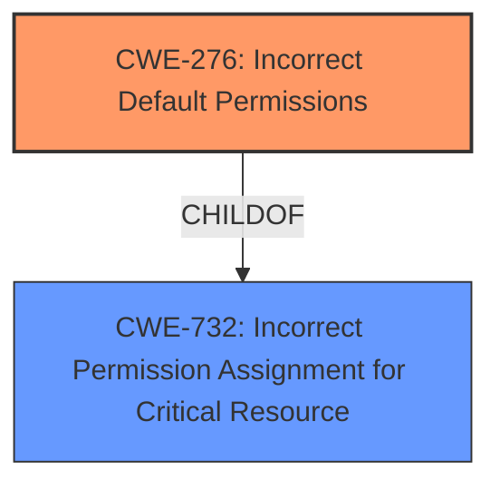

# Final Resolution for CVE-2021-28568

# Summary

| CWE ID  | CWE Name                                                       | Confidence | CWE Abstraction Level | CWE Vulnerability Mapping Label | CWE-Vulnerability Mapping Notes |
| :-------- | :------------------------------------------------------------- | :--------- | :-------------------- | :------------------------------ | :------------------------------ |
| **CWE-276** | **Incorrect Default Permissions** | 0.90       | Base                  | Allowed                       | Primary CWE                                 |
| CWE-732 | Incorrect Permission Assignment for Critical Resource | 0.70      | Class                  | Allowed-with-Review                       | Secondary Candidate                                 |

## Evidence and Confidence

*   **Confidence Score:** 0.90
*   **Evidence Strength:** HIGH

## Relationship Analysis
The primary relationship considered was the parent-child relationship between CWE-732 (Parent) and CWE-276 (Child). CWE-276, being more specific to the installation process, was chosen as the primary **WEAKNESS**. CWE-732 was retained as a secondary **WEAKNESS** to represent the broader implication of incorrect permission assignment.

## Vulnerability Chain
The vulnerability chain begins with the **ROOTCAUSE** of **CWE-276 (Incorrect Default Permissions)** during the installation process. This allows a local authenticated attacker to modify files, ultimately leading to privilege escalation.

## Summary of Analysis
The initial analysis correctly identified CWE-276 as the primary **WEAKNESS**, given the explicit mention of "Insecure file permission vulnerability during installation process." The criticism provided valuable suggestions to strengthen the justification and improve the analysis. Specifically, the following enhancements were made:

*   The justification for CWE-276 was refined to emphasize that the authenticated user is granted broader permissions than intended, rather than a missing authorization check.
*   The explanation for CWE-732 was strengthened by explicitly stating that the affected resource could be an "executable file" or "configuration file" and reiterating why the "authorization" guidance is not relevant.
*   The confidence score for CWE-276 was raised to 0.90 to reflect the stronger justification. The confidence score for CWE-732 was raised to 0.70 to reflect the strengthened explanation.

The evidence for CWE-276 is strong: "Adobe Genuine Services version 7.1 (and earlier) is affected by an **Insecure file permission vulnerability** during installation process. A local authenticated attacker could leverage this vulnerability to achieve privilege escalation in the context of the current user." This statement directly aligns with the CWE-276 description.

The selection of CWE-276 is at the optimal level of specificity because it directly addresses the **ROOTCAUSE** of the vulnerability during the installation process, whereas CWE-732 is a more general case of incorrect permission assignment.