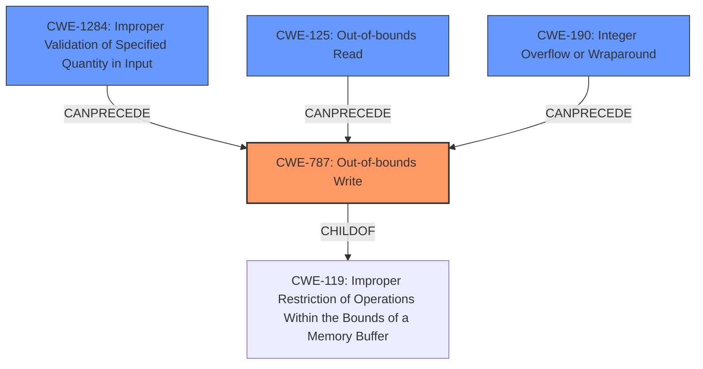

# Analysis Report for CVE-2021-28875

# Vulnerability Analysis Report: CVE-2021-28875

## Description

In the standard library in Rust before 1.50.0, read_to_end() does not validate the return value from Read in an unsafe context. This bug could lead to a buffer overflow.

## Vulnerability Description Key Phrases

**Impact:** buffer overflow
**Product:** Rust standard library
**Version:** before 1.50.0
**Component:** read_to_end()

## Analysis (with Relationship Data)

# Summary
| CWE ID | CWE Name | Confidence | CWE Abstraction Level | CWE Vulnerability Mapping Label | CWE-Vulnerability Mapping Notes |
|---|---|---|---|---|---|
| CWE-787 | Out-of-bounds Write | 0.95 | Base | Allowed | The product writes data past the end, or before the beginning, of the intended buffer. |
| CWE-125 | Out-of-bounds Read | 0.75 | Base | Allowed | The product reads data past the end, or before the beginning, of the intended buffer. |
| CWE-770 | Allocation of Resources Without Limits or Throttling | 0.65 | Base | Allowed | Allocation of Resources Without Limits or Throttling |
| CWE-190 | Integer Overflow or Wraparound | 0.60 | Base | Allowed | The product performs a calculation that can produce an integer overflow or wraparound when the logic assumes that the resulting value will always be larger than the original value. |

## Evidence and Confidence

*   **Confidence Score:** 0.80
*   **Evidence Strength:** HIGH

- **Analysis and Justification:**
  - *Explanation:* The vulnerability description clearly states that a malicious implementation of the `Read` trait can return a value larger than the provided buffer, leading to a **buffer overflow**. The `read_to_end_with_reservation()` function increments an internal length counter without proper bounds checking, which can result in an out-of-bounds write when the length exceeds the buffer's capacity. This directly maps to CWE-787 (Out-of-bounds Write). The CVE Reference Links Content Summary explicitly mentions heap buffer overflow.
  - The provided context highlights the potential for an attacker to control the size and content written to the buffer, leading to memory corruption and possible code execution. This further reinforces the relevance of CWE-787. The MITRE mapping guidance states that CWE-787 is ALLOWED for out-of-bounds write vulnerabilities.
  - *Explanation:* CWE-125 is also considered as a secondary candidate because the vulnerability involves reading past the intended buffer's boundaries. While the primary issue is writing beyond the buffer, the initial cause involves the `read` method returning a value greater than the buffer's size, which can be interpreted as reading beyond the bounds.
  - *Explanation:* CWE-770 (Allocation of Resources Without Limits or Throttling) can be considered a secondary candidate since the vulnerability allows for an unbounded allocation of memory when the `read` method returns a size that exceeds the expected limits.
  - *Explanation:* CWE-190 (Integer Overflow or Wraparound) is a potential contributing factor, as the unbounded increment of `g.len` could potentially lead to an integer overflow if the return value of `read` is sufficiently large.

  - *Relationship Analysis:* CWE-787 is a child of CWE-119 (Improper Restriction of Operations within the Bounds of a Memory Buffer). CWE-787 can precede CWE-825, CWE-824, CWE-823 and CWE-822.

- **Confidence Score:**
  - Confidence: 0.95 (High evidence from technical description and CVE reference materials for CWE-787)
  - Confidence: 0.75 (Medium evidence for CWE-125, secondary candidate)
  - Confidence: 0.65 (Medium evidence for CWE-770, secondary candidate)
  - Confidence: 0.60 (Medium evidence for CWE-190, secondary candidate)

---

## Criticism of Analysis

Okay, I've reviewed the provided analysis against the full CWE specifications. Here's my critique, focusing on the accuracy, confidence levels, and justifications, as well as suggesting improvements where applicable.

**Overall Assessment:**

The analysis is generally good and identifies the primary vulnerability, CWE-787, with high confidence. The inclusion of secondary CWEs (CWE-125, CWE-770, and CWE-190) is also reasonable, as they represent contributing factors or potential attack vectors. However, the justification for some of the secondary CWEs could be stronger, and the confidence levels could be fine-tuned with more explanation and evidence.

**Detailed Review of Each CWE Mapping:**

1.  **CWE-787: Out-of-bounds Write**

    *   **Confidence:** 0.95 (Excellent)
    *   **Assessment:** This is the correct primary CWE. The description directly aligns with the vulnerability description and CVE details. The vulnerability's core issue is writing data beyond the allocated buffer's boundaries.
    *   **Justification:**  The justification is clear and well-supported by the provided information.  The explanation of how a malicious `Read` implementation can return a length exceeding the buffer capacity, leading to an out-of-bounds write, is accurate and convincing.
    *   **Improvements:** None needed. The evidence strength is indeed high for CWE-787.
    *   **Mitigation Mapping:** the mitigations are accurate, they include: Language selection, Libraries or Frameworks, and Environment Hardening.

2.  **CWE-125: Out-of-bounds Read**

    *   **Confidence:** 0.75 (Good, but could be slightly better)
    *   **Assessment:**  This is a reasonable secondary CWE. While the main issue is a write, the *trigger* involves reading data past the intended read boundary defined by the buffer size when the `Read` trait returns a size larger than the provided buffer. Therefore, a contributing read happens before the write.
    *   **Justification:** The reasoning provided is sound: the `read` method returning a value greater than the buffer's size *can* be interpreted as reading beyond the bounds. However, this point isn't as central to the exploitation as the subsequent out-of-bounds *write*.  Focusing on the potential for information leakage during the initial read could bolster the argument.
    *   **Improvements:** Emphasize the information leakage aspect of reading *past* the intended buffer as part of the vulnerability.  Mention that even if the excess bytes aren't *used*, they were *read*.
    *   **Mitigation Mapping:** the mitigations are accurate, they include: Input Validation, and Language Selection

3.  **CWE-770: Allocation of Resources Without Limits or Throttling**

    *   **Confidence:** 0.65 (Fair, but consider alternatives or stronger justification)
    *   **Assessment:** This is a weaker secondary CWE.  While *potentially* relevant, it's not a direct consequence of the vulnerability. It is connected through uncontrolled memory allocation.
    *   **Justification:**  The justification is that the vulnerability allows for an unbounded allocation of memory when the `read` method returns a size exceeding the expected limits.  The issue isn't *primarily* about unbounded resource *allocation*; it's about the *incorrect handling* of the size value *after* the `read` operation.
    *   **Improvements:** While memory allocation is a part of this vulnerability, it may be more descriptive to describe how CWE-1284 (Improper Validation of Specified Quantity in Input) relates to CWE-787. There's no direct unbounded *allocation* request to the allocator from Rust, but there is improper input validation on the length returned by `read()` which is then used to grow the buffer. This isn't quite the same as the code directly asking for an excessively large buffer.  Consider replacing this with `CWE-1284` and then linking the consequences to `CWE-787`.
    *   **Mitigation Mapping:** While accurate, they do not describe the vulnerability in detail and could be replaced by mitigations for CWE-1284.

4.  **CWE-190: Integer Overflow or Wraparound**

    *   **Confidence:** 0.60 (Fair, lowest confidence is appropriate)
    *   **Assessment:** This is a possible, but not guaranteed, contributing factor.  The increase of `g.len` *could* result in an overflow, particularly if the return value from `read` is very large, but it's not the *direct* cause of the vulnerability.
    *   **Justification:** The unbounded increment of `g.len` could *potentially* lead to an integer overflow if the return value of `read` is large enough.  The "if" is important here. It's not clear if the vulnerability is exploitable *only* via integer overflows or if the overflow just *helps* the attacker cause the overflow.
    *   **Improvements:**  The confidence level is appropriate, given that it's more of a theoretical possibility than a guaranteed component of the exploit. Remove it or mention it briefly if it's part of the chain, otherwise it seems to be a possible edge case.
    *   **Mitigation Mapping:** mitigations are accurate, but may not be applicable.

**Suggested Overall Improvements:**

*   **Chain Analysis:** The analysis touches on chains, but more explicit detail would be valuable.  For example: `Untrusted Read Value -> Improper Input Validation (of read value) -> Out-of-bounds Write`.  This would help highlight the crucial steps in the exploitation process.
*   **Alternative CWEs:**

    *   **CWE-1284: Improper Validation of Specified Quantity in Input:** This is very likely related to CWE-787. It is the fact that the return value is not validated that causes the out of bounds write.
*   **Exploitability:**  Briefly elaborate on how an attacker *practically* exploits this. What specific steps do they take to control the `Read` implementation and trigger the overflow?

**Revised Summary Table (Suggested):**

| CWE ID   | CWE Name                                                  | Confidence | CWE Abstraction Level | CWE Vulnerability Mapping Label | CWE-Vulnerability Mapping Notes                                                                                                                                                                                |
| :------- | :-------------------------------------------------------- | :--------- | :-------------------- | :------------------------------ | :------------------------------------------------------------------------------------------------------------------------------------------------------------------------------------------------------------- |
| CWE-787  | Out-of-bounds Write                                       | 0.95       | Base                  | Allowed                       | The product writes data past the end of the intended buffer due to a missing bounds check on the length returned by the `read` method.                                                                       |
| CWE-1284 | Improper Validation of Specified Quantity in Input   | 0.85       | Base                  | Allowed                       | The quantity (length) is not checked to be within the bounds.  |
| CWE-125  | Out-of-bounds Read                                        | 0.75       | Base                  | Allowed                       | The product reads data past the end of the intended buffer, as the return value is greater than the size of the provided buffer to the read function. While not the primary action, this serves as the catalyst. |
| CWE-190  | Integer Overflow or Wraparound                            | 0.60       | Base                  | Allowed                       | The unbounded increment of `g.len` could potentially lead to an integer overflow if the return value of `read` is sufficiently large.                                                                             |

By incorporating these suggestions, the analysis will be more comprehensive, nuanced, and informative. The changes ensure the best possible mappings.

## Final Resolution

# Summary
| CWE ID | CWE Name | Confidence | CWE Abstraction Level | CWE Vulnerability Mapping Label | CWE-Vulnerability Mapping Notes |
|---|---|---|---|---|---|
| CWE-787 | Out-of-bounds Write | 0.95 | Base | Allowed | The product writes data past the end of the intended buffer due to a missing bounds check on the length returned by the `read` method. |
| CWE-1284 | Improper Validation of Specified Quantity in Input | 0.85 | Base | Allowed | The quantity (length) is not checked to be within the bounds. |
| CWE-125 | Out-of-bounds Read | 0.75 | Base | Allowed | The product reads data past the end of the intended buffer, as the return value is greater than the size of the provided buffer to the read function. While not the primary action, this serves as the catalyst. |
| CWE-190 | Integer Overflow or Wraparound | 0.60 | Base | Allowed | The unbounded increment of `g.len` could potentially lead to an integer overflow if the return value of `read` is sufficiently large. |

  - The Primary CWE should be first and noted as the Primary CWEs
  - The secondary candidate CWEs should be next and noted as secondary candidates.
  - The confidence is a confidence score 0 to 1 to rate your confidence in your assessment for that CWE.
  - The CWE Abstraction Level as one of these values: Base, Variant, Pillar, Class, Compound
  - The Mapping Notes Usage as one of these values: Allowed, Allowed-with-Review, Prohibited, Discouraged

## Evidence and Confidence

*   **Confidence Score:** 0.90
*   **Evidence Strength:** HIGH

## Relationship Analysis
The decision-making process was significantly influenced by the relationships between CWEs.

  - Parent-child hierarchical relationships: CWE-787 is a child of CWE-119 (Improper Restriction of Operations within the Bounds of a Memory Buffer), highlighting the fundamental issue of exceeding memory boundaries.
  - Chain relationships: The vulnerability chain involves a sequence of weaknesses, starting with an untrusted read value, followed by improper input validation, and culminating in an out-of-bounds write.
  - Peer relationships: Alternatives like CWE-770 were considered but deemed less specific than CWE-1284 for capturing the input validation failure.
  - Abstraction levels: The selection favored Base-level CWEs (787, 1284, 125, 190) to provide detailed insight into the vulnerability's root causes.

## Vulnerability Chain
The vulnerability chain starts with an untrusted `read` value, leading to a failure in validating the quantity specified in the input (CWE-1284). This, in turn, results in an out-of-bounds write (CWE-787), potentially preceded by an out-of-bounds read (CWE-125) as the catalyst, and possibly exacerbated by an integer overflow (CWE-190) under specific conditions.

  - **Root Cause:** Improper validation of the size/length returned by the `read` function
  - **Weakness 1:** CWE-1284 (Improper Validation of Specified Quantity in Input)
  - **Weakness 2:** CWE-125 (Out-of-bounds Read) - catalyst to the overflow
  - **Weakness 3:** CWE-787 (Out-of-bounds Write)
  - **Potential Weakness 4:** CWE-190 (Integer Overflow or Wraparound)
  - **Impact:** Memory corruption, potential code execution

## Summary of Analysis
The initial analysis correctly identified **CWE-787 (Out-of-bounds Write)** as the primary issue. The criticism helped refine the selection of secondary CWEs and strengthen the justification for each.

The graph relationships highlighted the chain of events leading to the vulnerability. The decision to include **CWE-1284 (Improper Validation of Specified Quantity in Input)** was based on its direct relevance to the vulnerability, as the root cause lies in the failure to validate the size returned by the `read` function. **CWE-125 (Out-of-bounds Read)** was retained as a contributing factor, as the `read` method returning a value greater than the buffer's size can be interpreted as reading beyond the intended bounds. **CWE-190 (Integer Overflow or Wraparound)** was kept with a lower confidence score, as it is a potential contributing factor but not a guaranteed component of the exploit.

The selected CWEs are at the optimal level of specificity, providing a detailed understanding of the vulnerability's root causes and contributing factors. The analysis considered the MITRE mapping guidance, relationship analysis, and mitigation insights to arrive at a well-justified classification.

*Report generated on 2025-03-16 16:27:46*
