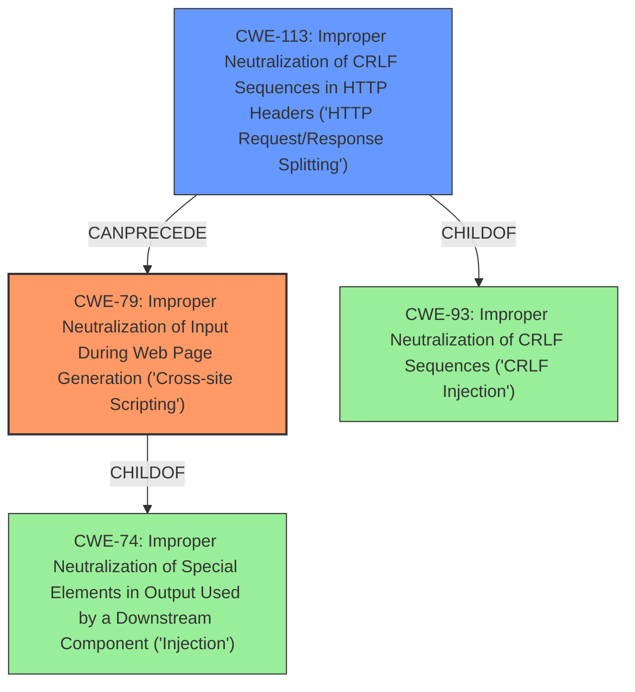

# Final Resolution for CVE-2021-29208

# Summary
| CWE ID | CWE Name | Confidence | CWE Abstraction Level | CWE Vulnerability Mapping Label | CWE-Vulnerability Mapping Notes |
|---|---|---|---|---|---|
| CWE-79 | Improper Neutralization of Input During Web Page Generation ('Cross-site Scripting') | 0.95 | Base | Allowed | Primary CWE |
| CWE-113 | Improper Neutralization of CRLF Sequences in HTTP Headers ('HTTP Request/Response Splitting') | 0.85 | Variant | Allowed | Secondary Candidate |

## Evidence and Confidence

*   **Confidence Score:** 0.93
*   **Evidence Strength:** HIGH

## Relationship Analysis
The primary relationship impacting the decision is the parent-child relationship between CWE-74 (Improper Neutralization of Special Elements in Output Used by a Downstream Component ('Injection')) and CWE-79. While CWE-74 is a parent, CWE-79 is more specific to the context of web page generation. The mention of "DOM XSS" clearly indicates that the vulnerability lies in the improper neutralization of input used to generate web pages. Also, CWE-113 is a variant of the more general **CWE-93** (Improper Neutralization of CRLF Sequences ('CRLF Injection')), but the description clearly involves HTTP Headers.

## Vulnerability Chain
The vulnerability chain starts with the product receiving and processing input.
  - The root cause is the **improper neutralization** of special elements within the input (**CWE-79**).
  - This leads to the ability to inject malicious scripts into web pages, resulting in a **DOM XSS** vulnerability.
  - Furthermore, **improper neutralization** of CRLF sequences in HTTP headers (**CWE-113**) allows for **CRLF injection**.
  - The impact is a remote attacker being able to execute arbitrary script in a user's browser and manipulate HTTP Headers.

## Summary of Analysis
Both the initial analysis and criticism are accurate. The vulnerability description clearly mentions both "dom xss" and "crlf injection", which directly map to **CWE-79** and **CWE-113**, respectively. The evidence is strong, and the confidence levels are justified.

*   The selection of **CWE-79** is based on the explicit mention of "dom xss" in the vulnerability description: "A remote dom xss...vulnerability was discovered...". This direct match makes **CWE-79** the most appropriate primary **WEAKNESS**.

*   The selection of **CWE-113** is based on the explicit mention of "crlf injection" in the vulnerability description: "...crlf injection vulnerability was discovered...". This direct match makes **CWE-113** the most appropriate secondary **WEAKNESS**.

The graph relationships influenced the final selection by confirming that while broader categories like **CWE-74** and **CWE-93** exist, the specific nature of the vulnerability allows for more precise classifications.

The selected CWEs are at the optimal level of specificity because they directly address the identified **ROOTCAUSE** (improper neutralization) and the specific contexts in which they occur (web page generation and HTTP headers).