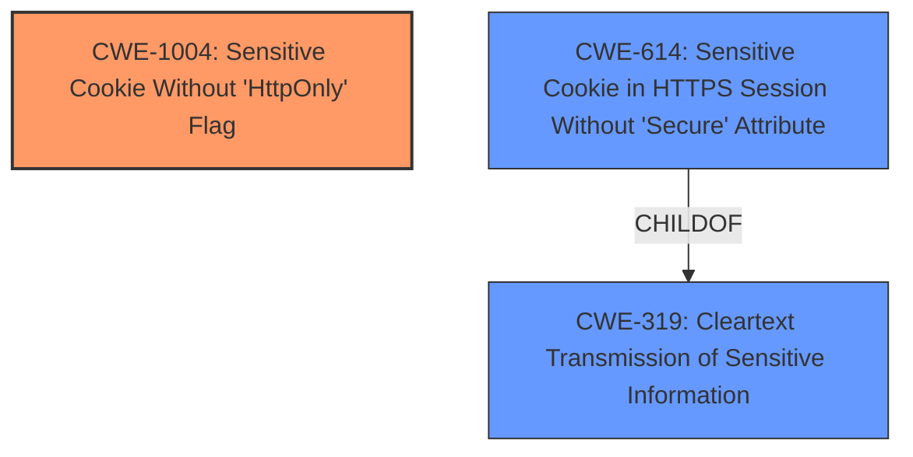

# Final Resolution for CVE-2021-29247

# Summary
| CWE ID | CWE Name | Confidence | CWE Abstraction Level | CWE Vulnerability Mapping Label | CWE-Vulnerability Mapping Notes |
|---|---|---|---|---|---|
| CWE-1004 | Sensitive Cookie Without 'HttpOnly' Flag | 0.95 | Variant | Allowed | Primary CWE |
| CWE-319 | Cleartext Transmission of Sensitive Information | 0.6 | Base | Allowed | Secondary Candidate |
| CWE-614 | Sensitive Cookie in HTTPS Session Without 'Secure' Attribute | 0.5 | Variant | Allowed | Secondary Candidate |

## Evidence and Confidence

*   **Confidence Score:** 0.9
*   **Evidence Strength:** HIGH

## Relationship Analysis
The primary **WEAKNESS** is the missing HttpOnly flag (CWE-1004).
CWE-319 (Cleartext Transmission) and CWE-614 (Missing Secure Attribute) are secondary candidates because they represent potential consequences if the cookie is transmitted over HTTP or HTTPS without the Secure attribute.

## Vulnerability Chain
The chain starts with the **ROOTCAUSE**: **failure to set the HTTPOnly flag for a cookie** (CWE-1004).
This can lead to potential consequences if the cookie is transmitted over HTTP, or HTTPS without secure flag enabled. The ultimate impact is that a remote attacker can obtain sensitive information.

## Summary of Analysis
The initial analysis and criticism are both accurate and well-reasoned. The primary CWE selection of CWE-1004 is correct because the vulnerability description explicitly states the **failure to set the HTTPOnly flag for a cookie**. The CVE reference links content summary reinforces this by stating the **root cause** is the "Lack of httponly" and the **weakness** is "Missing `HttpOnly` flag on a cookie".

The justification for secondary CWEs is also reasonable, though they are only applicable under specific circumstances. For CWE-319, this is only applicable if the cookie is transmitted over HTTP. For CWE-614, this is only applicable if the `Secure` attribute is also missing and the application is accessible over both HTTP and HTTPS.

The selected CWEs are at the optimal level of specificity as CWE-1004 directly addresses the missing HttpOnly flag.

The analysis is based on the evidence provided in the vulnerability description and CVE reference. A complete assessment would require a code review and network analysis, as noted in the criticism.