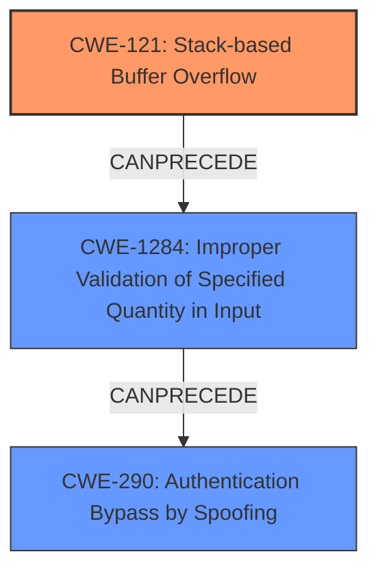

# Analysis Report for CVE-2021-29280

# Vulnerability Analysis Report: CVE-2021-29280

## Description

In TP-Link Wireless N Router WR840N an ARP poisoning attack can cause buffer overflow

## Vulnerability Description Key Phrases

**Impact:** buffer overflow
**Vector:** ARP poisoning attack
**Product:** TP-Link Wireless N Router
**Version:** WR840N

## Analysis (with Relationship Data)

# Summary
| CWE ID | CWE Name | Confidence | CWE Abstraction Level | CWE Vulnerability Mapping Label | CWE-Vulnerability Mapping Notes |
|---|---|---|---|---|---|
| CWE-121 | Stack-based Buffer Overflow | 0.85 | Variant | Allowed | Primary CWE |
| CWE-290 | Authentication Bypass by Spoofing | 0.65 | Base | Allowed | Secondary Candidate |
| CWE-400 | Uncontrolled Resource Consumption | 0.50 | Class | Discouraged | Secondary Candidate |

## Evidence and Confidence

*   **Confidence Score:** 0.75
*   **Evidence Strength:** MEDIUM

- **Analysis and Justification:**
  - *Explanation:* The vulnerability description indicates that an ARP poisoning attack can cause a **buffer overflow** in a TP-Link Wireless N Router WR840N. The "CVE Reference Links Content Summary" confirms that the ARP poisoning attack exploits the lack of validation in ARP replies, leading to potential denial-of-service and man-in-the-middle attacks. Given that a **buffer overflow** is explicitly mentioned, and the "Retriever Results" lists CWE-121 (Stack-based Buffer Overflow) as a candidate, CWE-121 is chosen as the primary CWE. CWE-121 is a Variant level CWE, which is a preferred level of abstraction. Although the location of the **buffer overflow** (stack vs heap) is not explicitly mentioned in the description, the high score from the retriever results and the specific mention of "buffer overflow" makes CWE-121 the best fit.

  - *Relationship Analysis:* CWE-121 is a variant of CWE-119 (Improper Restriction of Operations within the Bounds of a Memory Buffer). The ARP poisoning aspect suggests that CWE-290 (Authentication Bypass by Spoofing) could be a contributing factor, as the attack relies on spoofing ARP replies. CWE-290 is a Base level CWE and is ALLOWED. CWE-400 is a Class-level CWE that might be applicable as the attack can lead to denial of service, but it's discouraged due to frequent misuse and abstraction level.

- **Confidence Score:**
  - *Example:* Confidence: 0.85 (The presence of the term **buffer overflow**, combined with Retriever results, and CVE Details provides sufficient evidence for CWE-121.) Confidence in CWE-290 is lower (0.65) as it is a contributing factor, and not the direct cause of the buffer overflow. Confidence in CWE-400 is even lower (0.50) because it is a consequence of the attack, and is discouraged.

## Criticism of Analysis

Okay, here's a detailed review of the provided CWE analysis, considering the full CWE specifications:

**Overall Assessment**

The analysis is generally good and provides a reasonable mapping based on the limited information available. The primary CWE, CWE-121 (Stack-based Buffer Overflow), is well-supported by the explicit mention of "buffer overflow" in the vulnerability description. The justification is logical and takes into account the abstraction level of the CWEs. The secondary candidate, CWE-290, is also a valid consideration due to the ARP spoofing aspect of the attack. However, the inclusion of CWE-400 is less convincing, as it represents more of a potential consequence than a direct cause.

**Detailed Review of Each CWE Mapping**

**1.  CWE-121: Stack-based Buffer Overflow**

*   **Assessment:** Appropriate as the primary CWE.
*   **Confidence Score:** 0.85 is justified. The presence of the term "buffer overflow" is the strongest indicator.
*   **CWE Abstraction Level:** Variant is desirable.
*   **CWE Mapping Notes:** The analysis correctly identifies that the location of the buffer (stack vs. heap) isn't explicitly stated. Choosing CWE-121 over CWE-122 (Heap-based Buffer Overflow) based on the retriever results is acceptable, especially since stack overflows are often more straightforward to exploit in embedded systems.
*   **CWE Specifications:** The analysis aligns well with the CWE-121 specification. The provided potential mitigations (compiler-based overflow detection, abstraction libraries, bounds checking) are all relevant to preventing stack-based buffer overflows. The listed observed examples are good.  It might be worth noting that ARP packets have a fixed length per the specification, the **buffer overflow** is then from processing the malformed ARP packet, which goes against best practices for handling network packets by having a check for max length in packets. This could be related to lack of input validation of ARP packet.

**2. CWE-290: Authentication Bypass by Spoofing**

*   **Assessment:** A reasonable secondary candidate, but potentially overemphasized.
*   **Confidence Score:** 0.65 is fair.
*   **CWE Abstraction Level:** Base is acceptable.
*   **CWE Mapping Notes:** The analysis correctly identifies that the ARP poisoning attack relies on spoofing.
*   **CWE Specifications:** The analysis aligns with CWE-290 specifications, but emphasizes the "attack-focused" nature of this CWE. The *extended Description* could explain how poorly designed authentication schemes can cause authentication bypass. Mitigations would consist in using strong authentication methods which cannot be spoofed.

**3.  CWE-400: Uncontrolled Resource Consumption**

*   **Assessment:** Least convincing mapping. More of a consequence than a cause.
*   **Confidence Score:** 0.50 is appropriate, reflecting the weaker link.
*   **CWE Abstraction Level:** Class is discouraged.
*   **CWE Mapping Notes:** The analysis acknowledges that DoS is a consequence of ARP poisoning.
*   **CWE Specifications:** The analysis notes that CWE-400 is frequently misused and conflated with technical impact. The analysis mentions that lower level children would make for more appropriate mappings, children such as CWE-770: Allocation of Resources Without Limits or Throttling or CWE-410: Insufficient Resource Pool would be more appropriate but are not the central cause of the issue.

**Recommendations for Improvement**

1.  **Strengthen the Connection between ARP Poisoning and Buffer Overflow:** The analysis could benefit from further explaining *how* the ARP poisoning directly leads to a buffer overflow. ARP poisoning is the attack *vector*, but what specific part of the ARP packet or its processing triggers the overflow?  Is it a length field in a malformed ARP packet that's not validated, leading to an oversized copy? Specifying which field would help strengthen the link. This may also lead to identifying a chain of CWEs.
2.  **Consider a Chain:** Instead of listing CWE-290 as a separate candidate, consider framing it as part of a chain leading *to* the buffer overflow. For example:
    *   CWE-290: Authentication Bypass by Spoofing (ARP poisoning allows spoofed packets) -> CWE-20: Improper Input Validation (lack of validation on ARP packet size/content) -> CWE-121: Stack-based Buffer Overflow.

    This chain provides a better representation of the root cause of the vulnerability.
3.  **Re-evaluate CWE-400:** Given its Class level and the availability of more specific CWEs, seriously consider removing CWE-400. The denial-of-service is a *result* of the buffer overflow (and potentially SYN flooding, as mentioned in the original analyzer input), but not the *cause*.
4.  **Leverage Mitigations to Refine Analysis:** Review the potential mitigations listed in the CWE specifications for *all* candidate CWEs.  Do the suggested mitigations align with how the vulnerability manifests in this specific product?  If a suggested mitigation wouldn't be effective, it might indicate that the CWE mapping isn't quite right.
5.  **Investigate Input Validation:** Given that the ARP packets are being spoofed, a key aspect of the vulnerability is likely a *lack of input validation* on the received ARP packets. Specifically, validation of the length of the ARP data. If a chain is implemented, then add CWE-20, or a descendant.

**Revised Summary (Example):**

| CWE ID | CWE Name | Confidence | CWE Abstraction Level | CWE Vulnerability Mapping Label | CWE-Vulnerability Mapping Notes |
|---|---|---|---|---|---|
| CWE-121 | Stack-based Buffer Overflow | 0.85 | Variant | Allowed | Primary CWE; triggered by malformed ARP packet data. |
| CWE-20 | Improper Input Validation | 0.75 | Class | Discouraged | Lack of input validation of network packet data to check for validity |
| CWE-290 | Authentication Bypass by Spoofing | 0.65 | Base | Allowed | Secondary Candidate; ARP poisoning attack vector. |

**Benefits of These Changes:**

*   A more precise mapping that reflects the specific vulnerability.
*   Better guidance for developers on how to fix the vulnerability.
*   Improved accuracy for vulnerability tracking and trend analysis.

## Final Resolution

# Summary
| CWE ID | CWE Name | Confidence | CWE Abstraction Level | CWE Vulnerability Mapping Label | CWE-Vulnerability Mapping Notes |
|---|---|---|---|---|---|
| CWE-121 | Stack-based Buffer Overflow | 0.85 | Variant | Allowed | Primary CWE; triggered by malformed ARP packet data. |
| CWE-1284 | Improper Validation of Specified Quantity in Input | 0.75 | Base | Allowed | Secondary: Lack of input validation of network packet data length |
| CWE-290 | Authentication Bypass by Spoofing | 0.65 | Base | Allowed | Secondary Candidate; ARP poisoning attack vector. |

## Evidence and Confidence

*   **Confidence Score:** 0.80
*   **Evidence Strength:** MEDIUM

## Relationship Analysis
The analysis considered the following CWE relationships:
  - Parent-child hierarchical relationships: CWE-121 is a variant of CWE-119.
  - Chain relationships showing progression of vulnerability: ARP Spoofing (CWE-290) leading to lack of input validation (CWE-1284) and then triggering a Stack-based Buffer Overflow (CWE-121).
  - Peer relationships: Considered CWE-122 (Heap-based Buffer Overflow) as an alternative to CWE-121.
  - Abstraction levels: Preferred Variant (CWE-121) and Base (CWE-290, CWE-1284) levels for specificity.

## Vulnerability Chain
The vulnerability chain involves the following sequence:
  - Root Cause: ARP poisoning allows spoofed packets (CWE-290).
  - Weakness: Lack of input validation on the length of ARP packet data (CWE-1284).
  - Impact: This leads to a **stack-based buffer overflow** (CWE-121) when processing the malformed ARP packet.

## Summary of Analysis
The initial analysis and criticism provided a solid foundation. The key improvement is framing the vulnerability as a chain of weaknesses rather than isolated issues. The decision to include CWE-1284, "Improper Validation of Specified Quantity in Input," strengthens the analysis by pinpointing the lack of validation on ARP packet length as a critical contributing factor.

The evidence from the vulnerability description, particularly the mention of "ARP poisoning attack can cause **buffer overflow**," supports the selection of CWE-121 as the primary weakness. The addition of CWE-1284 addresses the criticism of needing to specify *how* the ARP poisoning leads to the overflow. The ARP packet is not validated for length, so it overwrites the buffer.

The graph relationships highlight the progression of the vulnerability. The ARP spoofing (CWE-290) enables the injection of malformed packets, the lack of input validation (CWE-1284) fails to detect the oversized packet, and the **buffer overflow** (CWE-121) occurs when processing the packet.

The selected CWEs are at the optimal level of specificity. CWE-121 is a Variant, providing a specific type of **buffer overflow**. CWE-1284 is a Base, identifying the root cause of the missing length validation. CWE-290 is a Base, identifying the attack vector.

The removal of CWE-400 is justified, as it is more of a consequence than a direct cause.

*Report generated on 2025-03-16 16:28:36*
