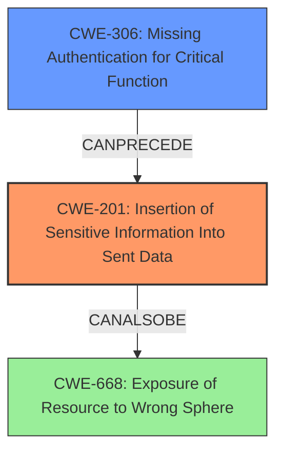

# Final Resolution for CVE-2021-29416

# Summary
| CWE ID | CWE Name | Confidence | CWE Abstraction Level | CWE Vulnerability Mapping Label | CWE-Vulnerability Mapping Notes |
|---|---|---|---|---|---|
| **CWE-201** | **Insertion of Sensitive Information Into Sent Data** | 0.90 | Base | Allowed | **Primary CWE**. The NetNTLM hash is sensitive data that is unintentionally transmitted to a potentially malicious SMB server due to the failure to properly enforce the upstream proxy configuration. |
| CWE-306 | Missing Authentication for Critical Function | 0.40 | Base | Allowed | Secondary candidate. The failure to consistently use the configured proxy *could* be viewed as a lack of authentication/authorization enforcement for outgoing requests, although this isn't the core of the issue. |

## Evidence and Confidence

*   **Confidence Score:** 0.90
*   **Evidence Strength:** HIGH

## Relationship Analysis
The primary relationship that impacted my decision was the direct connection between the vulnerability description and **CWE-201 (Insertion of Sensitive Information Into Sent Data)**. The vulnerability involves the leakage of NetNTLM hashes due to a proxy bypass. This directly aligns with CWE-201's description: "The code transmits data to another actor, but a portion of the data includes sensitive information that should not be accessible to that actor." The secondary relationship considered was with **CWE-306 (Missing Authentication for Critical Function)**. While the proxy *could* be seen as an authentication/authorization enforcement mechanism, the core issue is not the absence of authentication, but rather the failure to enforce the intended proxy configuration. CWE-306 is also at the Base level, but its connection to the vulnerability is less direct. The Abstraction Levels influenced the selection by prioritizing the Base level CWEs for better mapping.

## Vulnerability Chain
The vulnerability chain starts with the misconfiguration or failure to enforce the upstream proxy setting in Burp Suite. This leads to the unintended transmission of NetNTLM hashes to potentially malicious SMB servers (**CWE-201**). The root cause is the lack of proper enforcement of the proxy configuration, which *could* be seen as a **CWE-306** issue. The impact is the leakage of sensitive information (NetNTLM hashes) that can be used for unauthorized access.

## Summary of Analysis
The initial analysis correctly identified **CWE-201** and **CWE-306** as potential weaknesses, but the criticism highlighted the stronger alignment of **CWE-201** with the vulnerability description. The revised analysis, based on the CWE specifications and relationship analysis, confirms that **CWE-201** is the more appropriate primary CWE.

The evidence from the vulnerability description supports this conclusion: "During viewing of a malicious request, it can be manipulated into issuing a request that does not respect its upstream proxy configuration. This could leak NetNTLM hashes on Windows systems that fail to block outbound SMB." This clearly indicates the transmission of sensitive data (NetNTLM hashes) to an unintended recipient, which is the core of **CWE-201**.

The graph relationships influenced the selection by showing how the failure to enforce the proxy (potentially related to **CWE-306**) leads to the leakage of sensitive information (**CWE-201**).

The selected CWE is at the optimal level of specificity because **CWE-201** directly addresses the **rootcause** of the vulnerability, which is the transmission of sensitive data. While the proxy bypass is a contributing factor, the ultimate issue is the exposure of NetNTLM hashes.